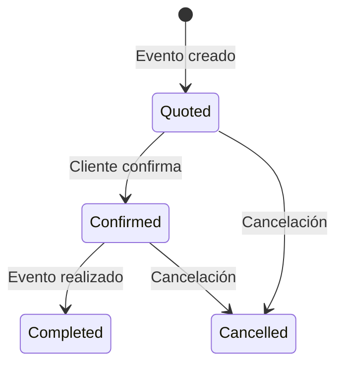
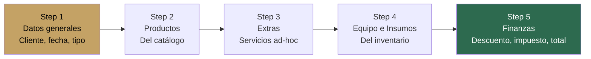
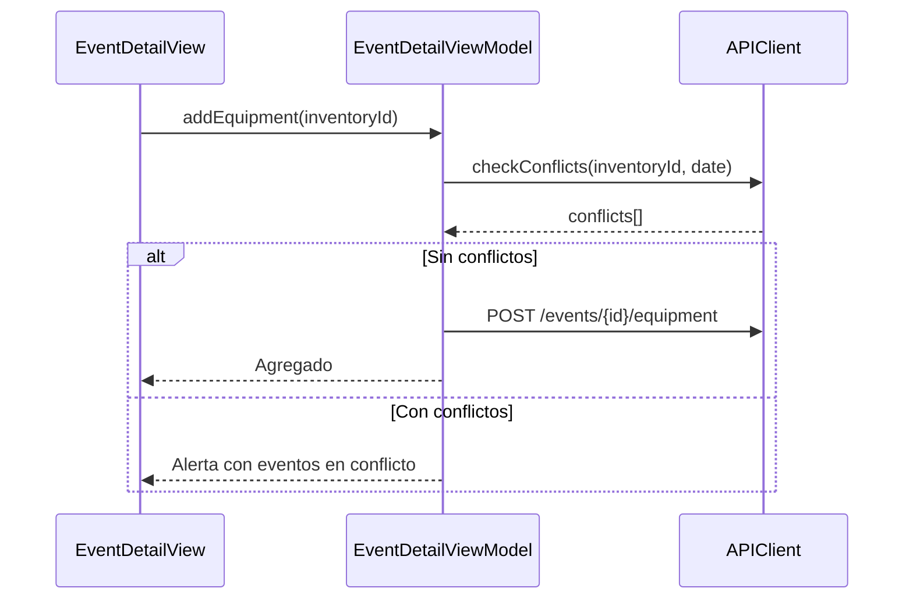
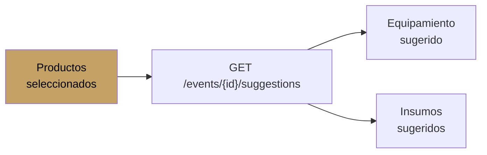

#ios #dominio #eventos

# Módulo Eventos

> [!abstract] Resumen
> Módulo central. CRUD completo con formulario multi-paso (5 steps), detalle con recursos anidados (productos, extras, equipo, insumos, fotos), checklist, detección de conflictos, sugerencias automáticas, y generación de 7 tipos de PDF.

---

## Pantallas

| Pantalla | Archivo | Descripción |
|----------|---------|-------------|
| `EventListView` | `SolennixFeatures/Events/Views/` | Lista con filtros y búsqueda |
| `EventFormView` | `SolennixFeatures/Events/Views/` | Formulario 5 pasos |
| `EventDetailView` | `SolennixFeatures/Events/Views/` | Detalle completo |
| `EventChecklistView` | `SolennixFeatures/Events/Views/` | Checklist con tareas |

---

## Ciclo de Vida

---

## Formulario Multi-Paso

### Step 1 — General

| Campo | Tipo | Requerido |
|-------|------|-----------|
| Cliente | Picker | Sí |
| Tipo de servicio | Text | Sí |
| Fecha | DatePicker | Sí |
| Hora inicio/fin | TimePicker | No |
| Ubicación | Text | No |
| Ciudad | Text | No |
| N° personas | Number | Sí |
| Notas | TextArea | No |

### Step 2 — Productos
Selección del catálogo con cantidad, precio unitario, descuento.

### Step 3 — Extras
Servicios ad-hoc con descripción, costo, precio, flag de excluir utilidad.

### Step 4 — Equipo e Insumos
Del inventario, con detección de conflictos y sugerencias automáticas.

### Step 5 — Finanzas
Descuento (% o fijo), impuesto, depósito, días de cancelación, reembolso. Cálculo automático de totales.

---

## Detalle del Evento

| Sección | Contenido |
|---------|-----------|
| Info general | Cliente, fecha, tipo, ubicación, status |
| Productos | Lista con cantidades y precios |
| Extras | Servicios adicionales |
| Equipamiento | Items del inventario tipo equipo |
| Insumos | Items consumibles |
| Fotos | Galería de fotos del evento |
| Pagos | Abonos registrados + saldo |
| Finanzas | Subtotal, descuento, impuesto, total |
| Acciones | Editar, generar PDFs, checklist |

---

## Detección de Conflictos

Cuando se asigna equipamiento, se verifica disponibilidad en la misma fecha:

---

## Sugerencias Automáticas

Basado en los productos del evento, el sistema sugiere equipamiento e insumos necesarios:

---

## Generación de PDFs

| Documento | Generador |
|-----------|-----------|
| Presupuesto | `BudgetPDFGenerator` |
| Contrato | `ContractPDFGenerator` |
| Cotización rápida | `QuickQuotePDFGenerator` |
| Lista de compras | `ShoppingListPDFGenerator` |
| Checklist | `ChecklistPDFGenerator` |
| Lista de equipo | `EquipmentListPDFGenerator` |
| Reporte de pagos | `PaymentReportPDFGenerator` |

---

## ViewModels

| ViewModel | Responsabilidad |
|-----------|----------------|
| `EventListViewModel` | Lista, filtros, búsqueda, paginación, delete |
| `EventFormViewModel` | 5 steps, validación, cálculos, save |
| `EventDetailViewModel` | Detalle, CRUD de sub-entidades, PDFs |
| `EventChecklistViewModel` | Tareas, mark complete |

---

## Relaciones

- [[Módulo Clientes]] — cada evento pertenece a un cliente
- [[Módulo Productos]] — productos asignados al evento
- [[Módulo Inventario]] — equipamiento e insumos
- [[Módulo Pagos]] — pagos del evento
- [[Sistema de PDFs]] — 7 generadores de documentos
- [[Módulo Calendario]] — visualización temporal
