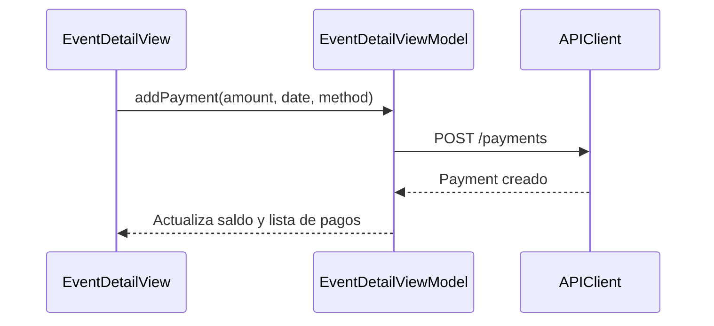

#ios #dominio #pagos

# Módulo Pagos

> [!abstract] Resumen
> Registro de pagos parciales y totales vinculados a eventos. Seguimiento de saldo pendiente, métodos de pago, y generación de reporte PDF.

---

## Campos del Pago

| Campo | Tipo | Requerido |
|-------|------|-----------|
| Evento | Selector | Sí |
| Monto | Decimal | Sí |
| Fecha de pago | DatePicker | Sí |
| Método de pago | Picker (efectivo, transferencia, tarjeta, otro) | No |
| Notas | TextArea | No |

---

## Cálculos Financieros

| Métrica | Fórmula |
|---------|---------|
| Total del evento | Σ(productos × precio - descuento) + Σ(extras) + impuesto |
| Total pagado | Σ(pagos del evento) |
| Saldo pendiente | Total - Pagado |
| Depósito requerido | Total × depositPercent% |

---

## Flujo

Los pagos se registran desde el detalle del evento:

---

## Relaciones

- [[Módulo Eventos]] — pagos vinculados a eventos
- [[Módulo Dashboard]] — KPIs financieros
- [[Sistema de PDFs]] — reporte de pagos
