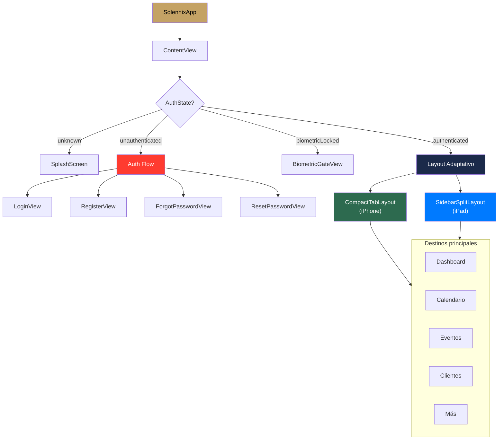

#ios #navegación #swiftui

# Navegación

> [!abstract] Resumen
> `NavigationStack` con enum `Route` hashable para rutas type-safe. Layout adaptativo: **TabView** en iPhone, **NavigationSplitView** en iPad. Deep links, Spotlight search, y cada tab mantiene su propio stack de navegación.

---

## Estructura de Navegación



---

## Route Enum

```swift
public enum Route: Hashable {
    // Auth
    case login, register, forgotPassword
    case resetPassword(token: String)

    // Main tabs
    case home, calendar, events, clients, more

    // Events
    case eventDetail(id: String)
    case eventForm(id: String?, clientId: String?, date: String?)
    case eventChecklist(id: String)

    // Clients
    case clientDetail(id: String)
    case clientForm(id: String?)
    case quickQuote

    // Products
    case productList, productDetail(id: String), productForm(id: String?)

    // Inventory
    case inventoryList, inventoryDetail(id: String), inventoryForm(id: String?)

    // Others
    case search(query: String?), settings, editProfile, changePassword
    case businessSettings, contractDefaults, pricing, about
}
```

> [!tip] Convención
> Las rutas de formulario usan `id: String?` — `nil` = creación, con valor = edición.

---

## Layout Adaptativo

| Dispositivo | Size class | Layout | Navegación |
|-------------|-----------|--------|-----------|
| iPhone portrait | compact | `CompactTabLayout` | TabView + NavigationStack |
| iPhone landscape | compact | `CompactTabLayout` | TabView + NavigationStack |
| iPad portrait | regular | `CompactTabLayout` | TabView (detecta orientación) |
| iPad landscape | regular | `SidebarSplitLayout` | NavigationSplitView con sidebar |
| Mac (Catalyst) | regular | `SidebarSplitLayout` | Sidebar navigation |

```swift
// ContentView detecta size class
@Environment(\.horizontalSizeClass) var sizeClass

var body: some View {
    if sizeClass == .regular && isLandscape {
        SidebarSplitLayout()
    } else {
        CompactTabLayout()
    }
}
```

---

## Tabs y NavigationStack

Cada tab tiene su propio `NavigationStack` independiente con `NavigationPath`:

```swift
TabView {
    NavigationStack(path: $homePath) {
        DashboardView()
            .navigationDestination(for: Route.self) { route in
                RouteDestination(route: route)
            }
    }
    .tabItem { Label("Inicio", systemImage: "house") }

    // ... más tabs
}
```

> [!important] Re-tap = Pop to Root
> Un binding custom detecta cuando el usuario toca el tab activo de nuevo y hace `path.removeLast(path.count)` para volver a la raíz.

---

## Tabs del TabView

| Tab | Ícono | Vista raíz |
|-----|-------|-----------|
| Inicio | `house` | `DashboardView` |
| Calendario | `calendar` | `CalendarView` |
| Eventos | `party.popper` | `EventListView` |
| Clientes | `person.2` | `ClientListView` |
| Más | `ellipsis.circle` | `MoreView` (settings, search, products, inventory) |

---

## Deep Links

| Esquema | Ruta | Destino |
|---------|------|---------|
| URL | `solennix://event/{id}` | EventDetail |
| URL | `solennix://client/{id}` | ClientDetail |
| URL | `solennix://product/{id}` | ProductDetail |
| URL | `solennix://new-event` | EventForm |
| URL | `solennix://reset-password?token=` | ResetPasswordView |
| Spotlight | CoreSpotlight indexed items | Entity detail views |
| Shortcuts | AppIntents | Acciones rápidas |

`DeepLinkHandler` resuelve URLs a `Route` enums y los push al NavigationPath correspondiente.

---

## Searchable

Cada tab principal soporta `.searchable()`:

```swift
NavigationStack(path: $path) {
    EventListView()
        .searchable(text: $searchText)
        .onSubmit(of: .search) {
            path.append(Route.search(query: searchText))
        }
}
```

---

## Archivos Clave

| Archivo | Ubicación |
|---------|-----------|
| `Route.swift` | `SolennixCore/` |
| `ContentView.swift` | `Solennix/` |
| `CompactTabLayout.swift` | `Solennix/Navigation/` |
| `SidebarSplitLayout.swift` | `Solennix/Navigation/` |
| `RouteDestination.swift` | `Solennix/Navigation/` |
| `DeepLinkHandler.swift` | `Solennix/Navigation/` |

---

## Relaciones

- [[Autenticación]] — AuthState determina la vista inicial
- [[Manejo de Estado]] — ViewModels accedidos via @Environment
- [[Widgets y Live Activities]] — deep links desde widgets
- [[Siri Shortcuts]] — App Intents navegan a pantallas
- [[Arquitectura General]] — Route definido en SolennixCore
