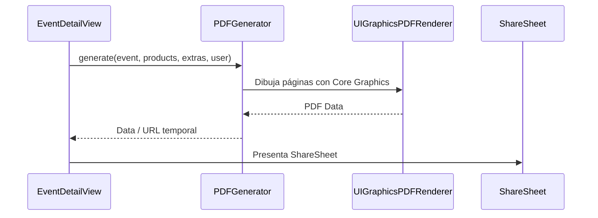

#ios #pdfs #documentos

# Sistema de PDFs

> [!abstract] Resumen
> 8 generadores de PDF usando **UIGraphicsPDFRenderer** nativo. Todos incluyen branding del negocio (logo, nombre, color) y se comparten via ShareSheet. Funcionalidad COMPLETA — a diferencia de Android, no hay dependencias faltantes.

---

## Documentos Disponibles

| Documento | Generador | Contenido |
|-----------|-----------|-----------|
| Cotización rápida | `QuickQuotePDFGenerator` | Productos + extras sin evento formal |
| Presupuesto | `BudgetPDFGenerator` | Productos + extras + totales del evento |
| Contrato | `ContractPDFGenerator` | Términos + datos negocio + cliente |
| Factura | `InvoicePDFGenerator` | Detalle financiero + pagos |
| Lista de compras | `ShoppingListPDFGenerator` | Insumos e ingredientes necesarios |
| Checklist | `ChecklistPDFGenerator` | Tareas del evento |
| Lista de equipamiento | `EquipmentListPDFGenerator` | Equipo asignado |
| Reporte de pagos | `PaymentReportPDFGenerator` | Historial de abonos y saldos |

---

## Tecnología

| Aspecto | Detalle |
|---------|---------|
| Framework | `UIGraphicsPDFRenderer` (UIKit nativo) |
| Renderizado | Canvas drawing con Core Graphics |
| Compartir | `ShareLink` / `UIActivityViewController` |
| Branding | Logo, nombre, color de marca del usuario |

---

## Flujo

---

## Branding en PDFs

| Dato | Fuente |
|------|--------|
| Nombre del negocio | `User.businessName` |
| Logo | `User.logoUrl` |
| Color de marca | `User.brandColor` |
| Template de contrato | `User.contractTemplate` |

---

## Archivos Clave

| Archivo | Ubicación |
|---------|-----------|
| `QuickQuotePDFGenerator.swift` | `SolennixFeatures/Common/PDFs/` |
| `BudgetPDFGenerator.swift` | `SolennixFeatures/Common/PDFs/` |
| `InvoicePDFGenerator.swift` | `SolennixFeatures/Common/PDFs/` |
| `ContractPDFGenerator.swift` | `SolennixFeatures/Common/PDFs/` |
| `ShoppingListPDFGenerator.swift` | `SolennixFeatures/Common/PDFs/` |
| `ChecklistPDFGenerator.swift` | `SolennixFeatures/Common/PDFs/` |
| `EquipmentListPDFGenerator.swift` | `SolennixFeatures/Common/PDFs/` |
| `PaymentReportPDFGenerator.swift` | `SolennixFeatures/Common/PDFs/` |

---

## Relaciones

- [[Módulo Eventos]] — genera PDFs desde detalle
- [[Módulo Clientes]] — cotización rápida
- [[Módulo Settings]] — datos del negocio en PDFs
- [[Módulo Pagos]] — reporte de pagos
