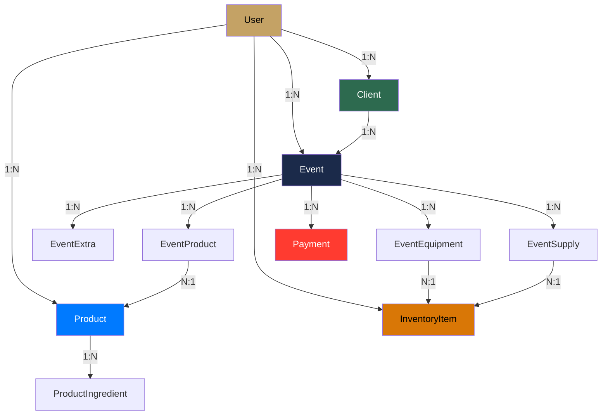

#ios #tipos #modelo

# Sistema de Tipos

> [!abstract] Resumen
> Todos los modelos viven en `SolennixCore/Models/`. Son structs `Codable` + `Identifiable` con conversión automática `snake_case` ↔ `camelCase` via JSONDecoder. Modelos cacheados separados para SwiftData.

---

## Entidades Principales

| Entidad | Archivo | Campos clave |
|---------|---------|-------------|
| `User` | `User.swift` | id, email, name, businessName, plan, stripeCustomerId, defaultDepositPercent |
| `Event` | `Event.swift` | id, clientId, eventDate, startTime, endTime, serviceType, status, totalAmount, taxRate, taxAmount |
| `Client` | `Client.swift` | id, name, phone, email, address, city, totalEvents, totalSpent |
| `Product` | `Product.swift` | id, name, category, basePrice, recipe, imageUrl, isActive |
| `InventoryItem` | `InventoryItem.swift` | id, ingredientName, currentStock, minimumStock, unit, unitCost, type |
| `Payment` | `Payment.swift` | id, eventId, amount, paymentDate, paymentMethod |

---

## Entidades de Relación

| Entidad | Relación | Campos clave |
|---------|----------|-------------|
| `EventProduct` | Event ↔ Product | eventId, productId, quantity, unitPrice, discount, discountType |
| `EventExtra` | Event → Extra | eventId, description, cost, price, excludeUtility |
| `EventEquipment` | Event ↔ InventoryItem | eventId, inventoryId, quantity, notes |
| `EventSupply` | Event ↔ InventoryItem | eventId, inventoryId, quantity, unitCost, source, excludeCost |
| `ProductIngredient` | Product → Ingrediente | productId, ingredientName, quantity, unit |
| `UnavailableDate` | User → Fecha bloqueada | id, date, reason |
| `Suggestions` | Respuesta de sugerencias | equipment, supplies (basado en productos) |

---

## Enums

| Enum | Valores | Conformance |
|------|---------|-------------|
| `EventStatus` | quoted, confirmed, completed, cancelled | Codable, CaseIterable |
| `DiscountType` | percent, fixed | Codable |
| `Plan` | basic, pro, premium, business | Codable |

---

## Diagrama de Relaciones



---

## Patrón de Serialización

```swift
struct Event: Codable, Identifiable, Hashable, Sendable {
    let id: String
    let userId: String
    let clientId: String
    let eventDate: String
    let startTime: String?
    let endTime: String?
    let serviceType: String
    let numPeople: Int
    let status: EventStatus
    let discount: Double
    let discountType: DiscountType
    // ...
}
```

> [!tip] Convención
> El `JSONDecoder` usa `keyDecodingStrategy: .convertFromSnakeCase` y el `JSONEncoder` usa `keyEncodingStrategy: .convertToSnakeCase`. No se necesitan CodingKeys manuales.

---

## Modelos de Caché (SwiftData)

| Modelo SwiftData | Modelo de dominio | Persistencia |
|-----------------|------------------|-------------|
| `CachedClient` | `Client` | `@Model` SwiftData |
| `CachedEvent` | `Event` | `@Model` SwiftData |
| `CachedProduct` | `Product` | `@Model` SwiftData |

> [!important] ModelContainer
> `SolennixModelContainer.create()` crea el container de SwiftData. Si falla la persistencia en disco, hace fallback a in-memory.

---

## Utilidades de Tipos

| Archivo | Propósito |
|---------|-----------|
| `AnyCodable.swift` | Wrapper para valores JSON dinámicos |
| `QuickQuoteTransferData.swift` | Datos para generar cotización rápida |
| `SolennixEventAttributes.swift` | Atributos para Live Activities |
| `DateFormatting.swift` | Extensiones de formateo de fechas |
| `CurrencyFormatting.swift` | Extensiones de formateo de moneda |

---

## Relaciones

- [[Arquitectura General]] — ubicación en SolennixCore
- [[Capa de Red]] — serialización automática en APIClient
- [[Caché y Offline]] — modelos SwiftData
- [[Módulo Eventos]] — entidad central del sistema
