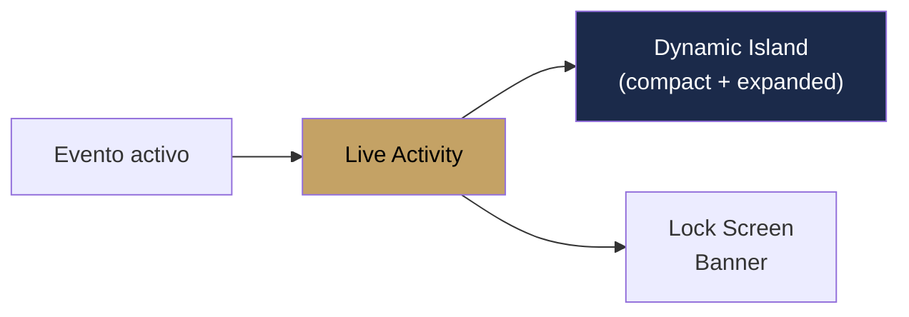

#ios #widgets #liveactivity #widgetkit

# Widgets y Live Activities

> [!abstract] Resumen
> Widgets de home screen y lock screen con **WidgetKit**, **Live Activities** con Dynamic Island para monitoreo de eventos en tiempo real, y **App Shortcuts** via AppIntents. Datos compartidos via App Group.

---

## Home Screen Widgets

### Upcoming Events Widget

| Aspecto | Detalle |
|---------|---------|
| Framework | WidgetKit |
| Tamaños | Small, Medium, Large |
| Contenido | Próximos 3-5 eventos con fecha y tipo |
| Tap | Deep link a detalle del evento |
| Refresh | Timeline provider con updates periódicos |

### KPI Widget

| Aspecto | Detalle |
|---------|---------|
| Contenido | Revenue del mes, conteo de eventos |
| Tap | Deep link a Dashboard |

### Lock Screen Widget (iOS 16+)

| Aspecto | Detalle |
|---------|---------|
| Ubicación | Lock screen / Always On Display |
| Contenido | Próximo evento (compacto) |

### Interactive Widget

| Aspecto | Detalle |
|---------|---------|
| Contenido | Acciones rápidas (nuevo evento, nuevo cliente) |
| Interactividad | Botones que ejecutan intents |

---

## Live Activities (Dynamic Island)

| Aspecto | Detalle |
|---------|---------|
| Framework | ActivityKit |
| Atributos | `SolennixEventAttributes` |
| Contenido | Nombre del evento, hora, status |
| Vista compact | Ícono + hora |
| Vista expanded | Nombre + detalles + checklist progress |
| Actualización | Push o manual desde la app |

> [!warning] Parcialmente implementado
> La infraestructura de Live Activities existe pero el mecanismo de actualización desde el backend no está completamente cableado.

---

## App Group

| Aspecto | Detalle |
|---------|---------|
| ID | `group.com.solennix.app` |
| Propósito | Compartir datos entre app y widget extension |
| Datos | Próximos eventos, KPIs, preferencias |

---

## Archivos Clave

| Archivo | Ubicación |
|---------|-----------|
| Widget views | `SolennixWidgetExtension/` |
| Live Activity | `SolennixLiveActivity/` |
| Event Attributes | `SolennixCore/SolennixEventAttributes.swift` |

---

## Relaciones

- [[Navegación]] — deep links desde widgets
- [[Caché y Offline]] — App Group para datos compartidos
- [[Módulo Eventos]] — datos de eventos en widgets
- [[Siri Shortcuts]] — App Intents compartidos
