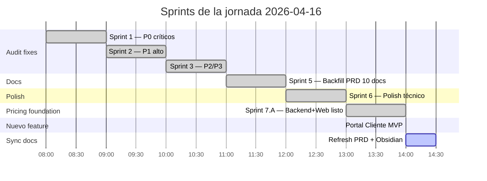
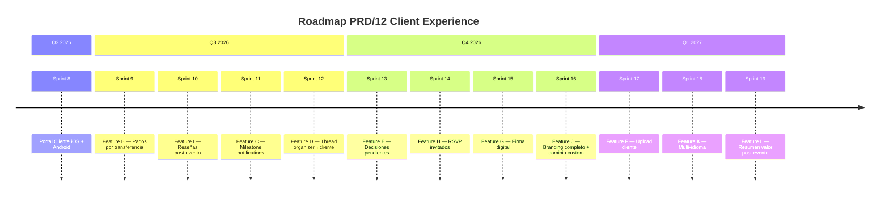
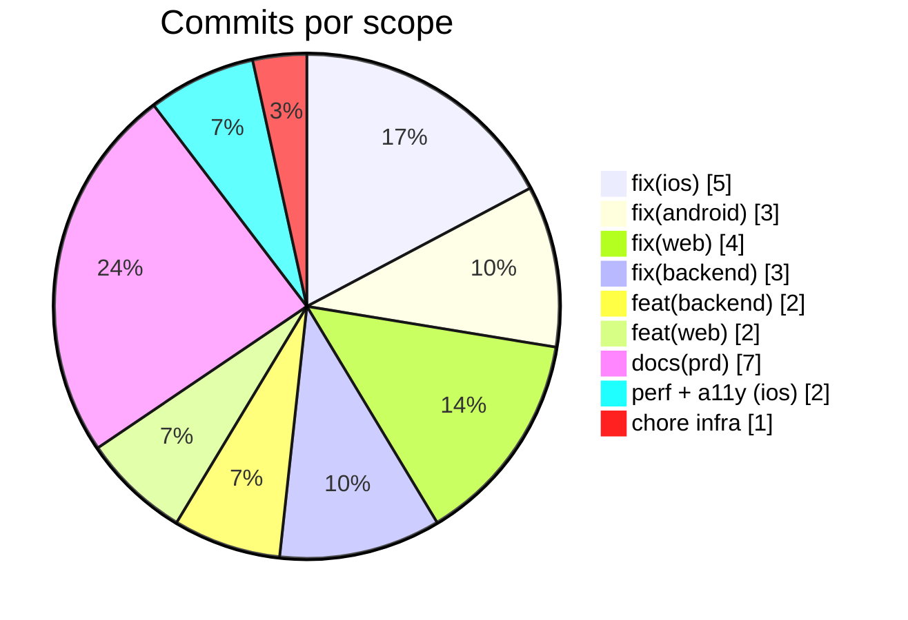
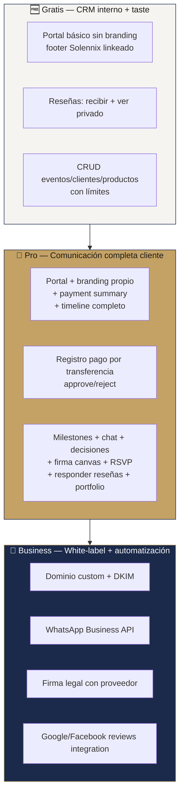

---
tags:
  - dashboard
  - solennix
  - daily-progress
aliases:
  - Dashboard
  - Hub
  - Inicio
date: 2026-04-16
updated: 2026-04-16
status: active
---

# 🏛️ Solennix — Dashboard Ejecutivo

> [!tip] Este es tu punto de entrada diario
> Abrí este archivo cada mañana para ver en **30 segundos** qué pasa con el producto. Todo lo demás se navega desde acá.

**Última actualización:** 2026-04-16 · cierre de jornada intensa (28 commits).

---

## 📊 Salud del producto — al día de hoy

> [!success] 🟢 PRODUCCIÓN — 4 plataformas live
> - iOS 1.0.2 · App Store México · `https://apps.apple.com/mx/app/solennix/id6760874129`
> - Android 1.0.0 · Play Store · APK firmado
> - Web · `solennix.com`
> - Backend · `api.solennix.com`
>
> ⚠️ Los cambios del 2026-04-16 aún NO están en stores. Próxima release los incorpora.

> [!success] ✅ AUDIT 2026-04-16 — 30 / 38 findings cerrados
> - **P0 crítico:** 7 / 8 resueltos · 1 inválido (finding erróneo del audit)
> - **P1 alto:** 11 / 12 resueltos · 1 skip documentado (Apple docs contradicen audit)
> - **P2 medio:** 8 / 11 resueltos · 3 diferidos con rationale
> - **P3 bajo:** 4 / 7 resueltos · 3 diferidos con rationale

> [!info] 🚀 FEATURE NUEVA — Portal Cliente MVP entregado
> Backend + Web live. iOS + Android pendientes (Sprint 8). Ver [[PRD/15_PORTAL_CLIENTE_TRACKER|tracker completo]].

> [!warning] ⏳ BLOQUEANTES externos
> Stripe Dashboard · App Store Connect · Google Play Console · RevenueCat.
> Acción del usuario (2–4 h), no de código. Detalle en [[PRD/09_ROADMAP|Roadmap §5]].

---

## 📅 Progreso de Sprints — estado visual



### 🎯 Sprints — barras de progreso

| Sprint | Objetivo | Progreso | Status |
|---|---|---|---|
| 1 | P0 fixes cross-platform | `████████████████████` 100% | ✅ cerrado |
| 2 | P1 fixes cross-platform | `███████████████████░` 92% | ✅ cerrado (1 skip justificado) |
| 3 | P2/P3 fixes | `█████████████████░░░` 83% | ✅ cerrado (3 diferidos) |
| 4 | Activar deploy VPS | `░░░░░░░░░░░░░░░░░░░░` 0% | ⏸️ deferido por usuario (deploy manual) |
| 5 | Backfill PRD (10 docs) | `████████████████████` 100% | ✅ cerrado |
| 6 | Polish técnico (perf + a11y) | `████████████████████` 100% | ✅ cerrado |
| 7.A | Pricing foundation (código) | `████████████████████` 100% | ✅ cerrado (espera dashboards ext.) |
| 7.B | Paywalls mobile coherentes | `░░░░░░░░░░░░░░░░░░░░` 0% | 📋 próximo sprint |
| 7.C | Enforcement matrix completo | `░░░░░░░░░░░░░░░░░░░░` 0% | 📋 después de 7.B |
| 8 | Portal Cliente iOS + Android | `░░░░░░░░░░░░░░░░░░░░` 0% | 📋 |
| 9 | Feature B (payments transfer) | `░░░░░░░░░░░░░░░░░░░░` 0% | 📋 |
| 10 | Feature I (reseñas) | `░░░░░░░░░░░░░░░░░░░░` 0% | 📋 |
| **Portal Cliente MVP** | **Backend + Web** | **`████████████░░░░░░░░` 60%** | 🚧 mobile pendiente |

---

## 🧩 Matriz visual por feature

### Core del producto — ya en producción

> [!success] ✅ Funcional en las 4 plataformas
> Auth · Eventos · Clientes · Productos · Inventario · Pagos (internos) · Calendario · PDFs · Dashboard · Settings · Push · Email.

### Pricing / Monetization

| | iOS | Android | Web | Backend |
|---|:-:|:-:|:-:|:-:|
| Plan Gratis | ✅ | ✅ | ✅ | ✅ |
| Plan Pro — código | 🚧 | 🚧 | ✅ | ✅ |
| Plan Pro — cobro real | ⏳ | ⏳ | ⏳ | ✅ |
| Plan Business — código | 🚧 | 🚧 | ✅ | ✅ |
| Plan Business — cobro real | ⏳ | ⏳ | ⏳ | ✅ |
| Paywall por `plan_limit_exceeded` | 📋 | 📋 | ✅ | ✅ |
| Trial 14 días web (Stripe) | — | — | ✅ | ✅ |
| Trial 14 días mobile (IAP) | ⏳ | ⏳ | — | ✅ |

**Leyenda:** ✅ shipped · 🚧 código listo, falta integración · ⏳ bloqueado en dashboards externos · 📋 planeado · — no aplica.

### Portal Cliente (PRD/12 Feature A) — 🚧 EN DESARROLLO

| | iOS | Android | Web | Backend |
|---|:-:|:-:|:-:|:-:|
| Endpoint público `/public/events/{token}` | ❌ | ❌ | ❌ | ✅ |
| Endpoints organizador CRUD | ❌ | ❌ | ✅ | ✅ |
| UI del portal (lo que ve el cliente) | — | — | ✅ | ❌ |
| Share card en EventDetail | 📋 | 📋 | ✅ | — |
| Copy + WhatsApp share | 📋 | 📋 | ✅ | — |
| Tier gating Gratis=básico / Pro=full | 📋 | 📋 | 📋 | 📋 |
| Rotación / Revocación | 📋 | 📋 | ✅ | ✅ |
| Acceso perpetuo (sin TTL default) | — | — | ✅ | ✅ |

**Detalle completo:** [[PRD/15_PORTAL_CLIENTE_TRACKER]]

### Transparencia & delight (PRD/12 features B–L) — 📋 Q3-Q4 2026



---

## 🔥 Lo que pasó hoy — 28 commits en `main`

```mermaid
graph LR
    A["📥 07:00 Audit<br/>38 findings"] --> B["🔴 Sprint 1<br/>P0 fixes"]
    B --> C["🟠 Sprint 2<br/>P1 fixes"]
    C --> D["🟡 Sprint 3<br/>P2/P3"]
    D --> E["📝 Sprint 5<br/>PRD backfill"]
    E --> F["✨ Sprint 6<br/>Polish"]
    F --> G["💰 Sprint 7.A<br/>Pricing"]
    G --> H["🎁 Portal<br/>Cliente MVP"]
    H --> I["📚 Refresh<br/>PRD docs"]
    I --> J["🏁 Cierre<br/>28 commits"]

    style A fill:#ff6b6b,stroke:#1B2A4A,color:#fff
    style B fill:#ff6b6b,stroke:#1B2A4A,color:#fff
    style C fill:#ffa500,stroke:#1B2A4A,color:#fff
    style D fill:#ffd700,stroke:#1B2A4A,color:#1A1A1A
    style E fill:#C4A265,stroke:#1B2A4A,color:#1A1A1A
    style F fill:#C4A265,stroke:#1B2A4A,color:#1A1A1A
    style G fill:#C4A265,stroke:#1B2A4A,color:#1A1A1A
    style H fill:#4caf50,stroke:#1B2A4A,color:#fff
    style I fill:#2196f3,stroke:#1B2A4A,color:#fff
    style J fill:#1B2A4A,stroke:#C4A265,color:#fff
```



### 🗓️ Commits de la jornada (más recientes arriba)

> [!example] 28 commits en `main` origin/main
> ```
> 90086e6  docs(prd): Gratis taste Portal básico + Reseñas básicas
> 057aa79  docs(prd): replace Stripe-pay with transfer registration + gate Gratis
> 99138cb  docs(prd): sync all roadmap + status docs with today's 25 commits
> 445f4cd  docs(prd): mark Cluster E (payments) as out of scope
> ead8ee3  docs(prd): add Pilar 5 client-experience ideas exploration
> a3f425a  fix(android): silent migration of legacy checklist prefs
> 06d69ff  feat(web): Client Portal MVP — /client/:token + share card
> 8dff4f3  feat(backend): Portal Cliente MVP — tokenized link + public view
> 993719c  feat(web): Business tier + paywall + plan param
> 8d521b2  feat(backend): Business tier + 14-day Stripe trial
> 8d99328  chore: .env.example completo con todas las vars
> 0284923  a11y(ios): VoiceOver pass Dashboard + chart + buttons
> 62a5d6b  perf(ios): DateFormatter cache + hot-path migration
> f960e02  fix(ios): Dashboard kpis preload
> d2b967e  fix(web): CalendarView → React Query
> 9660842  docs(prd): backfill 10 PRD documents (sprint 5)
> b4ad3e1  fix(ios): removePhoto undo + utf8 force-unwraps
> 5e4a900  fix(android): CSV filters + Calendar errors + encrypted checklist
> 3a72812  fix(backend): sort allowlist + rate limiter + admin errors
> 8335d5d  fix(web): Modal scroll lock + toast throttle + Settings guard
> 3b72e8e  fix(ios): Dashboard .task + DateFormatter + safer regex
> 665c002  fix(android): observeEvent + lifecycle + bounded fanout
> 8a3162f  fix(web): EventForm step validation + PublicEventForm
> a8a8dd4  fix(backend): GetAll LIMIT + Apple token timeout
> f1d0ef2  docs(prd): audit backlog + client-transparency roadmap
> e5751ae  fix(web): EventForm fetchMissingCosts loop
> 3bb1cba  fix(android): syncEventItems @Transaction
> 8277dc2  fix(ios): APIClient timeout + SwiftData error propagation
> 3ec4eba  fix(backend): restore Apple Sign-In for new users 🎯 P0 crítico
> ```

### 📊 Distribución por scope



---

## 🔮 Decisiones de producto cerradas el 2026-04-16

> [!abstract] 4 decisiones duras locked en PRD
> 1. **Portal Cliente MVP** shipped en backend + web (PRD/12 feature A parcial).
> 2. **Stripe "Pagar ahora" del cliente reemplazado por registro por transferencia + approve/reject.** Zero fees, mejor fit LATAM. Ver [[PRD/12_SUBSCRIPTION_PLATFORM_ORIGIN|PRD/12 feature B]].
> 3. **Cliente tiene acceso perpetuo al portal** — nunca caduca por default. Bodas, quinceañeras, eventos importantes se revisitan años después. Ver [[PRD/15_PORTAL_CLIENTE_TRACKER|§A.1]].
> 4. **Gratis tiene "taste" básico** de Portal + Reseñas como upgrade driver. Portal Gratis muestra info básica sin branding, con footer linkeado a Solennix (marketing). Reseñas Gratis permite recibir + ver privado, no responder ni portfolio público. Quality > quantity como upgrade driver.

### Filosofía del split Gratis / Pro / Business



---

## 🎯 Próximo foco de trabajo

> [!tip] Qué toca cuando retomemos
> Según prioridad + disponibilidad de dashboards externos del usuario:

| Prioridad | Trabajo | Bloqueado en | Impacto |
|:-:|---|---|---|
| 🥇 | **Sprint 4 — Activar deploy VPS** | Usuario configura secrets en GitHub | Activa auto-deploy CI/CD |
| 🥈 | **Sprint 7.B — Paywalls mobile** | Sin bloqueo técnico | Paridad UX con web |
| 🥉 | **Sprint 7.C — Enforcement tier matrix** | Sin bloqueo técnico | Activa el split Gratis/Pro real |
| 4º | **Sprint 8 — Portal Cliente iOS + Android** | Sin bloqueo técnico | Paridad cross-platform del MVP |
| 5º | **Sprint 9 — Feature B pagos transferencia** | Sin bloqueo técnico | Cierra el ciclo de cobro |
| 6º | **Sprint 10 — Feature I reseñas** | Sin bloqueo técnico | Marketing orgánico + retención |

### 🔴 Bloqueantes que dependen de vos (2–4 h en dashboards externos)

> [!warning] Estas tareas NO puede hacerlas Claude — son del usuario
> - **Stripe Dashboard** — crear Pro + Business prices (monthly + annual), configurar webhook, cargar `STRIPE_*` al VPS `.env`.
> - **App Store Connect** — subscription group + productos `solennix_premium_*` + trial 14d + submit for review (tarda 1-7 días).
> - **Google Play Console** — idem.
> - **RevenueCat Dashboard** — project + entitlement `pro_access` + offerings + webhook + verificar public keys iOS/Android son **live** (no Test Store).
> - **Resend** — dominio verificado + DKIM + SPF + `RESEND_API_KEY` al VPS.
>
> Checklist de 13 items: [[PRD/04_MONETIZATION#11. Keys y secrets — no confundir]]

---

## 📚 Navegación rápida

> [!info] MOCs (Maps of Content) por área
> - 📋 [[PRD/PRD MOC|PRD MOC]] — índice del PRD
> - 🍏 [[iOS/iOS MOC|iOS MOC]] — documentación iOS
> - 🤖 [[Android/Android MOC|Android MOC]] — documentación Android
> - 🌐 [[Web/Web MOC|Web MOC]] — documentación Web
> - ⚙️ [[Backend/Backend MOC|Backend MOC]] — documentación Backend
> - 🎯 [[SUPER_PLAN/SUPER PLAN MOC|SUPER PLAN MOC]] — programa de transformación

> [!info] Documentos vivos
> - 📊 [[PRD/11_CURRENT_STATUS|Estado Actual detallado]]
> - 📅 [[PRD/09_ROADMAP|Roadmap Maestro]]
> - 💰 [[PRD/04_MONETIZATION|Tiers + Monetización + Keys]]
> - 🎁 [[PRD/15_PORTAL_CLIENTE_TRACKER|Portal Cliente Tracker]]
> - 📝 [[PRD/16_SPRINT_LOG_2026_04_16|Sprint Log del día]]

> [!info] Roadmaps por plataforma
> - 🍏 [[iOS/Roadmap iOS]]
> - 🤖 [[Android/Roadmap Android]]
> - 🌐 [[Web/Roadmap Web]]
> - ⚙️ [[Backend/Roadmap Backend]]

---

## 🧭 Cómo usar este dashboard

> [!tip] Flujo diario recomendado
> 1. **Lunes AM** → abrí este dashboard. Mirá la tabla de sprints, elegí qué atacar.
> 2. **Durante el sprint** → trackeá commits en la sección "Commits de la jornada" actualizando manualmente o con el próximo dashboard.
> 3. **Cierre de sprint** → actualizá la barra de progreso + mové items de "próximo foco" al log.
> 4. **Fin de mes** → creá un nuevo dashboard o duplicá este con fecha nueva. El viejo queda como historia.

> [!question] ¿Querés que Claude regenere este dashboard cada N días?
> Pedilo y lo hago. Puedo auto-detectar:
> - Nuevos commits en `main`
> - Cambios en PRD/ que afecten la matriz
> - Sprints cerrados / abiertos
>
> El dashboard se regenera fresco cada vez que se lo pidas — no hay lock-in.

---

## 📝 Leyenda

| Ícono | Significado |
|:-:|---|
| ✅ | Shipped / Completado |
| 🚧 | En desarrollo (código parcial) |
| 📋 | Planeado |
| ⏳ | Bloqueado en acción externa (usuario) |
| ⏸️ | Deferido voluntariamente |
| ❌ | No implementado / no aplica |
| 🟢 | Estado OK |
| 🟡 | Requiere atención |
| 🔴 | Crítico |
| — | No aplica a esa plataforma |

---

#dashboard #solennix #daily-progress
