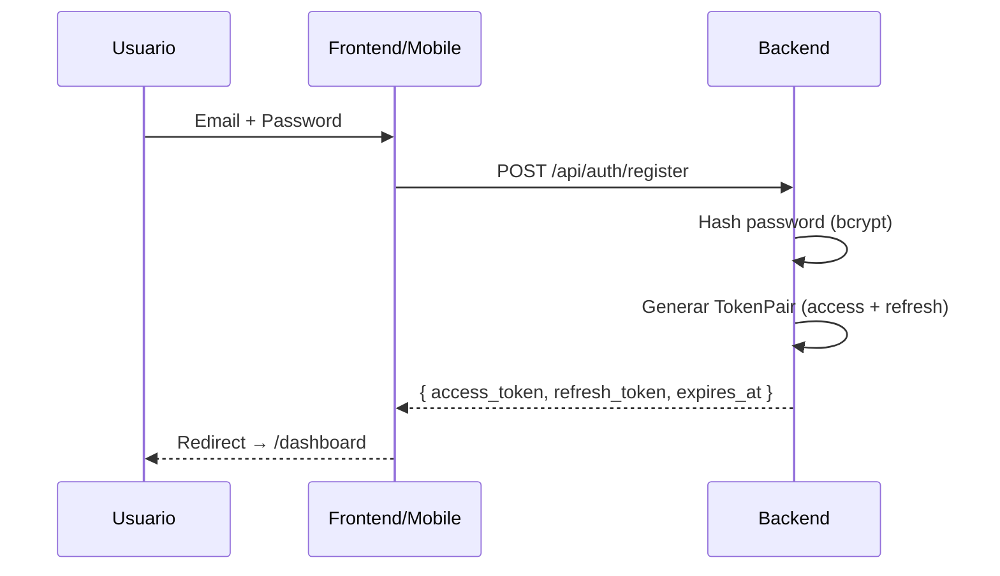
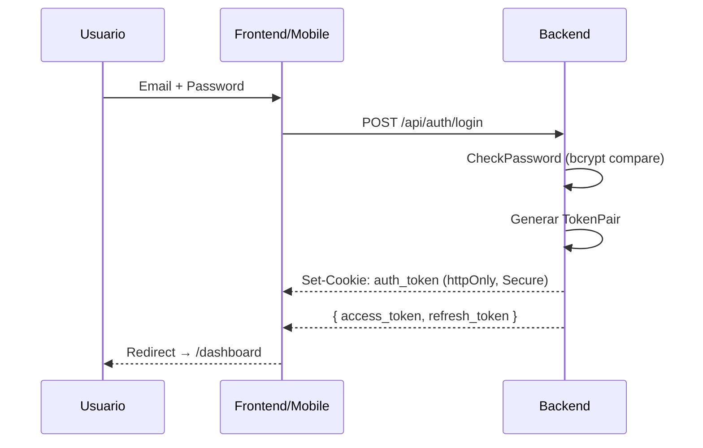
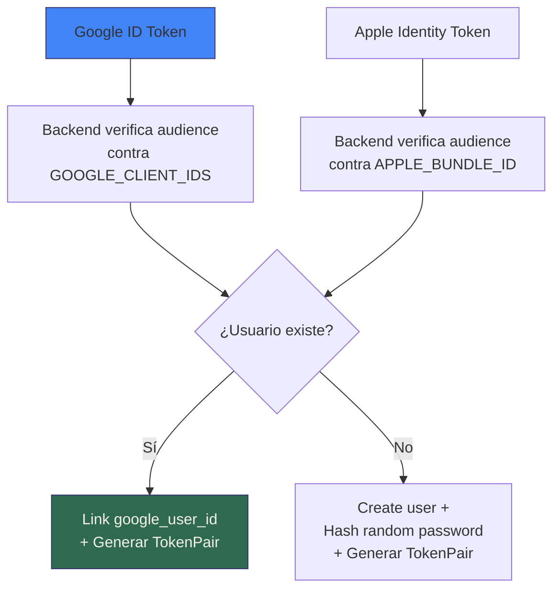

# Autenticación

#backend #auth #seguridad

> [!abstract] Resumen
> Autenticación basada en **JWT HS256** con tres tipos de token: access (24h), refresh (7d), password-reset (1h). Sin ORM, Sin sesiones en DB. Cookies httpOnly para web, Bearer header para mobile.

---

## Flujo de Registro



## Flujo de Login



## Tres Tipos de Token

| Tipo | Subject | Duración | Uso |
|------|---------|----------|-----|
| **Access Token** | `access` | Configurable (default 24h) | Autenticar requests API |
| **Refresh Token** | `refresh` | 7 días | Renovar access tokens sin re-login |
| **Reset Token** | `password-reset` | 1 hora | Restablecer contraseña |

## Token Claims

```go
type TokenClaims struct {
    UserID uuid.UUID `json:"user_id"`
    Email  string    `json:"email"`
    jwt.RegisteredClaims  // exp, iat, iss, sub
}
```

| Claim | Valor | Descripción |
|-------|-------|-------------|
| `iss` | `"solennix-backend"` | Issuer — identifica el emisor del token |
| `sub` | `"access"` / `"refresh"` / `"password-reset"` | Subject — tipo de token |
| `user_id` | UUID | ID del usuario |
| `email` | string | Email del usuario |

> [!important] Validación estricta por tipo
 token
> `ValidateToken()` rechaza tokens con subject `refresh` o `password-reset`.
> `ValidateRefreshToken()` solo acepta subject `refresh`.
> `ValidateResetToken()` solo acepta subject `password-reset`.
> **Previene** que un refresh token se use como access token y viceversa.

## OAuth (Google y Apple)



| Proveedor | Audience Check | Link Account |
|-----------|---------------|-------------|
| Google | `GOOGLE_CLIENT_IDS` (comma-separated: iOS, Android, Web) | `LinkGoogleAccount()` |
| Apple | `APPLE_BUNDLE_ID` | `LinkAppleAccount()` |

> [!note] Password nullable
 Migación 029 hace que `password_hash` sea nullable (`*string`). Esto permite cuentas OAuth-only sin password.

## Token Refresh

1. Cliente envía refresh token a `POST /api/auth/refresh`
2. Backend valida que sea tipo `refresh` (no `access`, no `reset`)
3. Genera nuevo `TokenPair` (access + refresh)
4. Retorna ambos tokens al cliente

## Token Blacklist (Logout)

- Al hacer logout, el token se hashea con SHA-256 y se agrega a `AccessTokenBlacklist` (`sync.Map`)
- El middleware Auth verifica blacklist antes de validar el JWT
- **Limitación**: Blacklist en memoria — se pierde al reiniciar el servidor

> [!warning] Mejora pendiente
> Migrar blacklist a Redis o tabla `revoked_tokens` en DB para persistencia entre reinicios.

## Password Hashing

- **Algoritmo**: bcrypt con `bcrypt.DefaultCost` (cost factor 10)
- **Nunca expuesto**: `PasswordHash` tiene tag `json:"-"`
- `HashPassword()` — genera hash al registrar o cambiar contraseña
- `CheckPassword()` — compara password plana con hash

## Cookies httpOnly (Web)

```go
// Login exitoso:
http.SetCookie(&http.Cookie{
    Name:     "auth_token",
    Value:    tokenPair.AccessToken,
    Path:     "/",
    HttpOnly: true,
    Secure:   cfg.Environment == "production",
    SameSite: http.SameSiteLaxMode,
    MaxAge:   cfg.JWTExpiryHours * 3600,
})

// Logout:
http.SetCookie(&http.Cookie{
    Name:     "auth_token",
    Value:    "",
    Path:     "/",
    HttpOnly: true,
    Secure:   cfg.Environment == "production",
    SameSite: http.SameSiteLaxMode,
    MaxAge:   -1,  // Delete
})
```

## Endpoints

| Metodo | Ruta | Handler | Descripción |
|--------|------|---------|-------------|
| `POST` | `/api/auth/register` | `Register` | Registro email/password |
| `POST` | `/api/auth/login` | `Login` | Login con credenciales |
| `POST` | `/api/auth/logout` | `Logout` | Limpia cookie + blacklist token |
| `POST` | `/api/auth/refresh` | `RefreshToken` | Renueva access token |
| `POST` | `/api/auth/forgot-password` | `ForgotPassword` | Email de recuperación |
| `POST` | `/api/auth/reset-password` | `ResetPassword` | Nueva contraseña con token |
| `POST` | `/api/auth/google` | `GoogleSignIn` | OAuth Google |
| `POST` | `/api/auth/apple` | `AppleSignIn` | OAuth Apple |
| `GET` | `/api/auth/me` | `Me` | Perfil del usuario actual |
| `POST` | `/api/auth/change-password` | `ChangePassword` | Cambio desde perfil |

> Rate limit: **5 requests/minuto** por IP en endpoints de auth.

## Relaciones

- [[Middleware Stack]] — Auth middleware en detalle
- [[Seguridad]] — JWT blacklist, bcrypt, cookies
- [[Arquitectura General]] — Servicios de auth
