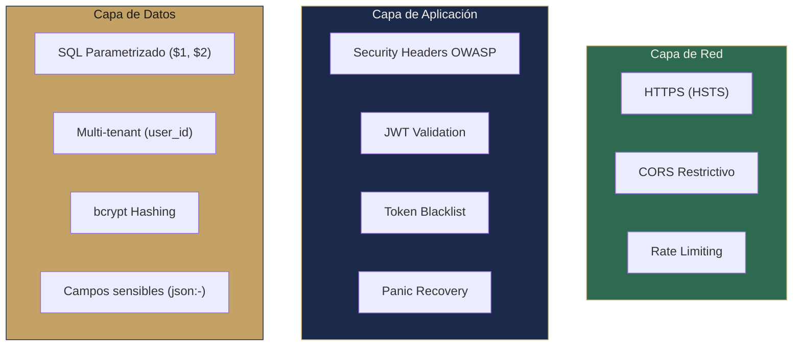

# Seguridad

#backend #seguridad #calidad

> [!abstract] Resumen
> Seguridad implementada en múltiples capas: OWASP headers, rate limiting por IP, JWT con validación estricta por tipo, bcrypt hashing, CORS restrictivo, token blacklist, y queries parametrizadas.

---

## Capas de Seguridad

## Security Headers (OWASP)

| Header | Valor | Protección |
|--------|-------|-----------|
| `X-Content-Type-Options` | `nosniff` | MIME sniffing |
| `X-Frame-Options` | `DENY` | Clickjacking |
| `X-XSS-Protection` | `1; mode=block` | XSS (legacy) |
| `Strict-Transport-Security` | `max-age=31536000; includeSubDomains` | SSL stripping (solo si TLS/proxy HTTPS) |
| `Content-Security-Policy` | `default-src 'self'; script-src 'self'; ...` | XSS, data injection |
| `Referrer-Policy` | `strict-origin-when-cross-origin` | Info leakage |
| `Permissions-Policy` | `geolocation=(), microphone=(), camera=()...` | APIs innecesarias |

> [!tip] CSP Detalle
> CSP permite `style-src 'self' 'unsafe-inline'` para compatibilidad con Tailwind/React. En producción idealmente se usaría nonces.

## Rate Limiting

| Grupo | Limite | Ventana | Algoritmo |
|-------|--------|---------|-----------|
| Auth | 5 req/min | 1 minuto | Fixed window |
| Uploads | 5 req/min | 1 minuto | Fixed window |
| Search | 30 req/min | 1 minuto | Fixed window |
| Admin | 30 req/min | 1 minuto | Fixed window |

> [!warning] Limitaciones
> - **Fixed window**: Permite burst al inicio de cada ventana. Mejor: sliding window o token bucket.
> - **En memoria**: No funciona con múltiples instancias. Para escalar: Redis.
> - **IP extraction**: `X-Forwarded-For` solo si `TrustProxy = true`.

## Autenticación JWT

### Fortalezas

- **3 tipos de token** con validación estricta (access, refresh, reset)
- **Signing method check**: Rechaza tokens firmados con método distinto a HMAC-SHA256
- **Token blacklist**: Tokens revocados en logout se verifican
- **Expiración configurable**: `JWT_EXPIRY_HOURS` (default 24h)
- **Secret mínimo**: `JWT_SECRET` debe tener al menos 32 bytes
- **Issuer claim**: `iss: "solennix-backend"` para identificación

### Mejoras Pendientes

| Mejora | Esfuerzo | Prioridad |
|--------|----------|-----------|
| Blacklist persistente (Redis/DB) | Medio | P1 |
| JWT `jti` claim para revocación granular | Medio | P2 |
| RS256 (asymmetric) para microservicios futuro | Alto | P3 |
| Token rotation en refresh (refresh token rotation) | Bajo | P2 |
| `aud` claim para validar consumidores | Bajo | P2 |

## Password Security

- **bcrypt** con cost factor 10 (`bcrypt.DefaultCost`)
- **Nunca expuesto**: `PasswordHash` usa `json:"-"`
- **Nullable**: OAuth-only users no tienen password (migración 029)
- **Minimum**: No hay validación de password strength en backend (solo frontend)

> [!danger] Gap: Sin password strength validation
> El backend NO valida complejidad de password. Todo depende del frontend. Agregar `len(password) >= 8` mínimo en el handler.

## SQL Injection Prevention

- **Queries parametrizadas**: Todas usan `$1`, `$2`, `$3`...
- **Sin concatenación**: Nunca se concatena input del usuario en SQL
- **pgx**: Driver que soporta nativamente prepared statements

## Multi-Tenant Isolation

- **Todas las queries filtran por `user_id`**
- **Middleware Auth inyecta `UserID` en context**
- **Handlers extraen `UserID` y lo pasan a repos**
- **Ningún endpoint permite acceso cross-tenant**

## CORS

- **Orígenes configurables**: `CORS_ALLOWED_ORIGINS` (comma-separated)
- **Credentials**: `Access-Control-Allow-Credentials: true` para cookies
- **Max-Age**: 1 hora de cache para preflight
- **Métodos**: GET, POST, PUT, DELETE, OPTIONS, PATCH

## Gaps de Seguridad Identificados

> [!danger] P0 — Críticos

| Gap | Impacto | Solución |
|-----|---------|----------|
| **Sin HTTPS enforcement** | Cookies enviadas en claro sin HSTS activo | Forzar HTTPS en producción |
| **Sin password strength** | Passwords débiles aceptadas | Validar en backend |
| **Blacklist en memoria** | Tokens revocados funcionan post-restart | Redis o DB table |

> [!warning] P1 — Importantes

| Gap | Impacto | Solución |
|-----|---------|----------|
| **Sin audit logging** | No hay registro de quién hizo qué | Activity log con user_id, action, resource |
| **Sin rate limiting por usuario** | Solo por IP, usuario con proxy puede evadir | Rate limit por userID autenticado |
| **Upload sin validation de contenido** | Solo extensión, no magic bytes | Verificar MIME real del archivo |
| **Sin CSRF token** | Cookie-based auth vulnerable a CSRF | Double-submit cookie o CSRF token |

> [!note] P2 — Mejoras futuras

| Gap | Impacto | Solución |
|-----|---------|----------|
| CSP con nonces | Protección XSS más robusta | Nonce-based CSP |
| Request signing | Prevenir replay attacks | HMAC signing en headers |
| API versioning | Breaking changes sin versión | `/api/v2/...` |

## Relaciones

- [[Middleware Stack]] — Implementación de cada middleware de seguridad
- [[Autenticación]] — JWT, bcrypt, OAuth
- [[Roadmap Backend]] — Plan de mejoras de seguridad
