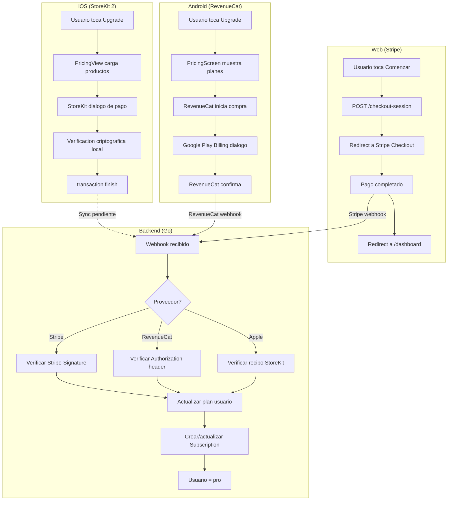

---
tags:
  - prd
  - monetizacion
  - stripe
  - revenuecat
  - solennix
aliases:
  - Monetización
  - Monetization
date: 2026-03-20
updated: 2026-04-04
status: active
---

# Monetizacion — Solennix (iOS + Android + Web)

**Version:** 1.0
**Fecha:** 2026-03-20
**Alcance:** Documento unificado de monetizacion para todas las plataformas
**Audiencia objetivo:** Organizadores de eventos en LATAM

> [!tip] Documentos relacionados
> - [[01_PRODUCT_VISION]] — Vision del producto y mercado objetivo
> - [[02_FEATURES]] — Features completas con tabla de paridad cross-platform
> - [[11_CURRENT_STATUS]] — Estado actual de implementacion y brechas

---

## 1. Modelo de Negocio

> [!info] Modelo general
> **Freemium con suscripcion.** El mismo modelo aplica en todas las plataformas (iOS, Android, Web).

El usuario obtiene una experiencia funcional y util en el tier gratuito — suficiente para organizar eventos pequenos y validar el valor de la app — pero con limitaciones estrategicas en volumen y features avanzados que motivan la conversion a Premium. No se busca frustrar al usuario, sino demostrar que Solennix escala con su negocio.

**Mercado objetivo:** Organizadores de eventos independientes y pequenas empresas de eventos en Latinoamerica (Mexico, Colombia, Argentina, Brasil, Chile, Peru). Precios adaptados al poder adquisitivo de la region.

**Posicionamiento de precio:** Herramienta profesional de gestion de eventos accesible (~$149-199 MXN/mes), competitiva frente a soluciones genericas como hojas de calculo y herramientas manuales que los organizadores usan actualmente.

---

## 2. Tier BASICO (Gratuito)

> [!abstract] Plan Basico
> El plan `basic` es el tier por defecto asignado a todos los usuarios al registrarse. Ofrece funcionalidad suficiente para validar el valor de Solennix con eventos reales.

| Feature | Limite Basico | Justificacion |
|---------|---------------|---------------|
| Eventos por mes | 3 eventos maximo | Suficiente para probar con eventos reales; insuficiente para organizadores activos con multiples eventos |
| Clientes registrados | 50 clientes maximo | Permite construir una base de clientes inicial; motiva upgrade al crecer el negocio |
| Catalogo (productos + inventario) | 20 items maximo | Suficiente para un menu basico; organizadores con catalogo amplio necesitan Premium |
| Dashboard basico | Disponible | KPIs basicos y vista general de eventos proximos |
| Calendario de eventos | Disponible | Funcionalidad core necesaria para validar el producto |
| Generacion de PDFs | Disponible (con marca de agua) | Cotizaciones, contratos y checklists funcionales pero con branding Solennix |
| Gestion de pagos | Disponible | Registro manual de pagos recibidos por evento |
| Widgets de iOS | NO disponible | Diferenciador premium de alto valor percibido |
| Comandos de Siri | NO disponible | Feature aspiracional para power users |
| Soporte prioritario | NO disponible | Incentivo adicional para conversion |
| Reportes avanzados | NO disponible | Analytics y metricas detalladas solo para Premium |

---

## 3. Tier PREMIUM

> [!abstract] Plan Premium
> El plan `premium` desbloquea todas las funcionalidades y elimina todas las restricciones. Es el tier recomendado para organizadores profesionales.

| Feature | Premium |
|---------|---------|
| Eventos por mes | Ilimitados |
| Clientes registrados | Ilimitados |
| Catalogo (productos + inventario) | Ilimitado |
| Dashboard | Completo con analytics avanzados |
| Generacion de PDFs | Sin marca de agua, con branding personalizado del negocio |
| Widgets de iOS | Todos disponibles (eventos proximos, metricas, accesos rapidos) |
| Comandos de Siri | Disponibles |
| Soporte prioritario | Respuesta en menos de 24 horas |
| Reportes avanzados | Metricas de ingresos, analisis por cliente, tendencias |
| Live Activities (iOS) | Seguimiento en tiempo real de eventos en curso |

---

## 4. Tier PRO (Equivalente a Premium)

En el backend, el plan `pro` funciona como equivalente a `premium`. Ambos desbloquean las mismas features. Esta dualidad existe por razones historicas:

- **`premium`**: Usado en la UI de iOS y Android (etiqueta visible al usuario)
- **`pro`**: Usado internamente en el backend y webhooks de Stripe/RevenueCat

El backend acepta ambos valores. La logica de gating trata `pro` y `premium` como equivalentes.

> [!note] Nota tecnica
> El handler de admin (`PUT /api/admin/users/{id}/upgrade`) acepta `basic`, `pro` y `premium` como planes validos. Los webhooks de Stripe y RevenueCat asignan el plan `pro` al usuario al activar una suscripcion.

---

## 5. Plan Gifted (Administrado por Admin)

El administrador puede otorgar acceso Premium a cualquier usuario mediante el endpoint de admin:

```
PUT /api/admin/users/{id}/upgrade
Body: { "plan": "pro", "expires_at": "2026-12-31" }  // expires_at es opcional
```

**Casos de uso:**
- Beta testers que ayudan a probar features nuevas
- Usuarios que reportan bugs criticos (recompensa)
- Influencers o promotores con acuerdos especiales
- Soporte al cliente (compensacion por problemas)

**Restricciones del endpoint:**
- Solo accesible por usuarios con rol `admin`
- No permite degradar a un usuario con suscripcion activa pagada (debe cancelar primero)
- Soporta fecha de expiracion opcional (`expires_at` en formato `YYYY-MM-DD`)

---

## 6. Precios

### Mercado LATAM (Mexico — Precio principal)

Los precios estan definidos en MXN y orientados al mercado latinoamericano.

| Plan | Precio | Precio anterior | Ahorro |
|------|--------|-----------------|--------|
| Mensual | **$149 MXN/mes** | $199 MXN/mes | 25% (precio de lanzamiento) |
| Anual | **$1,499 MXN/ano** | $2,499 MXN/ano | 40% vs precio anterior |
| Equivalente mensual (anual) | ~$125 MXN/mes | — | 16% vs mensual |

> [!note] Precios de lanzamiento
> Los precios de lanzamiento ($149/mes y $1,499/ano) son temporales. Los precios regulares seran $199/mes y $2,499/ano.

### iOS (StoreKit 2)

Los precios en iOS son configurados en App Store Connect y se adaptan automaticamente por region. El precio base de referencia:

| Plan | Precio referencia |
|------|-------------------|
| Mensual | ~$199 MXN/mes (o equivalente regional) |
| Anual | Disponible via `com.solennix.premium.yearly` |

### Mercado Global (US/EU — Futuro)

| Plan | Precio estimado | Equivalente mensual | Ahorro |
|------|----------------|---------------------|--------|
| Mensual | **$9.99 USD/mes** | $9.99 | — |
| Anual | **$79.99 USD/ano** | $6.67 | 33% |

> [!note] Expansion global
> Precios globales aun no configurados. Se implementaran cuando se expanda fuera de LATAM.

### Justificacion de precios

- **$149 MXN (~$8 USD)**: Accesible para micro-empresas de eventos en Mexico. Mas barato que cualquier SaaS de gestion de eventos del mercado.
- **Precio de lanzamiento**: Descuento temporal para capturar early adopters y generar base de usuarios pagos.
- **Anual con descuento**: Incentiva compromiso a largo plazo; mayor LTV por usuario.
- **Sin lifetime por ahora**: El modelo SaaS recurrente es preferible para revenue predecible. Se evaluara lifetime en el futuro.

---

## 7. Implementacion por Plataforma

### 7.1 iOS (StoreKit 2)

| Aspecto | Detalle |
|---------|---------|
| Framework | StoreKit 2 (nativo, sin SDK de terceros para compras) |
| Productos | `com.solennix.premium.monthly`, `com.solennix.premium.yearly` |
| Verificacion | Verificacion criptografica local via `VerificationResult` de StoreKit 2 |
| Sync con backend | Placeholder via `syncWithRevenueCat()` — pendiente de implementar envio de recibo al backend |
| Restore | `AppStore.sync()` + verificacion de `Transaction.currentEntitlement` para cada producto |
| Transaction listener | `Transaction.updates` escuchado en segundo plano desde inicio de la app |
| Estado local | `SubscriptionManager` como `@Observable`, inyectado via `@Environment` |
| Manejo de errores | `SubscriptionError` enum con casos: `productsNotFound`, `purchaseFailed`, `verificationFailed`, `userCancelled`, `pending`, `unknown` |

**Product IDs de StoreKit:**
```
com.solennix.premium.monthly   → Suscripcion mensual
com.solennix.premium.yearly    → Suscripcion anual
```

> [!tip] Arquitectura iOS
> Ver [[05_TECHNICAL_ARCHITECTURE_IOS]] para detalles de la arquitectura de paquetes SPM y el flujo de `SubscriptionManager`.

### 7.2 Android (Google Play Billing via RevenueCat)

| Aspecto | Detalle |
|---------|---------|
| Framework | RevenueCat SDK (wraps Google Play Billing Library) |
| Pantallas | `SubscriptionScreen` (gestion de suscripcion), `PricingScreen` (paywall con planes) |
| Feature gating | Implementado via estado de suscripcion de RevenueCat |
| Verificacion | Server-side via RevenueCat webhooks al backend Go |
| Sync con backend | RevenueCat webhooks → `POST /api/subscriptions/webhook/revenuecat` |

> [!note] Estado de implementacion Android
> RevenueCat SDK esta integrado en el modulo Android. Las pantallas `SubscriptionScreen` y `PricingScreen` existen y manejan el flujo de compra a traves de RevenueCat, que internamente usa Google Play Billing. La verificacion server-side se realiza via webhooks de RevenueCat al backend.

> [!tip] Arquitectura Android
> Ver [[06_TECHNICAL_ARCHITECTURE_ANDROID]] para detalles de la arquitectura multi-module y la integracion de RevenueCat.

### 7.3 Web (Stripe)

| Aspecto | Detalle |
|---------|---------|
| Proveedor | Stripe |
| Checkout | Stripe Checkout Sessions (`POST /api/subscriptions/checkout-session`) |
| Portal de facturacion | Stripe Customer Portal (`POST /api/subscriptions/portal-session`) |
| Webhook | `POST /api/subscriptions/webhook/stripe` — verifica firma con `Stripe-Signature` |
| Eventos procesados | `checkout.session.completed`, `customer.subscription.updated`, `customer.subscription.deleted`, `invoice.payment_failed` |
| Fallback de customer ID | Si el `StripeCustomerID` almacenado falla, reintenta con email del usuario |
| URLs de redireccion | Success: `/dashboard?session_id={ID}`, Cancel: `/pricing` |
| Precio configurado | Via `STRIPE_PRO_PRICE_ID` (variable de entorno) |

> [!tip] Arquitectura Web
> Ver [[08_TECHNICAL_ARCHITECTURE_WEB]] para detalles de la arquitectura React/TypeScript y la integracion con Stripe.

### 7.4 Backend (Go)

**Endpoints de suscripcion:**

| Metodo | Ruta | Descripcion | Auth |
|--------|------|-------------|------|
| `GET` | `/api/subscriptions/status` | Estado actual del plan y suscripcion | Si |
| `POST` | `/api/subscriptions/checkout-session` | Crear sesion de Stripe Checkout | Si |
| `POST` | `/api/subscriptions/portal-session` | Crear sesion de Stripe Customer Portal | Si |
| `POST` | `/api/subscriptions/webhook/stripe` | Webhook de Stripe (verificado por firma) | No (firma) |
| `POST` | `/api/subscriptions/webhook/revenuecat` | Webhook de RevenueCat (verificado por Authorization header) | No (secret) |
| `POST` | `/api/subscriptions/debug-upgrade` | Upgrade debug (solo dev, solo admin) | Si + Admin |
| `POST` | `/api/subscriptions/debug-downgrade` | Downgrade debug (solo dev, solo admin) | Si + Admin |

> [!tip] Arquitectura Backend
> Ver [[07_TECHNICAL_ARCHITECTURE_BACKEND]] para detalles del repository pattern y middleware de autenticacion.

**Modelo de datos — Subscription:**

```go
type Subscription struct {
    ID                  uuid.UUID   // PK
    UserID              uuid.UUID   // FK a users
    Provider            string      // 'stripe' | 'apple' | 'google'
    ProviderSubID       *string     // ID de suscripcion del proveedor
    RevenueCatAppUserID *string     // ID de usuario en RevenueCat
    Plan                string      // 'basic' | 'pro'
    Status              string      // 'active' | 'past_due' | 'canceled' | 'trialing'
    CurrentPeriodStart  *time.Time
    CurrentPeriodEnd    *time.Time
}
```

**Modelo de datos — User (campos relevantes):**

```go
type User struct {
    Plan             string      // 'basic' | 'pro' | 'premium'
    StripeCustomerID *string     // ID de cliente en Stripe
    PlanExpiresAt    *time.Time  // Fecha de expiracion del plan (para upgrades manuales)
}
```

**Mapeo de eventos de webhook:**

| Evento Stripe | Accion backend |
|---------------|----------------|
| `checkout.session.completed` | Upgrade a `pro`, guardar `StripeCustomerID`, crear registro de Subscription |
| `customer.subscription.updated` (active) | Mantener `pro`, actualizar periodo |
| `customer.subscription.updated` (past_due) | Mantener `pro`, marcar suscripcion como `past_due` |
| `customer.subscription.updated` (canceled) | Mantener `pro` hasta fin de periodo, marcar como `canceled` |
| `customer.subscription.updated` (unpaid) | Downgrade a `basic` |
| `customer.subscription.deleted` | Downgrade a `basic` |
| `invoice.payment_failed` | Marcar suscripcion como `past_due` |

| Evento RevenueCat | Accion backend |
|--------------------|----------------|
| `INITIAL_PURCHASE` | Upgrade a `pro` |
| `RENEWAL` | Upgrade a `pro` |
| `UNCANCELLATION` | Upgrade a `pro` |
| `CANCELLATION` | Downgrade a `basic` |
| `EXPIRATION` | Downgrade a `basic` |
| `BILLING_ISSUE` | Downgrade a `basic` |
| `PRODUCT_CHANGE` | Log informativo (cambio de plan) |

**Cache de estado Stripe:**
El endpoint `GET /api/subscriptions/status` incluye un cache en memoria de 5 minutos para datos de Stripe (`cancel_at_period_end`, `current_period_end`) para evitar rate limits de la API de Stripe.

---

## 8. Feature Gating (Enforcement)

### 8.1 Mecanismo principal — PlanLimitsManager (iOS)

El `PlanLimitsManager` es el componente central de enforcement en iOS. Es un objeto `@Observable` que:

1. Consulta la API para contar eventos del mes, clientes y items de catalogo
2. Compara contra los limites configurados
3. Expone propiedades booleanas para verificar si el usuario puede crear mas items

**Limites configurados:**

```swift
static let freePlanEventLimit = 3     // Eventos por mes
static let clientLimit = 50           // Clientes totales
static let catalogLimit = 20          // Productos + items de inventario
```

**Propiedades de verificacion:**

| Propiedad | Logica |
|-----------|--------|
| `isBasicPlan` | `user.plan == .basic` |
| `canCreateEvent` | `!isBasicPlan \|\| eventsThisMonth < 3` |
| `canCreateClient` | `!isBasicPlan \|\| clientsCount < 50` |
| `canCreateCatalogItem` | `!isBasicPlan \|\| catalogCount < 20` |

**Calculo de catalogo:** `catalogCount = products.count + inventory.count` — ambos tipos cuentan contra el mismo limite.

### 8.2 Gating por pantalla

| Pantalla | Restriccion Basico | Indicador UI |
|----------|-------------------|--------------|
| Formulario de evento | Bloqueado si `eventsThisMonth >= 3` | Prompt de upgrade |
| Lista de clientes | Boton "+" deshabilitado si `clientsCount >= 50` | Contador visible + icono de candado |
| Formulario de producto | Bloqueado si `catalogCount >= 20` | Prompt de upgrade |
| Formulario de inventario | Bloqueado si `catalogCount >= 20` | Prompt de upgrade |
| Pricing/Planes | Muestra plan actual, opciones de upgrade | Badge de plan actual |
| Settings | Muestra tier actual, link a gestion de suscripcion | Badge + boton de upgrade |

### 8.3 Indicadores UI

- **PlanBadge:** Badge visual que muestra el plan actual del usuario (Basico/Premium)
- **Boton "Actualizar a Premium":** Presente en Settings y en puntos de friccion
- **Prompts de upgrade:** Contextuales cuando el usuario alcanza un limite
- **Seccion de comparacion:** Tabla comparativa Basico vs Premium en PricingView

### 8.4 Comportamiento al alcanzar un limite

```
1. Usuario intenta crear un evento/cliente/producto
2. PlanLimitsManager verifica el conteo actual contra el limite
3. Si excede el limite:
   a. La accion se bloquea (boton deshabilitado o interceptado)
   b. Se muestra un prompt contextual explicando el limite
   c. Se ofrece boton directo a la pantalla de Pricing
4. Los datos existentes NO se eliminan ni restringen — solo se bloquea la creacion de nuevos
```

---

## 9. Flujos de Compra

### 9.1 Diagrama de flujo de suscripcion (cross-platform)



### 9.2 Flujo de compra — iOS (StoreKit 2)

```
 1. Usuario toca feature Premium o boton "Actualizar a Premium"
 2. Se navega a PricingView
 3. PricingView carga productos de StoreKit via SubscriptionManager.loadProducts()
 4. Se muestran botones con precios reales del App Store (localizados)
 5. Usuario selecciona plan (Mensual / Anual)
 6. SubscriptionManager.purchase(product) inicia la transaccion
 7. StoreKit muestra dialogo de pago nativo (Face ID / Touch ID)
 8. Se verifica la firma criptografica de la transaccion
 9. Se llama transaction.finish()
10. Se actualiza el estado de suscripcion localmente
11. Se sincroniza con el backend (pendiente de implementar completamente)
12. UI se actualiza inmediatamente — features Premium desbloqueadas
```

### 9.3 Flujo de compra — Android (RevenueCat)

```
 1. Usuario toca feature Premium o boton "Actualizar a Premium"
 2. Se navega a PricingScreen
 3. PricingScreen carga ofertas de RevenueCat
 4. Se muestran planes con precios reales de Google Play (localizados)
 5. Usuario selecciona plan (Mensual / Anual)
 6. RevenueCat SDK inicia la compra via Google Play Billing
 7. Google Play muestra dialogo de pago nativo
 8. RevenueCat confirma la transaccion y actualiza estado local
 9. RevenueCat envia webhook al backend
10. Backend actualiza plan del usuario a 'pro'
11. UI se actualiza — features Premium desbloqueadas
```

### 9.4 Flujo de compra — Web (Stripe)

```
 1. Usuario visita /pricing o toca "Comenzar ahora"
 2. Frontend llama POST /api/subscriptions/checkout-session
 3. Backend crea Stripe Checkout Session con el precio configurado
 4. Frontend redirige al usuario a la URL de Stripe Checkout
 5. Usuario completa el pago en Stripe
 6. Stripe redirige a /dashboard?session_id={ID}
 7. Stripe envia webhook checkout.session.completed al backend
 8. Backend actualiza plan del usuario a 'pro' y guarda StripeCustomerID
 9. Backend crea/actualiza registro de Subscription
10. Frontend detecta el cambio de plan y actualiza la UI
```

### 9.5 Flujo de restauracion

**iOS:**
```
1. Usuario toca "Restaurar compras" en PricingView
2. SubscriptionManager.restorePurchases() llama AppStore.sync()
3. Se verifican entitlements actuales via Transaction.currentEntitlement
4. Si hay suscripcion activa → isPremium = true
5. UI se actualiza
```

**Android:**
```
1. Usuario toca "Restaurar compras" en PricingScreen
2. RevenueCat SDK verifica entitlements activos con su servidor
3. Si hay suscripcion activa → estado Premium restaurado
4. RevenueCat notifica al backend via webhook si es necesario
5. UI se actualiza
```

**Web:**
```
1. El estado del plan se obtiene de GET /api/subscriptions/status
2. Si el usuario tiene una suscripcion activa en Stripe, el plan se refleja automaticamente
3. No hay flujo de "restauracion" manual — el backend es la fuente de verdad
```

### 9.6 Flujo de expiracion / cancelacion

```
1. Usuario cancela suscripcion (via App Store / Google Play / Stripe Customer Portal)
2. La suscripcion se mantiene activa hasta el final del periodo pagado
3. Al expirar:
   - Stripe: webhook customer.subscription.deleted → backend downgrade a 'basic'
   - iOS: Transaction.updates detecta cambio → isPremium = false
   - Android: RevenueCat detecta expiracion → webhook EXPIRATION → backend downgrade a 'basic'
   - RevenueCat: webhook EXPIRATION / CANCELLATION → backend downgrade a 'basic'
4. El usuario conserva todos sus datos pero no puede crear nuevos items si excede los limites del plan Basico
```

### 9.7 Elementos de la Paywall (PricingView)

- Plan actual del usuario con badge visual
- Tarjeta del plan Basico con features incluidas
- Tarjeta del plan Premium con badge "Recomendado"
- Precios reales del App Store / Google Play / Stripe (localizados por region)
- Boton de compra mensual y anual con loading state
- Tabla comparativa de funciones (Basico vs Premium)
- Boton "Restaurar compras"
- Boton "Administrar suscripcion" (solo si ya es Premium)
- Seccion de FAQ con preguntas frecuentes
- Links a Terminos de Uso y Politica de Privacidad:
  - Terms: https://creapolis.dev/terms-of-use/
  - Privacy: https://creapolis.dev/privacy-policy/

---

## 10. Metricas de Monetizacion

### 10.1 Objetivos de conversion

| Metrica | Target (30 dias) | Target (90 dias) | Stretch |
|---------|-------------------|-------------------|---------|
| Conversion Basico → Premium | >= 5% | >= 8% | >= 12% |
| Trial-to-Paid (si se implementa trial) | — | >= 35% | >= 50% |
| Churn mensual | — | < 10% | < 6% |
| ARPU (usuarios de pago) | >= $149 MXN/mes | >= $149 MXN/mes | >= $180 MXN/mes |

### 10.2 Proyecciones de revenue (conservadoras — mercado LATAM)

| Escenario | MAU | Conversion | ARPU (MXN) | MRR (MXN) | MRR (USD ~) |
|-----------|-----|-----------|------------|-----------|-------------|
| Base (Mes 6) | 2K | 5% | $149 | $14,900 | ~$830 |
| Bueno (Mes 6) | 5K | 8% | $149 | $59,600 | ~$3,300 |
| Stretch (Mes 12) | 10K | 10% | $165 | $165,000 | ~$9,200 |

### 10.3 Metricas a trackear

| Metrica | Herramienta |
|---------|-------------|
| Conversion por plan (mensual/anual) | Backend analytics |
| Revenue por plataforma (iOS/Android/Web) | App Store Connect / Google Play Console / Stripe Dashboard |
| Paywall view-to-purchase rate | In-app analytics |
| Feature mas intentada por usuarios Basico (trigger de conversion) | In-app analytics |
| Tiempo promedio Basico → Premium | Backend analytics |
| Churn por cohorte | Backend analytics |
| LTV por plan | Calculado (ARPU / churn rate) |
| Limite mas frecuentemente alcanzado | Backend analytics (eventos vs clientes vs catalogo) |

---

## 11. Problemas Actuales y Brechas

> [!warning] Brechas criticas
> Las siguientes secciones documentan problemas conocidos que deben resolverse antes del lanzamiento. Ver [[11_CURRENT_STATUS]] para el estado general del proyecto.

### 11.1 iOS — Features anunciadas como Premium pero NO gateadas

| Feature | Estado actual | Accion requerida |
|---------|---------------|------------------|
| Generacion de PDFs sin marca de agua | Disponible para todos | Agregar marca de agua para plan Basico |
| Widgets de iOS | Accesibles sin restriccion | Agregar gate — mostrar upgrade prompt |
| Comandos de Siri | Accesibles sin restriccion | Agregar gate |
| Reportes avanzados | No implementados aun | Implementar con gate desde el inicio |
| Live Activities | Accesibles sin restriccion | Evaluar si gatear o dejar como feature general |
| Sync con backend (RevenueCat) | `syncWithRevenueCat()` es un placeholder vacio | Implementar envio de recibo al backend para validacion server-side |

### 11.2 iOS — Discrepancia de plan enum

> [!warning] Bug potencial
> El modelo `Plan` en iOS (`SolennixCore/Models/User.swift`) solo define `basic` y `premium`, pero el backend puede enviar `pro`. Si el backend responde con `plan: "pro"`, el decode fallara o se interpretara incorrectamente.

**Accion requerida:** Agregar `case pro` al enum `Plan` en iOS, o mapear `pro` → `premium` en el decoder.

### 11.3 Android — Gating parcial

> [!note] Estado actualizado
> RevenueCat SDK esta integrado y las pantallas de suscripcion (`SubscriptionScreen`, `PricingScreen`) existen. Sin embargo, el feature gating en la UI (limites de eventos, clientes, catalogo) aun requiere implementacion completa.

| Componente | Estado |
|------------|--------|
| Google Play Billing (via RevenueCat) | Implementado |
| SubscriptionScreen | Implementado |
| PricingScreen (Paywall) | Implementado |
| Feature gating UI (limites) | Pendiente — no existe PlanLimitsManager equivalente |
| Indicadores de limites en UI | Pendiente |

### 11.4 Web — Gating parcial

| Feature | Estado |
|---------|--------|
| Checkout de Stripe | Funcional |
| Portal de facturacion | Funcional |
| Gating de creacion de eventos/clientes/catalogo | **No implementado en frontend** — el backend no rechaza creacion por plan |
| UI de limites alcanzados | No existe |

### 11.5 Backend — Sin enforcement server-side

> [!warning] Riesgo de seguridad
> Actualmente el backend **no rechaza** operaciones de creacion basado en el plan del usuario. Todo el enforcement se hace del lado del cliente (iOS `PlanLimitsManager`). Esto significa que:

- Un usuario podria bypassear los limites usando la API directamente
- El web no tiene enforcement ya que no tiene PlanLimitsManager equivalente
- **Accion requerida:** Agregar middleware o validacion en handlers de creacion que verifique limites basado en el plan del usuario

### 11.6 Precios — Alineacion pendiente

| Plataforma | Precio actual (implementado) | Precio objetivo |
|------------|------------------------------|-----------------|
| iOS (StoreKit) | Configurado en App Store Connect (verificar) | $199 MXN/mes, equivalente anual |
| Web (Stripe) | Depende de `STRIPE_PRO_PRICE_ID` | $149 MXN/mes (lanzamiento), $199 MXN/mes (regular) |
| Android (RevenueCat) | Configurado via Google Play Console / RevenueCat | $199 MXN/mes equivalente |

**Accion requerida:** Verificar y alinear precios entre todas las plataformas. El precio de lanzamiento en web ($149/mes) debe coincidir con lo configurado en App Store Connect para iOS y Google Play Console para Android.

---

#prd #monetizacion #stripe #revenuecat #solennix
