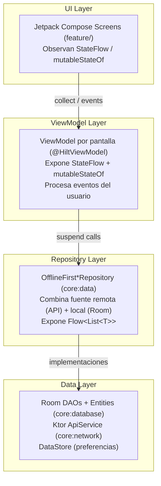
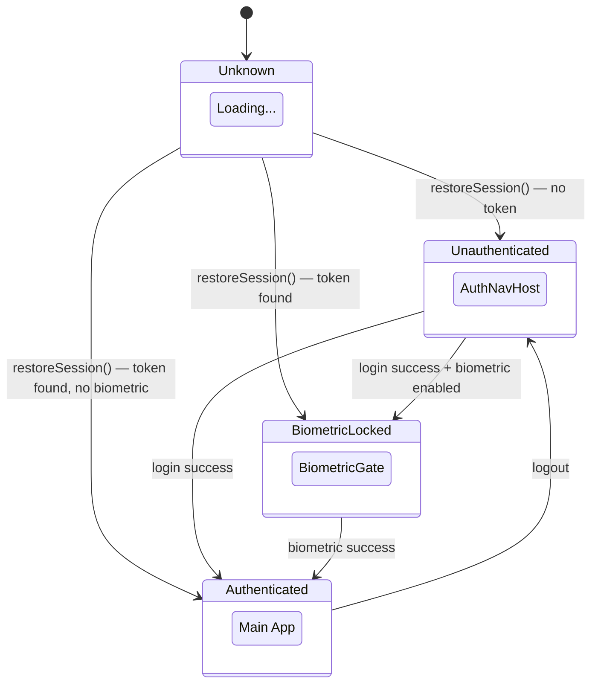
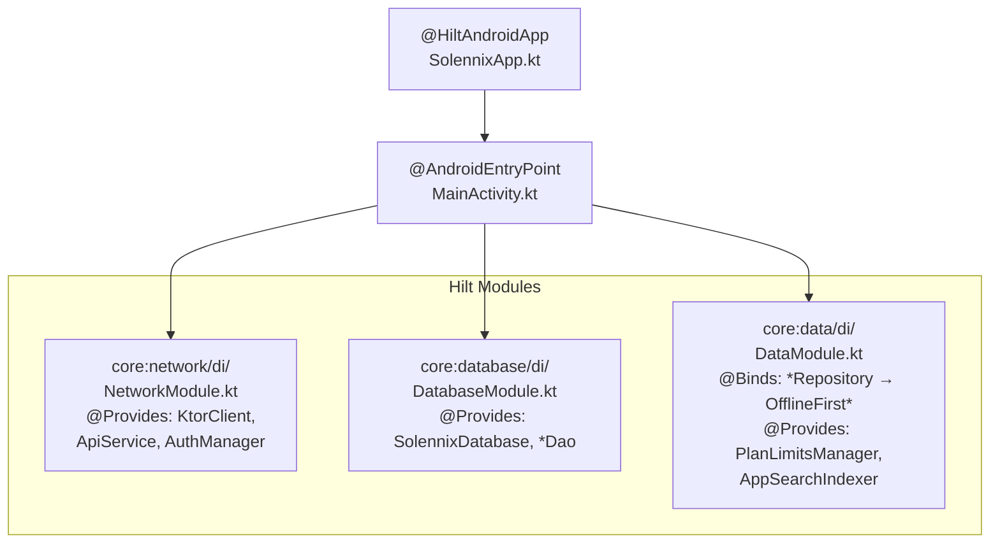

---
tags:
  - prd
  - arquitectura
  - android
  - compose
  - solennix
aliases:
  - Arquitectura Android
  - Android Architecture
date: 2026-03-20
updated: 2026-04-04
status: active
platform: Android
---

# Arquitectura Técnica — Android

**Versión:** 1.0
**Fecha:** 2026-03-20
**Plataforma:** Android (teléfono/tablet)

> [!tip] Documentos relacionados
> [[PRD MOC]] · [[01_PRODUCT_VISION]] · [[02_FEATURES]] · [[05_TECHNICAL_ARCHITECTURE_IOS]] · [[07_TECHNICAL_ARCHITECTURE_BACKEND]] · [[08_TECHNICAL_ARCHITECTURE_WEB]] · [[11_CURRENT_STATUS]]

---

## 1. Stack Tecnológico

> [!info] Stack principal
> **Kotlin 2.0** + **Jetpack Compose** (Material 3) + **Hilt** + **Ktor Client** + **Room** — orientado a offline-first con arquitectura multi-módulo MVVM.

| Capa              | Tecnología                        | Versión         | Justificación                                                               |
| ----------------- | --------------------------------- | --------------- | --------------------------------------------------------------------------- |
| **Lenguaje**      | Kotlin                            | 2.0.21          | Coroutines, null safety, first-class Android                                |
| **KSP**           | kotlin-symbol-processing          | 2.0.21-1.0.28   | Debe coincidir exactamente con la versión de Kotlin                         |
| **Build**         | AGP + Gradle                      | 8.13.2 + Gradle | Version Catalogs (`libs.versions.toml`)                                     |
| **UI**            | Jetpack Compose + Material 3      | BOM 2024.12.01  | Declarativa, Material You dynamic color                                     |
| **Arquitectura**  | MVVM                              | —               | ViewModel por pantalla, StateFlow + mutableStateOf para reactividad         |
| **DI**            | Hilt (Dagger)                     | 2.53.1          | Constructor injection, `@HiltViewModel`, `@HiltWorker` para WorkManager     |
| **DB Local**      | Room                              | 2.6.1           | SQLite typesafe con KSP, cache offline                                      |
| **Networking**    | Ktor Client                       | 3.0.3           | Motor OkHttp, Kotlinx Serialization, DTOs alineados con backend Go          |
| **Background**    | WorkManager                       | 2.10.0          | Sync diferido y tareas en segundo plano                                     |
| **Widgets**       | Glance                            | 1.1.1           | Compose-based widgets para Home Screen                                      |
| **Imágenes**      | Coil 3                            | 3.0.4           | Carga de imágenes con motor Ktor                                            |
| **Serialización** | Kotlinx Serialization             | 1.7.3           | JSON parsing compartido con Ktor                                            |
| **Billing**       | Play Billing Library              | 7.1.1           | Suscripciones in-app (FREE/PRO)                                             |
| **Biometría**     | AndroidX Biometric                | 1.2.0-alpha05   | Autenticación biométrica                                                    |
| **Credenciales**  | Credential Manager                | 1.5.0-rc01      | Google One Tap Sign-In                                                      |
| **Seguridad**     | Security Crypto                   | 1.1.0-alpha06   | EncryptedSharedPreferences para tokens                                      |
| **DataStore**     | Preferences DataStore             | 1.1.1           | Preferencias de usuario                                                     |
| **Charts**        | Vico                              | 2.0.0-alpha.28  | Gráficos para dashboard                                                     |
| **Adaptive**      | material3-window-size-class       | via BOM         | `WindowWidthSizeClass` para layouts responsivos                             |
| **Window**        | androidx.window                   | 1.3.0           | Soporte para foldables                                                      |
| **Navegación**    | Navigation Compose                | 2.8.5           | Navegación declarativa con type safety                                      |
| **Firebase**      | Firebase BOM                      | 33.9.0          | Messaging + Analytics                                                       |
| **Testing**       | JUnit5 + MockK + Turbine          | —               | Unit tests de ViewModels + validaciones de labels de accesibilidad TalkBack |
| **Performance**   | Baseline Profile + Macrobenchmark | 1.3.3           | Perfilado de startup y optimización de tiempos de arranque en release       |
| **SDK**           | minSdk 26 — targetSdk 35          | —               | Android 8.0+ hasta Android 15                                               |

---

## 2. Arquitectura — MVVM

### Patrón General

> [!abstract] Resumen de arquitectura
> El proyecto utiliza **MVVM (Model-View-ViewModel)** con arquitectura multi-módulo. Cada pantalla tiene su ViewModel inyectado con Hilt, y la UI observa el estado de forma reactiva.



### Principios

- **Un ViewModel por pantalla**: cada screen tiene su propio ViewModel inyectado con `@HiltViewModel`
- **Reactividad mixta**: StateFlow para datos asíncronos (listas, búsqueda), `mutableStateOf` para estado de formulario local
- **Hilt para DI**: módulos en `core/*/di/`, `@Inject constructor` en repositorios y servicios
- **Offline-first**: los repositorios combinan cache Room con llamadas a la API remota
- **Flujo unidireccional**: UI → ViewModel (eventos) → Repository → Data → UI (estados)
- **Multi-módulo**: separación estricta entre `core/`, `feature/`, `app/`, `widget/`

---

## 3. Estructura del Proyecto

```
android/
├── app/                                    # Módulo principal de la aplicación
│   ├── build.gradle.kts                    # Dependencias: todos los core + feature modules
│   └── src/main/java/.../solennix/
│       ├── SolennixApp.kt                  # @HiltAndroidApp Application class
│       ├── MainActivity.kt                 # Single Activity, FragmentActivity + EdgeToEdge
│       ├── MainNavHost.kt                  # Auth state machine + deep links + adaptive layout
│       └── ui/navigation/
│           ├── AuthNavHost.kt              # Flujo de autenticación (Login/Register/Forgot)
│           ├── CompactBottomNavLayout.kt   # Bottom navigation para teléfonos (Compact)
│           └── AdaptiveNavigationRailLayout.kt  # NavigationRail para tablets (Medium/Expanded)
│
├── core/
│   ├── model/                              # Data classes compartidas
│   │   └── src/main/java/.../core/model/
│   │       ├── Client.kt                   # Cliente
│   │       ├── Event.kt                    # Evento
│   │       ├── EventProduct.kt             # Producto de evento
│   │       ├── EventExtra.kt               # Extra de evento
│   │       ├── EventEquipment.kt           # Equipo de evento
│   │       ├── EventSupply.kt              # Insumo de evento
│   │       ├── EventPhoto.kt               # Foto de evento
│   │       ├── Product.kt                  # Producto del catálogo
│   │       ├── ProductIngredient.kt        # Ingrediente de producto
│   │       ├── InventoryItem.kt            # Item de inventario
│   │       ├── Payment.kt                  # Pago
│   │       ├── User.kt                     # Usuario
│   │       ├── AuthResponse.kt             # Respuesta de autenticación
│   │       ├── ApiError.kt                 # Error de API
│   │       ├── EquipmentConflict.kt        # Conflicto de equipo
│   │       ├── EquipmentSuggestion.kt      # Sugerencia de equipo
│   │       ├── SupplySuggestion.kt         # Sugerencia de insumo
│   │       ├── UnavailableDate.kt          # Fecha no disponible
│   │       └── extensions/
│   │           ├── CurrencyFormatting.kt   # .asMXN() formato moneda
│   │           ├── DateFormatting.kt       # Formato de fechas
│   │           └── StringValidation.kt     # Validaciones de strings
│   │
│   ├── network/                            # Cliente HTTP Ktor
│   │   └── src/main/java/.../core/network/
│   │       ├── KtorClient.kt              # HttpClient(OkHttp) + bearer auth + JSON
│   │       ├── ApiService.kt              # Wrapper genérico: get<T>, post<T>, put<T>, delete<T>
│   │       ├── AuthManager.kt             # Gestión de sesión + AuthState (sealed class)
│   │       ├── Endpoints.kt               # Constantes de endpoints de la API
│   │       ├── NetworkMonitor.kt          # Conectividad de red
│   │       ├── EventDayNotificationManager.kt  # Notificaciones de eventos del día
│   │       └── di/
│   │           └── NetworkModule.kt       # Provides KtorClient, ApiService, AuthManager
│   │
│   ├── designsystem/                       # Sistema de diseño Material 3
│   │   └── src/main/java/.../core/designsystem/
│   │       ├── theme/
│   │       │   ├── Theme.kt               # SolennixTheme (Material 3 + custom colors)
│   │       │   ├── Color.kt               # Paleta de colores
│   │       │   ├── Typography.kt          # Tipografía
│   │       │   ├── Shape.kt               # Formas
│   │       │   ├── Spacing.kt             # Espaciado
│   │       │   ├── Elevation.kt           # Elevaciones
│   │       │   ├── Gradient.kt            # Gradientes
│   │       │   └── SolennixColorScheme.kt # Esquema de colores personalizado
│   │       ├── component/
│   │       │   ├── SolennixTextField.kt   # Campo de texto customizado
│   │       │   ├── Avatar.kt              # Avatar de usuario/cliente
│   │       │   ├── StatusBadge.kt         # Badge de estado de evento
│   │       │   ├── KPICard.kt             # Tarjeta de KPI para dashboard
│   │       │   ├── ConfirmDialog.kt       # Diálogo de confirmación
│   │       │   ├── EmptyState.kt          # Estado vacío
│   │       │   ├── PremiumButton.kt       # Botón premium con gating
│   │       │   ├── SkeletonLoading.kt     # Skeleton loading
│   │       │   ├── ToastOverlay.kt        # Toast overlay
│   │       │   └── UpgradeBanner.kt       # Banner de upgrade PRO
│   │       └── util/
│   │           └── HapticFeedback.kt      # Haptic feedback helper
│   │
│   ├── database/                           # Base de datos Room
│   │   └── src/main/java/.../core/database/
│   │       ├── SolennixDatabase.kt        # @Database con todas las entidades
│   │       ├── converter/
│   │       │   └── JsonConverters.kt      # TypeConverters para Room
│   │       ├── entity/
│   │       │   ├── CachedClient.kt        # Entidad cache de cliente
│   │       │   ├── CachedEvent.kt         # Entidad cache de evento
│   │       │   ├── CachedEventProduct.kt  # Entidad cache de producto de evento
│   │       │   ├── CachedEventExtra.kt    # Entidad cache de extra de evento
│   │       │   ├── CachedInventoryItem.kt # Entidad cache de inventario
│   │       │   ├── CachedPayment.kt       # Entidad cache de pago
│   │       │   └── CachedProduct.kt       # Entidad cache de producto
│   │       ├── dao/
│   │       │   ├── ClientDao.kt           # CRUD clientes
│   │       │   ├── EventDao.kt            # CRUD eventos
│   │       │   ├── EventItemDao.kt        # CRUD productos/extras de evento
│   │       │   ├── InventoryDao.kt        # CRUD inventario
│   │       │   ├── PaymentDao.kt          # CRUD pagos
│   │       │   └── ProductDao.kt          # CRUD productos
│   │       └── di/
│   │           └── DatabaseModule.kt      # Provides SolennixDatabase + DAOs
│   │
│   └── data/                               # Repositorios (offline-first)
│       └── src/main/java/.../core/data/
│           ├── repository/
│           │   ├── ClientRepository.kt         # OfflineFirstClientRepository
│           │   ├── EventRepository.kt          # OfflineFirstEventRepository
│           │   ├── ProductRepository.kt        # OfflineFirstProductRepository
│           │   ├── InventoryRepository.kt      # OfflineFirstInventoryRepository
│           │   └── PaymentRepository.kt        # OfflineFirstPaymentRepository
│           ├── plan/
│           │   └── PlanLimitsManager.kt        # Gestión de límites FREE/PRO
│           ├── search/
│           │   └── AppSearchIndexer.kt         # Indexación para búsqueda global
│           └── di/
│               └── DataModule.kt               # Binds repositorios + provides
│
├── feature/
│   ├── auth/                               # Autenticación
│   │   └── ui/
│   │       ├── LoginScreen.kt             # Pantalla de login
│   │       ├── RegisterScreen.kt          # Pantalla de registro
│   │       ├── ForgotPasswordScreen.kt    # Recuperar contraseña
│   │       ├── ResetPasswordScreen.kt     # Restablecer contraseña
│   │       ├── BiometricGateScreen.kt     # Gate biométrico
│   │       └── GoogleSignInButton.kt      # Botón Google One Tap
│   │   └── viewmodel/
│   │       └── AuthViewModel.kt           # Login, register, session mgmt
│   │
│   ├── dashboard/                          # Pantalla principal
│   │   └── ui/
│   │       ├── DashboardScreen.kt         # KPIs, eventos próximos, gráficas
│   │       ├── OnboardingScreen.kt        # Onboarding de primera vez
│   │       ├── OnboardingChecklist.kt     # Checklist post-onboarding
│   │       └── OnboardingPageContent.kt   # Contenido de páginas de onboarding
│   │   └── viewmodel/
│   │       └── DashboardViewModel.kt      # Stats, próximos eventos
│   │
│   ├── events/                             # Gestión de eventos
│   │   └── ui/
│   │       ├── EventListScreen.kt         # Lista de eventos con filtros
│   │       ├── EventDetailScreen.kt       # Detalle de evento + acciones
│   │       ├── EventFormScreen.kt         # Formulario multi-paso (6 pasos)
│   │       ├── EventChecklistScreen.kt    # Checklist del evento
│   │       └── PhotoGallerySheet.kt       # Galería de fotos del evento
│   │   └── viewmodel/
│   │       ├── EventListViewModel.kt      # Lista con búsqueda y filtros
│   │       ├── EventDetailViewModel.kt    # Detalle + pagos + documentos
│   │       ├── EventFormViewModel.kt      # Form state: 6 pasos, productos, extras, equipo, insumos
│   │       └── EventChecklistViewModel.kt # Estado del checklist
│   │   └── pdf/
│   │       ├── PdfGenerator.kt            # Base para generación de PDFs
│   │       ├── PdfConstants.kt            # Constantes compartidas
│   │       ├── BudgetPdfGenerator.kt      # Cotización PDF
│   │       ├── ContractPdfGenerator.kt    # Contrato PDF
│   │       ├── InvoicePdfGenerator.kt     # Factura PDF
│   │       ├── ChecklistPdfGenerator.kt   # Checklist PDF
│   │       ├── EquipmentListPdfGenerator.kt   # Lista de equipo PDF
│   │       ├── ShoppingListPdfGenerator.kt    # Lista de compras PDF
│   │       └── PaymentReportPdfGenerator.kt   # Reporte de pagos PDF
│   │
│   ├── clients/                            # Gestión de clientes
│   │   └── ui/
│   │       ├── ClientListScreen.kt        # Lista de clientes
│   │       ├── ClientDetailScreen.kt      # Detalle de cliente + historial
│   │       └── ClientFormScreen.kt        # Formulario de cliente
│   │   └── viewmodel/
│   │       ├── ClientListViewModel.kt
│   │       ├── ClientDetailViewModel.kt
│   │       └── ClientFormViewModel.kt
│   │
│   ├── products/                           # Catálogo de productos
│   │   └── ui/
│   │       ├── ProductListScreen.kt       # Lista de productos
│   │       ├── ProductDetailScreen.kt     # Detalle con ingredientes
│   │       └── ProductFormScreen.kt       # Formulario de producto
│   │   └── viewmodel/
│   │       ├── ProductListViewModel.kt
│   │       ├── ProductDetailViewModel.kt
│   │       └── ProductFormViewModel.kt
│   │
│   ├── inventory/                          # Gestión de inventario
│   │   └── ui/
│   │       ├── InventoryListScreen.kt     # Lista filtrada por tipo
│   │       ├── InventoryDetailScreen.kt   # Detalle de item
│   │       └── InventoryFormScreen.kt     # Formulario de item
│   │   └── viewmodel/
│   │       ├── InventoryListViewModel.kt
│   │       ├── InventoryDetailViewModel.kt
│   │       └── InventoryFormViewModel.kt
│   │
│   ├── calendar/                           # Vista de calendario
│   │   └── ui/
│   │       └── CalendarScreen.kt          # Calendario mensual de eventos
│   │   └── viewmodel/
│   │       └── CalendarViewModel.kt
│   │
│   ├── search/                             # Búsqueda global
│   │   └── ui/
│   │       └── SearchScreen.kt            # Búsqueda unificada
│   │   └── viewmodel/
│   │       └── SearchViewModel.kt
│   │
│   └── settings/                           # Configuración
│       └── ui/
│       │   ├── SettingsScreen.kt          # Pantalla principal de ajustes
│       │   ├── EditProfileScreen.kt       # Editar perfil
│       │   ├── ChangePasswordScreen.kt    # Cambiar contraseña
│       │   ├── BusinessSettingsScreen.kt  # Config del negocio (logo, datos)
│       │   ├── ContractDefaultsScreen.kt  # Defaults para contratos
│       │   ├── PricingScreen.kt           # Planes y precios
│       │   ├── SubscriptionScreen.kt      # Gestión de suscripción
│       │   ├── AboutScreen.kt             # Acerca de
│       │   ├── TermsScreen.kt             # Términos de uso
│       │   └── PrivacyScreen.kt           # Política de privacidad
│       └── viewmodel/
│       │   ├── SettingsViewModel.kt
│       │   ├── EditProfileViewModel.kt
│       │   ├── ChangePasswordViewModel.kt
│       │   ├── BusinessSettingsViewModel.kt
│       │   ├── ContractDefaultsViewModel.kt
│       │   └── SubscriptionViewModel.kt
│       └── billing/
│           └── BillingManager.kt          # RevenueCat SDK wrapper
│
└── widget/                                 # Home Screen Widgets (Glance)
    └── build.gradle.kts
```

---

## 4. Módulos Core

### 4.1 `core:model` — Modelos de Datos Compartidos

Contiene todas las data classes serializables con `@Serializable` (Kotlinx Serialization). No tiene dependencias Android — es Kotlin puro. Incluye:

- **Entidades de dominio**: `Client`, `Event`, `Product`, `InventoryItem`, `Payment`
- **Entidades de evento**: `EventProduct`, `EventExtra`, `EventEquipment`, `EventSupply`, `EventPhoto`
- **Enums**: `EventStatus` (QUOTED, CONFIRMED, IN_PROGRESS, COMPLETED, CANCELLED), `DiscountType` (PERCENT, FIXED), `InventoryType` (EQUIPMENT, SUPPLY, INGREDIENT), `SupplySource` (STOCK, PURCHASE)
- **Respuestas API**: `AuthResponse`, `ApiError`
- **Sugerencias**: `EquipmentSuggestion`, `SupplySuggestion`, `EquipmentConflict`
- **Extensiones**: `CurrencyFormatting` (`.asMXN()`), `DateFormatting`, `StringValidation`

### 4.2 `core:network` — Cliente HTTP (Ktor)

Cliente HTTP construido sobre Ktor con motor OkHttp. Componentes principales:

- **`KtorClient`**: `@Singleton` inyectado por Hilt. Configura `HttpClient(OkHttp)` con:
  - `ContentNegotiation` — JSON con `ignoreUnknownKeys`, `isLenient`, `coerceInputValues`
  - Bearer auth manual via `createClientPlugin("BearerAuth")` — lee token fresco del storage en cada request
  - `Logging` a nivel HEADERS
  - `defaultRequest` con `BuildConfig.API_BASE_URL`
  - Timeouts de 30 segundos (connect/read/write)

- **`ApiService`**: Wrapper genérico con métodos `get<T>()`, `post<T>()`, `put<T>()`, `delete<T>()` que usan el `KtorClient`

- **`AuthManager`**: Gestiona la sesión del usuario con un `StateFlow<AuthState>`:

  ```
  sealed class AuthState {
      object Unknown          // App iniciando, sesión desconocida
      object Unauthenticated  // Sin sesión válida
      object BiometricLocked  // Sesión existe pero requiere biometría
      object Authenticated    // Sesión activa y validada
  }
  ```

- **`Endpoints`**: Constantes centralizadas de todos los endpoints REST del backend Go

- **`NetworkMonitor`**: Monitorea conectividad de red

- **`EventDayNotificationManager`**: Notificaciones para eventos del día

### 4.3 `core:designsystem` — Sistema de Diseño

Implementa el tema visual de Solennix basado en Material 3:

- **`SolennixTheme`**: Wrapper de `MaterialTheme` con colores custom accesibles via `SolennixTheme.colors`, `SolennixTheme.spacing`, etc.
- **`SolennixColorScheme`**: Esquema de colores personalizado con soporte para light/dark
- **Contraste dinámico**: componentes interactivos (FAB, badges seleccionados) usan `MaterialTheme.colorScheme.onPrimary` para evitar hardcodes de blanco en dark mode
- **Tokens**: `Color.kt`, `Typography.kt`, `Shape.kt`, `Spacing.kt`, `Elevation.kt`, `Gradient.kt`
- **Componentes reutilizables**: `SolennixTextField`, `Avatar`, `StatusBadge`, `KPICard`, `ConfirmDialog`, `EmptyState`, `PremiumButton`, `SkeletonLoading`, `ToastOverlay`, `UpgradeBanner`
- **Utilidades**: `HapticFeedback` para feedback táctil

**Calibración de contraste (Fase 3 A11y):** `Color.kt` endurece `secondaryText`, `tertiaryText` y `tabBarInactive` en light/dark para mantener legibilidad AA sobre `background`, `surface` y `card`. `EmptyState` también elevó el contraste del ícono base para evitar estados vacíos visualmente lavados.

**Soporte `fontScale` extremo (Fase 3 A11y):** `KPICard`, `PremiumButton` y `QuickActionButton` se adaptan a escalas altas (`fontScale >= 1.3f`) con alturas mínimas mayores y textos multi-línea controlados para evitar clipping/truncado agresivo en dashboard y CTAs críticos.

### 4.4 `core:database` — Base de Datos Room

Cache local offline-first con Room:

- **`SolennixDatabase`**: `@Database` con entidades `Cached*` (CachedClient, CachedEvent, CachedEventProduct, CachedEventExtra, CachedInventoryItem, CachedPayment, CachedProduct)
- **DAOs**: `ClientDao`, `EventDao`, `EventItemDao`, `InventoryDao`, `PaymentDao`, `ProductDao`
- **Converters**: `JsonConverters` para tipos complejos
- **Módulo Hilt**: `DatabaseModule` provee la instancia de DB y cada DAO

### 4.5 `core:data` — Repositorios

Capa de acceso a datos que combina API remota + cache local:

- **`OfflineFirstClientRepository`**: CRUD de clientes con cache Room
- **`OfflineFirstEventRepository`**: CRUD de eventos + items (productos, extras, equipo, insumos) + conflictos + sugerencias
- **`OfflineFirstProductRepository`**: CRUD de productos con ingredientes
- **`OfflineFirstInventoryRepository`**: CRUD de inventario filtrable por tipo
- **`OfflineFirstPaymentRepository`**: CRUD de pagos con cache Room, sync por evento y fallback remoto para detalle (`GET /api/payments/{id}`)
- **`PlanLimitsManager`**: Evalúa límites del plan (FREE vs PRO)
- **`AppSearchIndexer`**: Indexación para búsqueda global unificada
- **`DataModule`**: Hilt module que hace `@Binds` de interfaces a implementaciones concretas

---

## 5. Módulos Feature

### 5.1 `feature:auth` — Autenticación

| Pantalla               | ViewModel       | Descripción                         |
| ---------------------- | --------------- | ----------------------------------- |
| `LoginScreen`          | `AuthViewModel` | Email/password + Google One Tap     |
| `RegisterScreen`       | `AuthViewModel` | Registro con validación             |
| `ForgotPasswordScreen` | `AuthViewModel` | Solicitar reset de contraseña       |
| `ResetPasswordScreen`  | `AuthViewModel` | Ingresar nueva contraseña con token |
| `BiometricGateScreen`  | —               | Gate biométrico al reanudar app     |
| `GoogleSignInButton`   | —               | Componente de Google Sign-In        |

### 5.2 `feature:dashboard` — Pantalla Principal

| Pantalla              | ViewModel            | Descripción                           |
| --------------------- | -------------------- | ------------------------------------- |
| `DashboardScreen`     | `DashboardViewModel` | KPIs, eventos próximos, gráficas Vico |
| `OnboardingScreen`    | —                    | Onboarding de primera vez (5 páginas) |
| `OnboardingChecklist` | —                    | Checklist post-onboarding             |

### 5.3 `feature:events` — Gestión de Eventos

| Pantalla               | ViewModel                 | Descripción                                                                           |
| ---------------------- | ------------------------- | ------------------------------------------------------------------------------------- |
| `EventListScreen`      | `EventListViewModel`      | Lista con búsqueda y filtros por estado                                               |
| `EventDetailScreen`    | `EventDetailViewModel`    | Detalle completo + pagos + documentos PDF                                             |
| `EventFormScreen`      | `EventFormViewModel`      | Formulario multi-paso (6 pasos): General, Productos, Extras, Equipo, Insumos, Resumen |
| `EventChecklistScreen` | `EventChecklistViewModel` | Checklist de preparación del evento                                                   |
| `PhotoGallerySheet`    | —                         | Bottom sheet para galería de fotos                                                    |

**Generadores PDF**: `BudgetPdfGenerator`, `ContractPdfGenerator`, `InvoicePdfGenerator`, `ChecklistPdfGenerator`, `EquipmentListPdfGenerator`, `ShoppingListPdfGenerator`, `PaymentReportPdfGenerator`

### 5.4 `feature:clients` — Gestión de Clientes

| Pantalla             | ViewModel               | Descripción                    |
| -------------------- | ----------------------- | ------------------------------ |
| `ClientListScreen`   | `ClientListViewModel`   | Lista con búsqueda             |
| `ClientDetailScreen` | `ClientDetailViewModel` | Detalle + historial de eventos |
| `ClientFormScreen`   | `ClientFormViewModel`   | Crear/editar cliente           |

### 5.5 `feature:products` — Catálogo de Productos

| Pantalla              | ViewModel                | Descripción                       |
| --------------------- | ------------------------ | --------------------------------- |
| `ProductListScreen`   | `ProductListViewModel`   | Lista de productos                |
| `ProductDetailScreen` | `ProductDetailViewModel` | Detalle con ingredientes y costos |
| `ProductFormScreen`   | `ProductFormViewModel`   | Crear/editar producto             |

### 5.6 `feature:inventory` — Inventario

| Pantalla                | ViewModel                  | Descripción                                                                                               |
| ----------------------- | -------------------------- | --------------------------------------------------------------------------------------------------------- |
| `InventoryListScreen`   | `InventoryListViewModel`   | Lista filtrada por tipo (EQUIPMENT, SUPPLY, INGREDIENT) con alerta de stock bajo discreta (badge pequeno) |
| `InventoryDetailScreen` | `InventoryDetailViewModel` | Detalle de item                                                                                           |
| `InventoryFormScreen`   | `InventoryFormViewModel`   | Crear/editar item de inventario                                                                           |

### 5.7 `feature:calendar` — Calendario

| Pantalla         | ViewModel           | Descripción              |
| ---------------- | ------------------- | ------------------------ |
| `CalendarScreen` | `CalendarViewModel` | Vista mensual de eventos |

### 5.8 `feature:search` — Búsqueda Global

| Pantalla       | ViewModel         | Descripción                                                                                       |
| -------------- | ----------------- | ------------------------------------------------------------------------------------------------- |
| `SearchScreen` | `SearchViewModel` | Búsqueda unificada (eventos, clientes, productos, inventario) con regla de stock bajo consistente |

Regla funcional de stock bajo (Android): `minimumStock > 0 && currentStock < minimumStock`.

### 5.9 `feature:settings` — Configuración

| Pantalla                 | ViewModel                   | Descripción                              |
| ------------------------ | --------------------------- | ---------------------------------------- |
| `SettingsScreen`         | `SettingsViewModel`         | Menú principal de ajustes                |
| `EditProfileScreen`      | `EditProfileViewModel`      | Editar nombre, email, foto               |
| `ChangePasswordScreen`   | `ChangePasswordViewModel`   | Cambiar contraseña                       |
| `BusinessSettingsScreen` | `BusinessSettingsViewModel` | Logo, nombre del negocio, datos fiscales |
| `ContractDefaultsScreen` | `ContractDefaultsViewModel` | Plantilla de contrato por defecto        |
| `PricingScreen`          | —                           | Comparación de planes                    |
| `SubscriptionScreen`     | `SubscriptionViewModel`     | Gestión de suscripción activa            |
| `AboutScreen`            | —                           | Versión, créditos                        |
| `TermsScreen`            | —                           | Términos de uso (WebView)                |
| `PrivacyScreen`          | —                           | Política de privacidad (WebView)         |

---

## 6. Capa de Red (Ktor)

### Configuración del Cliente HTTP

```kotlin
@Singleton
class KtorClient @Inject constructor(
    private val authManager: AuthManager
) {
    val httpClient = HttpClient(OkHttp) {
        // JSON: ignoreUnknownKeys, isLenient, coerceInputValues
        install(ContentNegotiation) {
            json(Json { ignoreUnknownKeys = true; isLenient = true; coerceInputValues = true })
        }

        // Bearer auth manual — lee token fresco en cada request
        install(createClientPlugin("BearerAuth") {
            onRequest { request, _ ->
                val tokens = authManager.getBearerTokens()
                if (tokens != null) request.bearerAuth(tokens.accessToken)
            }
        })

        // Logging a nivel HEADERS
        install(Logging) { level = LogLevel.HEADERS }

        // Base URL desde BuildConfig
        defaultRequest {
            url(BuildConfig.API_BASE_URL)
            contentType(ContentType.Application.Json)
        }

        expectSuccess = true

        // Timeouts OkHttp: 30s connect/read/write
        engine {
            config {
                connectTimeout(30, TimeUnit.SECONDS)
                readTimeout(30, TimeUnit.SECONDS)
                writeTimeout(30, TimeUnit.SECONDS)
            }
        }
    }
}
```

> [!note] Decisión: Bearer Auth Manual vs Plugin Auth
> Se usa un `createClientPlugin("BearerAuth")` manual en lugar del plugin `Auth` de Ktor porque el plugin nativo cachea tokens y no detecta tokens almacenados después del login en la misma sesión. El plugin manual lee el token fresco del storage en cada request, garantizando que las llamadas post-login funcionen correctamente.

### ApiService

Wrapper genérico que simplifica las llamadas HTTP:

```kotlin
apiService.get<List<Event>>(Endpoints.EVENTS, params)
apiService.post<Event>(Endpoints.EVENTS, body)
apiService.put<Event>(Endpoints.event(id), body)
apiService.delete(Endpoints.event(id))
```

---

## 7. Navegación

### Máquina de Estados de Autenticación

`MainNavHost.kt` implementa una máquina de estados basada en `AuthManager.AuthState`:



### Layouts Adaptativos

Según `WindowWidthSizeClass`:

| Tamaño                        | Layout                  | Componente                     |
| ----------------------------- | ----------------------- | ------------------------------ |
| **Compact** (< 600dp)         | Bottom Navigation Bar   | `CompactBottomNavLayout`       |
| **Medium/Expanded** (≥ 600dp) | Navigation Rail lateral | `AdaptiveNavigationRailLayout` |

### Deep Linking

Soporte de deep links con esquema `solennix://`:

| URI                       | Destino               |
| ------------------------- | --------------------- |
| `solennix://client/{id}`  | `ClientDetailScreen`  |
| `solennix://event/{id}`   | `EventDetailScreen`   |
| `solennix://product/{id}` | `ProductDetailScreen` |

Procesado en `MainActivity.onNewIntent()` y `parseDeepLinkRoute()` en `MainNavHost.kt`.

### Destinos de Navegación

La navegación principal incluye las siguientes tabs y destinos:

- **Dashboard** → `DashboardScreen`
- **Eventos** → `EventListScreen` → `EventDetailScreen` / `EventFormScreen` / `EventChecklistScreen`
- **Clientes** → `ClientListScreen` → `ClientDetailScreen` / `ClientFormScreen`
- **Calendario** → `CalendarScreen`
- **Más** → `SettingsScreen` → Subpantallas de configuración

---

## 8. Modelos de Datos

### SharedElement Transitions (Fase 3)

Implementada la transición Container Transform entre la lista de eventos y el detalle, usando la API de Compose 1.7 (`@ExperimentalSharedTransitionApi`).

**Arquitectura de CompositionLocals:**

```kotlin
// core/designsystem/util/LocalNavScopes.kt
val LocalSharedTransitionScope = compositionLocalOf<SharedTransitionScope?> { null }
val LocalNavAnimatedVisibilityScope = compositionLocalOf<AnimatedVisibilityScope?> { null }
```

**Proveedores** (en layouts de navegación):

- `CompactBottomNavLayout` — envuelve NavHost en `SharedTransitionLayout { CompositionLocalProvider(LocalSharedTransitionScope ...) }`
- `AdaptiveNavigationRailLayout` — mismo patrón para tablets
- Cada destino `composable { }` provee `LocalNavAnimatedVisibilityScope provides this`

**Consumidores:**

- `EventListItem` — `sharedBounds(key = "event_card_${event.id}", animatedVisibilityScope = avs)`
- `EventDetailScreen` — recibe `sharedElementKey: String?`, aplica `sharedBounds` al `Scaffold`

**Convención de keys:** `"event_card_{eventId}"` — vincula Card en lista con la pantalla de detalle.

**Respeto de accesibilidad de animaciones:** `AnimatedEventListItem` lee `Settings.Global.ANIMATOR_DURATION_SCALE` en composable scope y multiplica el delay de stagger. Si el valor es 0 (animaciones desactivadas por el usuario), salta el delay completamente.

**Spring physics en swipe:** `ProductListScreen` e `InventoryListScreen` usan `SwipeToDismissBox` con feedback elástico en el fondo de borrado (`animateFloatAsState(..., spring(...))`) para escalar/desplazar el ícono de delete según el progreso del gesto. En inventario, además, el contenedor de la sección anima el reflow con `animateContentSize(spring(...))` cuando un item desaparece.

---

### Entidades Principales

```kotlin
@Serializable
data class Event(
    val id: String,
    val userId: String,
    val clientId: String,
    val eventDate: String,           // "2026-03-20"
    val startTime: String?,          // "14:00"
    val endTime: String?,            // "20:00"
    val serviceType: String,         // Tipo de servicio (ej: "Boda", "XV Años")
    val numPeople: Int,
    val status: EventStatus,         // QUOTED, CONFIRMED, IN_PROGRESS, COMPLETED, CANCELLED
    val discount: Double,
    val discountType: DiscountType,  // PERCENT, FIXED
    val requiresInvoice: Boolean,
    val taxRate: Double,
    val taxAmount: Double,
    val totalAmount: Double,
    val location: String?,
    val city: String?,
    val depositPercent: Double?,
    val cancellationDays: Double?,
    val refundPercent: Double?,
    val notes: String?,
    val createdAt: String,
    val updatedAt: String
)

@Serializable
data class Client(
    val id: String,
    val userId: String,
    val name: String,
    val phone: String,
    val email: String?,
    val address: String?,
    val city: String?,
    val totalEvents: Int?,
    val totalSpent: Double?,
    val createdAt: String,
    val updatedAt: String
)

@Serializable
data class Product(
    val id: String,
    val userId: String,
    val name: String,
    val description: String?,
    val basePrice: Double,
    val category: String?,
    val imageUrl: String?,
    val createdAt: String,
    val updatedAt: String
)

@Serializable
data class InventoryItem(
    val id: String,
    val userId: String,
    val ingredientName: String,
    val type: InventoryType,        // EQUIPMENT, SUPPLY, INGREDIENT
    val unit: String,
    val currentStock: Double,
    val unitCost: Double?,
    val createdAt: String,
    val updatedAt: String
)
```

### Entidades de Evento

```kotlin
@Serializable
data class EventProduct(
    val id: String, val eventId: String, val productId: String,
    val quantity: Double, val unitPrice: Double, val discount: Double,
    val totalPrice: Double?, val createdAt: String
)

@Serializable
data class EventExtra(
    val id: String, val eventId: String, val description: String,
    val cost: Double, val price: Double, val excludeUtility: Boolean,
    val createdAt: String
)

@Serializable
data class EventEquipment(
    val id: String, val eventId: String, val inventoryId: String,
    val quantity: Int, val createdAt: String,
    val equipmentName: String?, val unit: String?, val currentStock: Double?
)

@Serializable
data class EventSupply(
    val id: String, val eventId: String, val inventoryId: String,
    val quantity: Double, val unitCost: Double, val source: SupplySource,
    val createdAt: String, val excludeCost: Boolean = false,
    val supplyName: String?, val unit: String?, val currentStock: Double?
)
```

---

## 9. Inyección de Dependencias (Hilt)

### Organización de Módulos



### Patrón de Inyección

**ViewModels** — inyección automática via `@HiltViewModel`:

```kotlin
@HiltViewModel
class EventFormViewModel @Inject constructor(
    private val eventRepository: EventRepository,
    private val clientRepository: ClientRepository,
    private val productRepository: ProductRepository,
    private val inventoryRepository: InventoryRepository,
    private val apiService: ApiService,
    savedStateHandle: SavedStateHandle     // Navigation args automáticos
) : ViewModel()
```

**Singletons de infraestructura** — `@Singleton` + `@Inject constructor`:

```kotlin
@Singleton
class KtorClient @Inject constructor(private val authManager: AuthManager)
```

**Módulo de datos** — `@Binds` para interfaces:

```kotlin
@Module
@InstallIn(SingletonComponent::class)
abstract class DataModule {
    @Binds
    abstract fun bindEventRepository(impl: OfflineFirstEventRepository): EventRepository
    // ...
}
```

**Módulo de base de datos** — `@Provides` para Room:

```kotlin
@Module
@InstallIn(SingletonComponent::class)
object DatabaseModule {
    @Provides @Singleton
    fun provideDatabase(@ApplicationContext context: Context): SolennixDatabase =
        Room.databaseBuilder(context, SolennixDatabase::class.java, "solennix.db").build()

    @Provides
    fun provideEventDao(db: SolennixDatabase): EventDao = db.eventDao()
    // ...
}
```

---

## 10. Testing

### Estrategia de Testing

| Tipo                   | Herramientas                     | Alcance                                     |
| ---------------------- | -------------------------------- | ------------------------------------------- |
| **Unit Tests**         | JUnit 4/5, Mockk, Turbine        | ViewModels, Repositories, lógica de negocio |
| **Instrumented Tests** | AndroidJUnitRunner, Compose Test | UI Compose, Room DAOs, integración          |

### Configuración

- `testInstrumentationRunner = "androidx.test.runner.AndroidJUnitRunner"` en `app/build.gradle.kts`
- ProGuard habilitado en release con `isMinifyEnabled = true` y `isShrinkResources = true`

---

## 11. Gotchas y Decisiones Técnicas

> [!note] Ktor sobre Retrofit
> **Decisión**: Usar Ktor Client en lugar de Retrofit.
>
> **Razón**: Ktor es Kotlin-first, soporta Kotlinx Serialization nativamente sin adaptadores adicionales, y permite plugins custom (como el bearer auth manual). Además, comparte el mismo ecosistema de serialización con el backend (JSON).

> [!note] Bearer Auth Manual vs Plugin Nativo
> **Decisión**: Plugin custom `createClientPlugin("BearerAuth")` en lugar del plugin `Auth` de Ktor.
>
> **Razón**: El plugin `Auth` de Ktor cachea tokens internamente y no detecta tokens almacenados después del login dentro de la misma instancia del HttpClient. El plugin manual lee el token fresco del `AuthManager` en cada request, garantizando que las llamadas post-login funcionen sin necesidad de recrear el cliente.

> [!note] Arquitectura Multi-Módulo
> **Decisión**: 5 módulos core + 9 módulos feature + app + widget.
>
> **Razón**: Tiempos de build incrementales más rápidos, separación de concerns clara, y prevención de dependencias circulares. Cada feature module solo depende de los core modules que necesita.

> [!note] Hilt sobre Koin
> **Decisión**: Hilt (Dagger) en lugar de Koin.
>
> **Razón**: Validación en tiempo de compilación (KSP), rendimiento superior en runtime (sin reflexión), integración nativa con ViewModel (`@HiltViewModel`), WorkManager (`@HiltWorker`), y Navigation Compose (`hiltViewModel()`). El soporte multi-módulo es también más robusto.

> [!note] Compose-First (Sin Views XML)
> **Decisión**: Toda la UI en Jetpack Compose, sin XML layouts.
>
> **Razón**: Desarrollo más rápido, mejor testabilidad, integración nativa con el state management de los ViewModels (StateFlow + collectAsState), y soporte para layouts adaptativos con `WindowWidthSizeClass`.

> [!note] FragmentActivity como Base
> **Decisión**: `MainActivity` extiende `FragmentActivity` en lugar de `ComponentActivity`.
>
> **Razón**: Requerido por la API de Biometric Prompt (`androidx.biometric`), que necesita `FragmentActivity` para mostrar el diálogo biométrico.

> [!note] Estado de Formulario con mutableStateOf
> **Decisión**: Los ViewModels de formularios usan `mutableStateOf` (Compose State) para campos individuales en lugar de un solo `StateFlow<FormState>`.
>
> **Razón**: Simplifica la recomposición granular — cada campo solo recompone su propio composable. Para listas y datos asíncronos se mantiene `StateFlow` con `collectAsStateWithLifecycle()`.

> [!note] Room como Cache (No Source of Truth)
> **Decisión**: Room actúa como cache offline, no como fuente de verdad.
>
> **Razón**: La fuente de verdad es el backend Go. Los repositorios `OfflineFirst*` intentan la API primero, cachean en Room, y exponen el cache via `Flow<List<T>>` para reactividad instantánea. Esto permite funcionar offline pero siempre prioriza datos frescos cuando hay conectividad.

> [!note] Generación de PDFs Nativa
> **Decisión**: Generación de PDFs usando Android Canvas/PDF nativo, sin librerías de terceros.
>
> **Razón**: Menor tamaño de APK, sin dependencias externas, control total sobre el layout. Los PDFs generados incluyen: cotizaciones, contratos, facturas, checklists, listas de equipo, listas de compras, y reportes de pagos.

> [!note] Deep Links con Esquema Custom
> **Decisión**: Esquema `solennix://` para deep links.
>
> **Razón**: Permite navegación directa desde widgets (Glance), notificaciones, y enlaces compartidos sin necesidad de App Links verificados. Procesados en `MainActivity.onNewIntent()`.

---

#prd #arquitectura #android #compose #solennix
