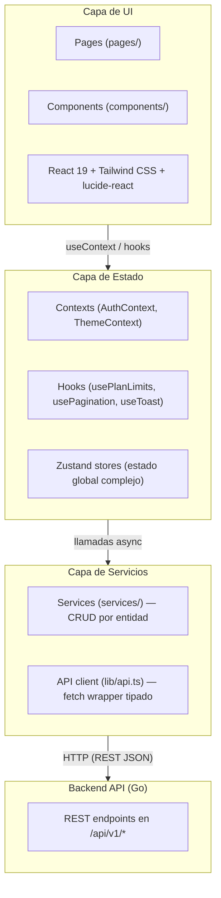
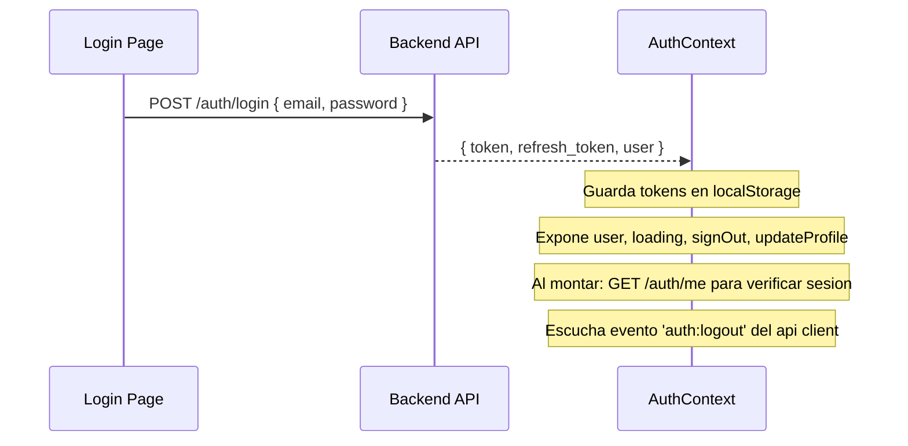
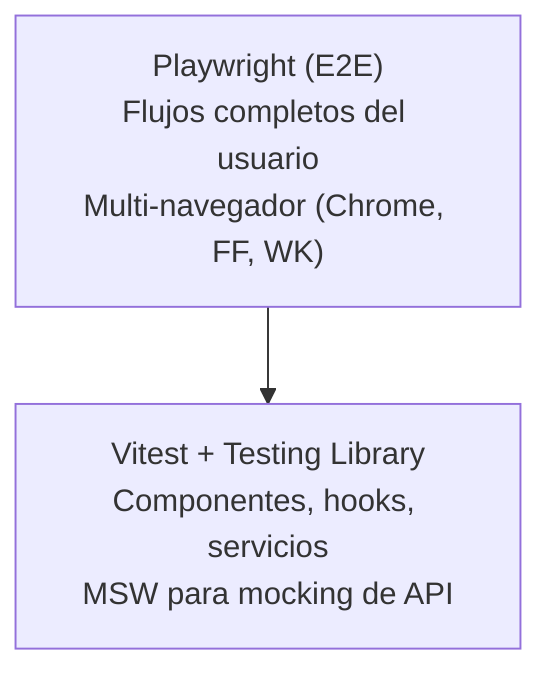

---
tags:
  - prd
  - arquitectura
  - web
  - react
  - typescript
  - solennix
aliases:
  - Arquitectura Web
  - Web Architecture
date: 2026-03-20
updated: 2026-04-17
status: active
platform: Web
---

# Arquitectura Tecnica — Web (SPA)

> [!tip] Para documentacion detallada de cada modulo web, ver [[Web MOC]]

**Version:** 1.0
**Fecha:** 2026-03-20 · **Última actualización:** 2026-04-17
**Plataforma:** Web (navegadores modernos: Chrome, Firefox, Safari, Edge)

> [!abstract] Resumen
> SPA construida con **React 19 + TypeScript** sobre **Vite**, con **Tailwind CSS** para estilos, estado client vía **React Context** (AuthContext, ThemeContext), estado server vía **TanStack React Query 5**, y **zod + react-hook-form** para formularios tipados. Arquitectura por capas: Pages → Hooks/Contexts → Services → Backend API (Go). Ver tambien [[07_TECHNICAL_ARCHITECTURE_BACKEND]] para la contraparte del servidor.

> [!warning] Corrección 2026-04-16
> La tabla de abajo menciona "Zustand 5.0.11". **No está en uso a 2026-04-16** — la app migró a React Query + Context. CLAUDE.md todavía dice "Zustand"; actualizar ambos cuando se consolide. HTTP es `fetch` nativo (clase `ApiClient` en `lib/api.ts`), no Axios.

> [!info] Stack actualizado (2026-04-16 — `web/package.json`)
>
> | Capa             | Librería                           | Versión        |
> | ---------------- | ---------------------------------- | -------------- |
> | Server state     | **TanStack React Query**           | 5.96.x         |
> | Client state     | React Context (Auth, Theme)        | —              |
> | HTTP             | fetch nativo (`ApiClient` class)   | —              |
> | Auth social      | Firebase SDK                       | 12.11.x        |
> | Push             | Firebase Messaging (FCM)           | —              |
> | PWA              | vite-plugin-pwa                    | 1.2.x          |
> | OpenAPI codegen  | openapi-typescript                 | 7.4.x          |

**Documentos relacionados:** [[PRD MOC]] · [[01_PRODUCT_VISION]] · [[02_FEATURES]] · [[11_CURRENT_STATUS]]
**Arquitecturas hermanas:** [[05_TECHNICAL_ARCHITECTURE_IOS]] · [[06_TECHNICAL_ARCHITECTURE_ANDROID]] · [[07_TECHNICAL_ARCHITECTURE_BACKEND]]

---

## 1. Stack Tecnologico

> [!info] Stack principal
> React 19.2 · TypeScript ~5.9.3 · Vite 7.3.1 · Tailwind CSS 4.2.0 · Zustand 5.0.11

| Capa                 | Tecnologia                | Version       | Justificacion                                                                                       |
| -------------------- | ------------------------- | ------------- | --------------------------------------------------------------------------------------------------- |
| **Framework UI**     | React                     | 19.2          | Componentes declarativos, Hooks, Concurrent Features, ecosistema maduro                             |
| **Lenguaje**         | TypeScript                | ~5.9.3        | Tipado estatico, IntelliSense, deteccion de errores en compilacion                                  |
| **Build Tool**       | Vite                      | 7.3.1         | HMR instantaneo, ESBuild para dev, Rollup para produccion, mucho mas rapido que CRA/Webpack         |
| **Estilos**          | Tailwind CSS              | 4.2.0         | Utility-first, purge automatico, consistencia de diseno sin escribir CSS custom                     |
| **Estado Global**    | Zustand                   | 5.0.11        | Minimalista, sin boilerplate, compatible con React 19, reemplaza Redux/Context para estado complejo |
| **Routing**          | react-router-dom          | 7.13.0        | Rutas declarativas, rutas protegidas, parametros dinamicos                                          |
| **Formularios**      | react-hook-form           | 7.71.2        | Rendimiento superior (uncontrolled inputs), integracion nativa con zod via `@hookform/resolvers`    |
| **Validacion**       | zod                       | 4.3.6         | Schemas de validacion type-safe, inferencia de tipos TypeScript, validacion en runtime              |
| **Graficos**         | recharts                  | 3.7.0         | Graficos declarativos basados en D3, componibles con React, responsive                              |
| **PDF**              | jsPDF + jspdf-autotable   | 4.2.0 / 5.0.7 | Generacion de PDF en el cliente (cotizaciones, contratos, resumen de eventos)                       |
| **Calendario**       | react-day-picker          | 9.13.2        | Selector de fechas accesible, personalizable con Tailwind                                           |
| **Fechas**           | date-fns                  | 4.1.0         | Funciones puras e inmutables para manipulacion de fechas, tree-shakeable                            |
| **Iconos**           | lucide-react              | 0.575.0       | Iconos SVG ligeros, consistentes, tree-shakeable                                                    |
| **CSS Utils**        | clsx + tailwind-merge     | 2.1.1 / 3.5.0 | Composicion condicional de clases sin conflictos de Tailwind                                        |
| **Testing Unitario** | Vitest                    | 4.0.18        | Compatible con Vite, API compatible con Jest, rapido, coverage con v8                               |
| **Testing E2E**      | Playwright                | 1.58.2        | Multi-navegador, auto-waiting, paralelismo, screenshots                                             |
| **API Mocking**      | MSW (Mock Service Worker) | 2.12.10       | Intercepta requests a nivel de red, reutilizable entre tests unitarios y E2E                        |
| **Testing Library**  | @testing-library/react    | 16.3.2        | Tests centrados en el usuario, queries accesibles                                                   |
| **Linting**          | ESLint                    | 10.0.1        | Analisis estatico con plugins para React Hooks y React Refresh                                      |

---

## 2. Arquitectura

### Patron General

> [!abstract] Arquitectura por capas
> El proyecto web es una **SPA (Single Page Application)** con enrutamiento del lado del cliente. Sigue un patron de arquitectura por capas donde las paginas consumen contextos/hooks que a su vez utilizan servicios para comunicarse con el backend API.



### Principios

> [!note] Decisiones de diseno
>
> - **Composicion de componentes**: paginas compuestas por componentes reutilizables, cada uno con responsabilidad unica
> - **Capa de API tipada**: todos los servicios usan el cliente API generico (`api.get<T>`, `api.post<T>`) con tipos TypeScript
> - **Validacion con zod**: schemas definidos una vez, usados para validacion de formularios Y para inferir tipos TypeScript
> - **Separacion de responsabilidades**: pages no hacen fetch directamente — delegan a services; components no manejan estado global — usan contexts/hooks
> - **Rutas protegidas**: `ProtectedRoute` verifica autenticacion, `AdminRoute` verifica rol de administrador

---

## 3. Estructura del Proyecto

```
web/src/
├── main.tsx                          # Entry point: ReactDOM.createRoot, BrowserRouter
├── App.tsx                           # Definicion de todas las rutas
├── index.css                         # Imports de Tailwind CSS
│
├── pages/                            # Componentes de pagina (una por ruta)
│   ├── Landing.tsx                   # Landing page publica
│   ├── Login.tsx                     # Inicio de sesion
│   ├── Register.tsx                  # Registro de usuario
│   ├── ForgotPassword.tsx            # Solicitud de reset de contrasena
│   ├── ResetPassword.tsx             # Formulario de nueva contrasena
│   ├── Dashboard.tsx                 # Panel principal con KPIs y graficos
│   ├── Search.tsx                    # Busqueda global
│   ├── Settings.tsx                  # Configuracion del usuario y negocio
│   ├── Pricing.tsx                   # Planes y precios (FREE/PRO)
│   ├── About.tsx                     # Acerca de la aplicacion
│   ├── Privacy.tsx                   # Politica de privacidad
│   ├── Terms.tsx                     # Terminos de uso
│   ├── NotFound.tsx                  # Pagina 404
│   │
│   ├── Calendar/
│   │   ├── CalendarView.tsx          # Vista de calendario con eventos
│   │   └── components/
│   │       └── UnavailableDatesModal.tsx  # Modal para fechas no disponibles
│   │
│   ├── Events/
│   │   ├── EventForm.tsx             # Formulario de creacion/edicion de eventos (multi-paso)
│   │   ├── EventSummary.tsx          # Resumen detallado del evento
│   │   └── components/
│   │       ├── EventGeneralInfo.tsx   # Paso 1: informacion general
│   │       ├── EventProducts.tsx      # Paso 2: productos/servicios
│   │       ├── EventExtras.tsx        # Paso 3: extras
│   │       ├── EventSupplies.tsx      # Paso 4: insumos y equipo
│   │       ├── EventEquipment.tsx     # Equipo del inventario
│   │       ├── EventFinancials.tsx    # Paso 5: resumen financiero
│   │       ├── Payments.tsx           # Gestion de pagos del evento
│   │       └── QuickClientModal.tsx   # Modal para crear cliente rapido
│   │
│   ├── Clients/
│   │   ├── ClientList.tsx            # Lista de clientes con paginacion
│   │   ├── ClientForm.tsx            # Formulario de creacion/edicion
│   │   └── ClientDetails.tsx         # Detalle del cliente con historial
│   │
│   ├── Products/
│   │   ├── ProductList.tsx           # Catalogo de productos/servicios
│   │   ├── ProductForm.tsx           # Formulario de creacion/edicion
│   │   └── ProductDetails.tsx        # Detalle del producto
│   │
│   ├── Inventory/
│   │   ├── InventoryList.tsx         # Lista de items de inventario
│   │   ├── InventoryForm.tsx         # Formulario de creacion/edicion
│   │   └── InventoryDetails.tsx      # Detalle con disponibilidad
│   │
│   ├── QuickQuote/
│   │   └── QuickQuotePage.tsx        # Cotizacion rapida sin crear evento
│   │
│   └── Admin/
│       ├── AdminDashboard.tsx        # Dashboard administrativo (metricas globales)
│       └── AdminUsers.tsx            # Gestion de usuarios del sistema
│
├── components/                       # Componentes compartidos
│   ├── Layout.tsx                    # Layout principal: sidebar + header + Outlet; bottom nav/FAB solo en smartphones (<768px)
│   ├── ProtectedRoute.tsx            # HOC que redirige a /login si no autenticado
│   ├── AdminRoute.tsx                # HOC que verifica rol admin
│   ├── Logo.tsx                      # Logo de Solennix (SVG)
│   ├── Modal.tsx                     # Modal reutilizable
│   ├── ConfirmDialog.tsx             # Dialogo de confirmacion (eliminar, cancelar)
│   ├── Pagination.tsx                # Controles de paginacion
│   ├── Skeleton.tsx                  # Placeholder de carga (skeleton screens)
│   ├── Empty.tsx                     # Estado vacio con icono y CTA
│   ├── ToastContainer.tsx            # Notificaciones toast
│   ├── BottomTabBar.tsx              # Navegacion inferior solo para smartphones (<768px)
│   ├── QuickActionsFAB.tsx           # FAB de acciones rapidas solo para smartphones (<768px)
│   ├── UpgradeBanner.tsx             # Banner de upgrade a plan PRO
│   ├── OnboardingChecklist.tsx       # Checklist de onboarding para nuevos usuarios
│   ├── PendingEventsModal.tsx        # Modal de eventos pendientes de confirmacion (orfano post-refactor de marzo 2026; pendiente decidir reemplazo definitivo tras revert PR #76)
│   ├── SetupRequired.tsx             # Pantalla de configuracion inicial requerida
│   └── ContractTemplateEditor.tsx    # Editor de plantillas de contrato
│
├── contexts/                         # React Contexts
│   ├── AuthContext.tsx               # Autenticacion: user, login, logout, token management
│   └── ThemeContext.tsx              # Tema: dark/light mode, persistencia en localStorage
│
├── hooks/                            # Custom hooks
│   ├── usePagination.ts             # Logica de paginacion (page, limit, total)
│   ├── usePlanLimits.ts             # Verificacion de limites del plan (FREE vs PRO)
│   ├── useTheme.ts                  # Hook para acceder al tema actual
│   └── useToast.ts                  # Hook para mostrar notificaciones toast
│
├── services/                         # Capa de servicios API
│   ├── clientService.ts             # CRUD de clientes
│   ├── eventService.ts              # CRUD de eventos
│   ├── eventPaymentService.ts       # Pagos asociados a eventos (registro manual)
│   ├── productService.ts            # CRUD de productos/servicios
│   ├── inventoryService.ts          # CRUD de inventario
│   ├── searchService.ts             # Busqueda global multi-entidad
│   ├── subscriptionService.ts       # Gestion de suscripciones (planes)
│   ├── adminService.ts              # Endpoints de administracion
│   └── unavailableDatesService.ts   # Gestion de fechas no disponibles
│
├── lib/                              # Utilidades y helpers
│   ├── api.ts                       # Cliente HTTP: wrapper sobre fetch con auth, refresh, retry
│   ├── errorHandler.ts              # Logging de errores centralizado
│   ├── finance.ts                   # Calculos financieros (totales, depositos, impuestos)
│   ├── pdfGenerator.ts             # Generacion de PDFs (cotizaciones, contratos)
│   ├── contractTemplate.ts          # Motor de plantillas de contrato con variables
│   ├── inlineFormatting.ts          # Formateo de texto con marcado inline
│   ├── exportCsv.ts                # Exportacion de datos a CSV
│   └── utils.ts                     # Utilidades generales (formateo de moneda, fechas, etc.)
│
├── types/                            # Tipos TypeScript
│   └── entities.ts                  # Interfaces: Event, Client, Product, InventoryItem, Payment, etc.
│
└── assets/                           # Archivos estaticos (imagenes, fuentes)
```

---

## 4. Rutas

### Rutas Publicas (sin autenticacion)

| Ruta               | Componente       | Descripcion                                       |
| ------------------ | ---------------- | ------------------------------------------------- |
| `/`                | `Landing`        | Pagina de aterrizaje con informacion del producto |
| `/login`           | `Login`          | Formulario de inicio de sesion                    |
| `/register`        | `Register`       | Formulario de registro                            |
| `/forgot-password` | `ForgotPassword` | Solicitud de restablecimiento de contrasena       |
| `/reset-password`  | `ResetPassword`  | Formulario para establecer nueva contrasena       |
| `/about`           | `About`          | Informacion sobre Solennix                        |
| `/privacy`         | `Privacy`        | Politica de privacidad                            |
| `/terms`           | `Terms`          | Terminos de uso                                   |

### Rutas Protegidas (requieren autenticacion)

Todas envueltas en `<ProtectedRoute>` + `<Layout>` (sidebar, header, Outlet).

| Ruta                  | Componente         | Descripcion                                          |
| --------------------- | ------------------ | ---------------------------------------------------- |
| `/dashboard`          | `Dashboard`        | Panel principal con KPIs, graficos, eventos proximos |
| `/search`             | `SearchPage`       | Busqueda global de clientes, eventos, productos      |
| `/calendar`           | `CalendarView`     | Vista de calendario mensual con eventos              |
| `/cotizacion-rapida`  | `QuickQuotePage`   | Cotizacion rapida sin crear evento completo          |
| `/events/new`         | `EventForm`        | Crear nuevo evento (formulario multi-paso)           |
| `/events/:id/edit`    | `EventForm`        | Editar evento existente                              |
| `/events/:id/summary` | `EventSummary`     | Resumen completo del evento                          |
| `/clients`            | `ClientList`       | Lista de clientes con busqueda y paginacion          |
| `/clients/new`        | `ClientForm`       | Crear nuevo cliente                                  |
| `/clients/:id`        | `ClientDetails`    | Detalle del cliente con eventos asociados            |
| `/clients/:id/edit`   | `ClientForm`       | Editar cliente existente                             |
| `/products`           | `ProductList`      | Catalogo de productos y servicios                    |
| `/products/new`       | `ProductForm`      | Crear nuevo producto                                 |
| `/products/:id`       | `ProductDetails`   | Detalle del producto                                 |
| `/products/:id/edit`  | `ProductForm`      | Editar producto existente                            |
| `/inventory`          | `InventoryList`    | Lista de items de inventario                         |
| `/inventory/new`      | `InventoryForm`    | Crear nuevo item de inventario                       |
| `/inventory/:id`      | `InventoryDetails` | Detalle del item con disponibilidad                  |
| `/inventory/:id/edit` | `InventoryForm`    | Editar item de inventario                            |
| `/settings`           | `Settings`         | Configuracion de perfil, negocio, contrato           |
| `/pricing`            | `Pricing`          | Planes y precios (fuera del Layout principal)        |

> [!tip] Planes y monetizacion
> La ruta `/pricing` muestra los tiers FREE/PRO definidos en [[04_MONETIZATION]]. Los limites del plan se verifican via el hook `usePlanLimits`.

### Rutas de Administrador (requieren rol admin)

Envueltas adicionalmente en `<AdminRoute>`.

| Ruta           | Componente       | Descripcion                   |
| -------------- | ---------------- | ----------------------------- |
| `/admin`       | `AdminDashboard` | Metricas globales del sistema |
| `/admin/users` | `AdminUsers`     | Gestion de todos los usuarios |

### Ruta Comodin

| Ruta | Componente | Descripcion                          |
| ---- | ---------- | ------------------------------------ |
| `*`  | `NotFound` | Pagina 404 para rutas no encontradas |

---

## 5. Capa de Servicios

Cada servicio encapsula las llamadas HTTP a un grupo de endpoints del backend. Todos utilizan el cliente API generico de `lib/api.ts`.

| Servicio                    | Archivo                      | Funcionalidad                                                                                                                           |
| --------------------------- | ---------------------------- | --------------------------------------------------------------------------------------------------------------------------------------- |
| **clientService**           | `clientService.ts`           | CRUD de clientes: listar (con paginacion/busqueda), crear, obtener por ID, actualizar, eliminar                                         |
| **eventService**            | `eventService.ts`            | CRUD de eventos: listar, crear, obtener por ID, actualizar, eliminar. Incluye productos, extras, insumos y equipo asociados al evento   |
| **eventPaymentService**     | `eventPaymentService.ts`     | Pagos de eventos: registrar pago manual, listar pagos de un evento, eliminar pago                                                       |
| **productService**          | `productService.ts`          | CRUD de productos/servicios del catalogo: listar, crear, obtener, actualizar, eliminar                                                  |
| **inventoryService**        | `inventoryService.ts`        | CRUD de inventario: listar items, crear, obtener, actualizar, eliminar. Verificacion de disponibilidad por fecha                        |
| **subscriptionService**     | `subscriptionService.ts`     | Gestion de suscripciones Pro: crear sesion de checkout en Stripe, obtener portal de facturacion, obtener plan actual, verificar limites |
| **searchService**           | `searchService.ts`           | Busqueda global multi-entidad: buscar clientes, eventos y productos en una sola consulta                                                |
| **adminService**            | `adminService.ts`            | Operaciones administrativas: listar todos los usuarios, estadisticas globales, gestion de cuentas                                       |
| **unavailableDatesService** | `unavailableDatesService.ts` | Gestion de fechas no disponibles: listar, crear, eliminar fechas bloqueadas en el calendario                                            |

Regla funcional de stock bajo (Web): `minimum_stock > 0 && current_stock < minimum_stock`.

### Cliente API (`lib/api.ts`)

> [!note] Cliente HTTP centralizado
> El cliente API centralizado proporciona:
>
> - **Wrapper tipado sobre `fetch`**: metodos `get<T>`, `post<T>`, `put<T>`, `delete<T>` con genericos TypeScript
> - **Autenticacion automatica**: adjunta el token JWT desde `localStorage` en el header `Authorization: Bearer`
> - **Refresh de token**: intercepta respuestas 401, intenta renovar con el refresh token, y reintenta la peticion original
> - **Logout automatico**: si el refresh falla, emite evento `auth:logout` para limpiar el estado
> - **Base URL configurable**: apunta al backend Go (`/api/v1/`)

---

## 6. Autenticacion

### Flujo de Autenticacion



### Componentes de Proteccion

- **`ProtectedRoute`**: verifica que `user !== null` en AuthContext. Si no hay usuario autenticado, redirige a `/login`. Muestra spinner mientras `loading === true`.
- **`AdminRoute`**: ademas de verificar autenticacion, comprueba que `user.role === 'admin'`. Redirige si el usuario no tiene permisos de administrador.

### Almacenamiento de Tokens

| Token           | Almacenamiento | Uso                                                       |
| --------------- | -------------- | --------------------------------------------------------- |
| `auth_token`    | `localStorage` | JWT para autenticar peticiones API (header Authorization) |
| `refresh_token` | `localStorage` | Token de larga duracion para renovar el auth_token        |

### Interfaz de Usuario (`User`)

```typescript
interface User {
  id: string;
  email: string;
  name: string;
  business_name?: string;
  logo_url?: string;
  brand_color?: string;
  plan: "basic" | "pro" | "premium"; // 'basic' (gratis) o 'pro'/'premium' (pagado)
  role?: string; // 'admin' | undefined
  stripe_customer_id?: string;
  default_deposit_percent?: number;
  default_cancellation_days?: number;
  default_refund_percent?: number;
  contract_template?: string | null;
}
```

---

## 7. Formularios

### Patron: react-hook-form + zod

> [!note] Patron de formularios
> Todos los formularios siguen un patron consistente: schema zod para validacion + react-hook-form para estado del formulario. El tipo TypeScript se infiere automaticamente del schema.

#### 1. Definicion del Schema (zod)

```typescript
import { z } from "zod";

const clientSchema = z.object({
  name: z.string().min(1, "El nombre es requerido"),
  email: z.string().email("Email invalido").optional(),
  phone: z.string().optional(),
  notes: z.string().optional(),
});

type ClientFormData = z.infer<typeof clientSchema>;
```

#### 2. Registro del Formulario (react-hook-form)

```typescript
import { useForm } from "react-hook-form";
import { zodResolver } from "@hookform/resolvers/zod";

const {
  register,
  handleSubmit,
  formState: { errors },
} = useForm<ClientFormData>({
  resolver: zodResolver(clientSchema),
  defaultValues: existingClient ?? {},
});
```

#### 3. Renderizado con Validacion

```tsx
<input {...register("name")} className="..." />;
{
  errors.name && <span className="text-red-500">{errors.name.message}</span>;
}
```

### Ventajas del Patron

- **Tipo inferido automaticamente**: `z.infer<typeof schema>` genera el tipo TypeScript sin duplicar definiciones
- **Validacion en runtime**: zod valida datos reales (no solo en compilacion)
- **Rendimiento**: react-hook-form usa inputs no controlados, minimizando re-renders
- **Mensajes en espanol**: los mensajes de error se definen inline en el schema

---

## 8. Generacion de PDFs

### Tecnologia

- **jsPDF** (v4.2.0): motor de generacion de PDF en el cliente
- **jspdf-autotable** (v5.0.7): plugin para tablas con formato automatico

### Ubicacion

`lib/pdfGenerator.ts` contiene las funciones de generacion.

### Funcionalidades

| Tipo de PDF           | Contenido                                                                                                                                 |
| --------------------- | ----------------------------------------------------------------------------------------------------------------------------------------- |
| **Cotizacion**        | Logo del negocio, datos del cliente, tabla de productos/servicios con precios, extras, subtotal, impuestos, total, condiciones de pago    |
| **Contrato**          | Plantilla personalizable del usuario (`contract_template`), variables reemplazadas dinamicamente (nombre del cliente, fecha, monto, etc.) |
| **Resumen de Evento** | Informacion general del evento, productos, extras, insumos, pagos realizados, saldo pendiente                                             |

### Flujo

1. El usuario hace clic en "Descargar PDF" o "Generar Cotizacion"
2. Se recopilan los datos del evento/cliente desde el estado local
3. `pdfGenerator.ts` construye el documento con jsPDF
4. Se aplica el branding del usuario (logo, color, nombre del negocio)
5. El PDF se descarga automaticamente en el navegador

---

## 9. Graficos y Dashboard

### Tecnologia

**recharts** (v3.7.0): libreria de graficos declarativos para React, basada en D3.

### Dashboard Principal

El componente `Dashboard.tsx` presenta:

| Componente             | Tipo                     | Datos                                                                     |
| ---------------------- | ------------------------ | ------------------------------------------------------------------------- |
| **KPIs**               | Tarjetas numericas       | Eventos del mes, ingresos del mes, clientes totales, tasa de confirmacion |
| **Ingresos Mensuales** | Grafico de barras/lineas | Ingresos agrupados por mes (ultimos 6-12 meses)                           |
| **Eventos por Estado** | Grafico de dona/pie      | Distribucion: pendiente, confirmado, completado, cancelado                |
| **Proximos Eventos**   | Lista                    | Eventos de los proximos 7 dias con fecha, cliente y monto                 |

### Responsividad

Los graficos de recharts son responsive por defecto usando `<ResponsiveContainer>`, adaptandose al ancho del contenedor padre.

---

## 10. Diseno

### Tailwind CSS — Utility-First

El proyecto utiliza **Tailwind CSS 4.2** como framework de estilos con enfoque utility-first.

### Configuracion

- **PostCSS**: Tailwind se integra via `@tailwindcss/postcss` como plugin de PostCSS
- **Imports**: `index.css` importa las directivas base de Tailwind
- **Utilidades de composicion**: `clsx` para clases condicionales, `tailwind-merge` para resolver conflictos de clases

### Tema Dark/Light

- **ThemeContext**: contexto React que gestiona el modo claro/oscuro
- **Persistencia**: la preferencia se guarda en `localStorage`
- **Deteccion automatica**: respeta `prefers-color-scheme` del sistema operativo como valor inicial
- **Implementacion**: clase `dark` en el elemento `<html>`, Tailwind aplica variantes `dark:` automaticamente

### Responsive Design

| Breakpoint    | Uso                                  |
| ------------- | ------------------------------------ |
| `sm` (640px)  | Moviles en landscape                 |
| `md` (768px)  | Tablets                              |
| `lg` (1024px) | Desktop — sidebar visible            |
| `xl` (1280px) | Desktop grande — contenido mas ancho |

### Componentes de Layout

- **`Layout.tsx`**: sidebar colapsable + header con usuario + area de contenido (`<Outlet />`)
- **Sidebar**: navegacion principal con iconos de lucide-react, colapsable en movil
- **Mobile-first**: el diseno base es movil, se extiende con breakpoints

---

## 11. Testing

### Estrategia de Testing



### Tests Unitarios (Vitest)

- **Framework**: Vitest 4.0.18, compatible con la API de Jest
- **DOM**: jsdom 28.1.0 como entorno de simulacion del navegador
- **Cobertura**: `@vitest/coverage-v8` para reportes de cobertura
- **Estructura**: cada archivo `*.ts(x)` tiene su `*.test.ts(x)` junto a el (co-locacion)
- **Configuracion**: `vitest` definido en `tsconfig.json` como tipo global

### Tests de Componentes

- **@testing-library/react**: render, screen, queries accesibles (getByRole, getByText)
- **@testing-library/user-event**: simulacion realista de interacciones del usuario
- **@testing-library/jest-dom**: matchers extendidos (toBeInTheDocument, toHaveClass)

### Mocking de API (MSW)

- **Mock Service Worker**: intercepta peticiones HTTP a nivel de Service Worker
- **Handlers reutilizables**: mismos handlers para tests unitarios y desarrollo local
- **Respuestas tipadas**: los handlers devuelven datos que coinciden con las interfaces TypeScript

### Tests E2E (Playwright)

- **Multi-navegador**: Chrome, Firefox, WebKit
- **Scripts**:
  - `npm run test:e2e` — ejecutar todos los tests E2E
  - `npm run test:e2e:ui` — modo interactivo con UI de Playwright
  - `npm run test:e2e:install` — instalar navegadores

### Scripts de Testing

```bash
npm run test              # Vitest en modo watch
npm run test:run          # Vitest single run
npm run test:coverage     # Vitest con reporte de cobertura
npm run test:e2e          # Playwright tests
npm run test:e2e:ui       # Playwright modo UI
```

---

## 12. Build y Despliegue

### Build de Produccion

```bash
npm run build
# Equivalente a: cross-env NODE_OPTIONS=--max-old-space-size=4096 tsc -b && vite build
```

1. **Type checking**: `tsc -b` verifica tipos TypeScript (con 4GB de heap para proyectos grandes)
2. **Bundling**: Vite/Rollup genera bundles optimizados con tree-shaking, code-splitting y minificacion
3. **Source maps**: generados como `hidden` (no referenciados en los bundles, disponibles para debugging)
4. **Output**: archivos estaticos en `dist/`

### Configuracion de Vite

- **Plugin React**: `@vitejs/plugin-react` con Babel (incluye `react-dev-locator` en desarrollo)
- **Path aliases**: `vite-tsconfig-paths` resuelve los alias `@/*` definidos en `tsconfig.json`
- **Target**: ES2020 para compatibilidad con navegadores modernos

### TypeScript

- **Target**: ES2020
- **Module resolution**: `bundler` (resolucion moderna para Vite)
- **Path mapping**: `@/*` → `./src/*`
- **JSX**: `react-jsx` (transform automatico, sin necesidad de importar React)
- **Strict mode**: deshabilitado actualmente (migracion progresiva)

### Despliegue con Docker

```dockerfile
# Etapa 1: Build
FROM node:20-alpine AS build
WORKDIR /app
COPY package*.json ./
RUN npm ci
COPY . .
RUN npm run build

# Etapa 2: Servir
FROM nginx:alpine
COPY --from=build /app/dist /usr/share/nginx/html
COPY nginx.conf /etc/nginx/conf.d/default.conf
EXPOSE 80
```

### Nginx

- Sirve los archivos estaticos de `dist/`
- Configuracion de fallback a `index.html` para client-side routing (SPA)
- Headers de cache para assets con hash
- Compresion gzip

---

## 13. Gotchas y Decisiones Tecnicas

### Decisiones Clave

> [!note] Decisiones tecnicas fundamentales
> Estas decisiones definen el stack y patron del proyecto web. Cada una fue evaluada contra alternativas concretas.

| Decision                              | Alternativa Descartada                  | Justificacion                                                                                                                                                                          |
| ------------------------------------- | --------------------------------------- | -------------------------------------------------------------------------------------------------------------------------------------------------------------------------------------- |
| **Zustand** para estado global        | Redux Toolkit, Jotai                    | Minimalista, zero boilerplate, no requiere Provider wrapper, API simple con hooks. Redux es excesivo para esta escala; Context API causa re-renders innecesarios para estado frecuente |
| **Tailwind CSS** sobre CSS Modules    | CSS Modules, styled-components, Emotion | Co-locacion de estilos con markup, purge automatico en produccion, consistencia de diseno sin archivo de estilos separado. Mejor DX con autocompletado                                 |
| **Vite** sobre CRA                    | Create React App, Webpack               | HMR instantaneo (ESBuild en dev), builds de produccion mas rapidos con Rollup, configuracion minima, ESM nativo. CRA esta deprecated                                                   |
| **zod** para validacion en runtime    | Yup, Joi, io-ts                         | Inferencia de tipos TypeScript nativa (`z.infer`), API fluida, tree-shakeable, ecosistema TypeScript-first. Yup no infiere tipos                                                       |
| **react-hook-form** sobre Formik      | Formik, formularios manuales            | Rendimiento superior (inputs no controlados, menos re-renders), API mas ligera, integracion nativa con zod. Formik re-renderiza todo el formulario en cada cambio                      |
| **jsPDF** para generacion client-side | Server-side PDF, @react-pdf/renderer    | Generacion instantanea sin round-trip al servidor, funciona offline, menor carga en el backend. Suficiente para cotizaciones y contratos simples                                       |
| **date-fns** sobre Moment.js          | Moment.js, Day.js, Luxon                | Funciones puras e inmutables, tree-shakeable (solo importar lo que se usa), sin mutaciones accidentales. Moment.js esta en maintenance mode y no es tree-shakeable                     |
| **localStorage** para tokens          | httpOnly cookies, sessionStorage        | Simplicidad de implementacion para MVP. El backend tambien soporta httpOnly cookies como alternativa mas segura (migracion futura)                                                     |
| **Path aliases** (`@/*`)              | Rutas relativas (`../../`)              | Imports limpios y refactorizables. `@/services/eventService` es mas legible que `../../../services/eventService`. Configurado en tsconfig + vite-tsconfig-paths                        |

### Gotchas Conocidos

> [!warning] Gotchas a tener en cuenta
> Puntos que requieren atencion o tienen migraciones planificadas.

| Gotcha                        | Detalle                                                                                                                                                            |
| ----------------------------- | ------------------------------------------------------------------------------------------------------------------------------------------------------------------ |
| **Strict mode deshabilitado** | `tsconfig.json` tiene `strict: false`. Planificado habilitarlo progresivamente para detectar mas errores en compilacion                                            |
| **4GB heap para tsc**         | El build usa `NODE_OPTIONS=--max-old-space-size=4096` porque el type-checking de TypeScript puede exceder el heap por defecto con muchos archivos                  |
| **Source maps hidden**        | Los source maps se generan pero no se referencian en los bundles (evita exponer codigo fuente en produccion, pero disponibles para herramientas de error tracking) |
| **Token en localStorage**     | Vulnerable a XSS. Mitigado con CSP headers y sanitizacion de inputs. Plan futuro: migrar a httpOnly cookies                                                        |
| **react-dev-locator**         | Plugin de Babel solo en desarrollo para localizar componentes en el editor. Se desactiva automaticamente en produccion                                             |
| **@react-pdf/renderer**       | Presente en dependencias pero el generador principal usa jsPDF. Posible migracion futura para PDFs mas complejos con layout React                                  |

---

> [!tip] Documentos relacionados
>
> - [[PRD MOC]] — Indice general del PRD
> - [[Web MOC]] — Detalle de cada modulo web
> - [[07_TECHNICAL_ARCHITECTURE_BACKEND]] — Arquitectura del backend Go
> - [[05_TECHNICAL_ARCHITECTURE_IOS]] — Arquitectura iOS (SwiftUI)
> - [[06_TECHNICAL_ARCHITECTURE_ANDROID]] — Arquitectura Android (Compose)
> - [[02_FEATURES]] — Features y tabla de paridad cross-platform
> - [[11_CURRENT_STATUS]] — Estado actual de implementacion

#prd #arquitectura #web #react #typescript #solennix
