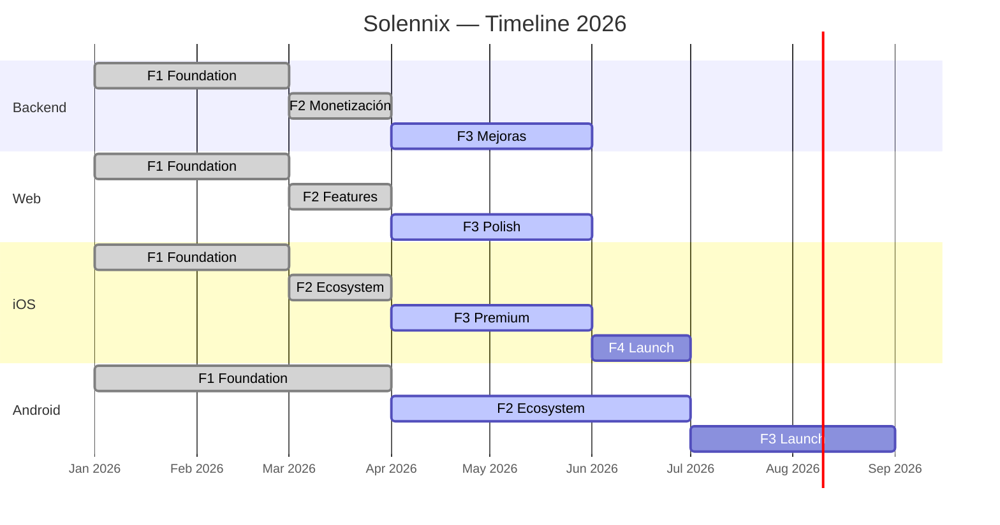
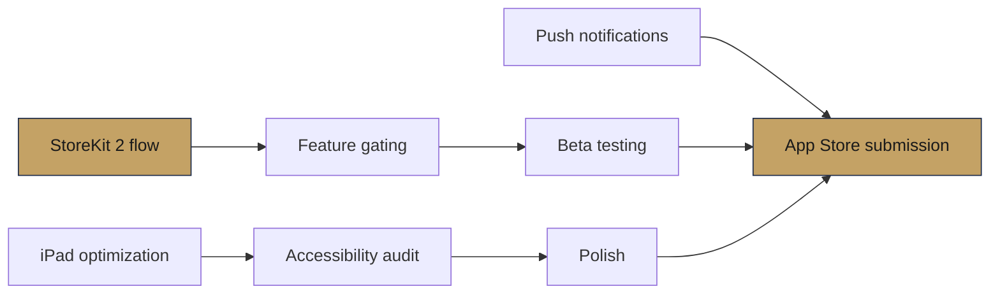
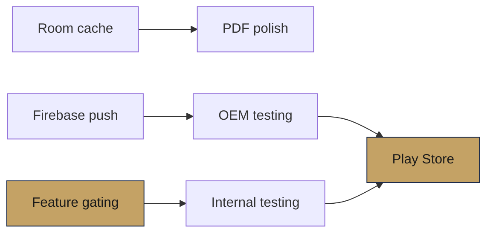
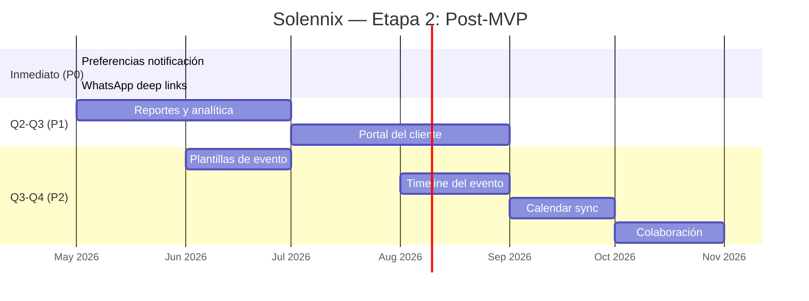

---
tags:
  - prd
  - roadmap
  - timeline
  - solennix
aliases:
  - Roadmap
  - Timeline
date: 2026-03-20
updated: 2026-04-04
status: active
---

# Roadmap

> [!tip] Documentos relacionados
>
> - [[PRD MOC]] — índice del PRD
> - [[11_CURRENT_STATUS|Estado Actual]] — qué está implementado hoy
> - [[02_FEATURES|Features]] — catálogo completo con paridad
> - [[10_COLLABORATION_GUIDE|Guía de Colaboración]] — workflow con Claude Code
> - [[SUPER PLAN MOC]] — sistema de ejecución cross-platform (12 semanas)
> - [[07_WAVE_PLAN_12_WEEKS]] — plan operativo por ondas
> - [[05_RELEASE_GOVERNANCE_AND_QUALITY_GATES]] — calidad obligatoria por PR/release

---

## Supuestos

> [!info] Contexto de desarrollo
>
> - **Desarrollador**: Tiago (solo) + Claude Code Max
> - **Horas/semana**: 20-30 horas
> - **Plataformas**: Las 4 en paralelo (no secuencialmente)
> - **Reutilización**: ~30% de diseño y lógica se comparte conceptualmente entre plataformas

---

## Estimación de Esfuerzo

| Área                       | Backend (h) | Web (h)  | iOS (h)  | Android (h) | Notas                              |
| -------------------------- | :---------: | :------: | :------: | :---------: | ---------------------------------- |
| Eventos CRUD + form        |     30      |    40    |    50    |     50      | Form wizard más complejo en mobile |
| Clientes CRUD              |     15      |    20    |    25    |     25      | Incluye quick client               |
| Productos + recetas        |     20      |    25    |    30    |     30      | Recetas con ingredientes           |
| Inventario                 |     15      |    20    |    25    |     25      | Stock tracking, tipos              |
| Calendario                 |     10      |    20    |    20    |     20      | Unavailable dates                  |
| Auth (email + OAuth + bio) |     25      |    20    |    30    |     30      | Apple/Google Sign-In               |
| Dashboard + KPIs           |      5      |    25    |    20    |     20      | Charts, pending events             |
| Pagos + Stripe             |     25      |    20    |    15    |     10      | Stripe web, StoreKit iOS           |
| PDFs (7-8 tipos)           |      —      |    20    |    40    |     40      | Generación en cliente              |
| Búsqueda + Spotlight       |     10      |    15    |    20    |     15      | CoreSpotlight solo iOS             |
| Widgets + Live Activity    |      —      |    —     |    35    |     25      | WidgetKit, Glance                  |
| Suscripciones + gating     |     20      |    15    |    20    |     25      | Play Billing más complejo          |
| Admin panel                |     10      |    30    |    —     |      —      | Solo web                           |
| Settings + business config |      5      |    15    |    20    |     20      | Branding, contratos                |
| Onboarding                 |      —      |    5     |    15    |     15      | Welcome flow                       |
| Deep linking               |      5      |    5     |    10    |     10      | URL scheme                         |
| Offline cache              |      —      |    —     |    20    |     20      | SwiftData / Room                   |
| Testing                    |     30      |    20    |    25    |     25      | Unit + integration                 |
| CI/CD + deploy             |     15      |    10    |    10    |     15      | Docker, Fastlane, GitHub Actions   |
| Polish + QA                |     20      |    15    |    25    |     30      | Fragmentación Android              |
| **Total estimado**         |  **~260**   | **~340** | **~475** |  **~470**   |                                    |

> [!note] Las apps móviles requieren ~40% más esfuerzo que web/backend por widgets, PDFs nativos, offline cache y suscripciones in-app.

---

## Fases — Backend (Go)

### Fase 1: Foundation ✅

- ✅ Setup Go + Chi + PostgreSQL + Docker
- ✅ Auth completa (register, login, refresh, forgot/reset, Google, Apple)
- ✅ CRUD: eventos, clientes, productos, inventario
- ✅ Event items: products, extras, equipment, supplies
- ✅ Middleware stack completo
- ✅ 29 migraciones aplicadas
- ✅ File uploads + Search global

### Fase 2: Monetización ✅

- ✅ Stripe integration (checkout, webhooks, portal)
- ✅ RevenueCat webhooks
- ✅ Subscription management
- ✅ Admin panel endpoints

### Fase 3: Mejoras Pendientes (~60h)

| Tarea                                | Horas | Prioridad |
| ------------------------------------ | :---: | :-------: |
| Push notifications (Firebase/APNS)   |  20h  |   Alta    |
| Email notifications (eventos, pagos) |  15h  |   Media   |
| Export CSV/Excel                     |  10h  |   Baja    |
| Reportes financieros avanzados       |  15h  |   Media   |

Ver [[07_TECHNICAL_ARCHITECTURE_BACKEND|Arq. Backend]] para detalle técnico.

---

## Fases — Web (React)

### Fase 1: Foundation ✅

- ✅ Setup React + Vite + Tailwind + TypeScript
- ✅ Auth flow completo
- ✅ CRUD: eventos, clientes, productos, inventario
- ✅ Dashboard con KPIs y charts
- ✅ Calendario con unavailable dates
- ✅ Settings, business config, pricing

### Fase 2: Features Avanzadas ✅

- ✅ Admin panel (dashboard, user management)
- ✅ PDF generation (jsPDF)
- ✅ Quick quote
- ✅ Search global + Command Palette
- ✅ Stripe checkout + payment success
- ✅ Landing page + pricing page

### Fase 3: Polish Pendiente (~50h)

| Tarea                                      | Horas | Prioridad |
| ------------------------------------------ | :---: | :-------: |
| Responsive mobile improvements             |  10h  |   Media   |
| PWA support (offline básico)               |  15h  |   Baja    |
| Performance (lazy loading, code splitting) |  10h  |   Media   |
| E2E tests Playwright (cobertura completa)  |  15h  |   Media   |

Ver [[08_TECHNICAL_ARCHITECTURE_WEB|Arq. Web]] y [[Web MOC]] para detalle.

---

## Fases — iOS (SwiftUI)

### Fase 1: Foundation ✅

- ✅ Setup Xcode + SPM packages + project.yml
- ✅ MVVM con @Observable + actor-based APIClient
- ✅ Auth (login, register, biometric, forgot, Apple Sign-In)
- ✅ Eventos (list, detail, form 5-step, checklist, photos)
- ✅ Clientes (list, detail, form, quick quote)
- ✅ Productos + Inventario CRUD
- ✅ Calendario, Dashboard, KPIs

### Fase 2: Apple Ecosystem ✅

- ✅ Navigation adaptive (CompactTab + SidebarSplit)
- ✅ Widgets (4 tipos: upcoming, KPIs, lock screen, interactive)
- ✅ Live Activity + Dynamic Island
- ✅ Core Spotlight indexing
- ✅ Deep linking (solennix://)
- ✅ PDF generation (7 tipos)
- ✅ Offline cache (SwiftData)

### Fase 3: Premium + Polish (~120h)

| Tarea                             | Horas | Claude Code |
| --------------------------------- | :---: | :---------: |
| StoreKit 2 purchase flow completo |  20h  |    Medio    |
| Feature gating enforcement        |  15h  |    Alto     |
| Push notifications (APNs)         |  15h  |    Medio    |
| iPad/macOS layouts optimizados    |  20h  |    Alto     |
| Accessibility audit (VoiceOver)   |  10h  |    Alto     |
| Performance optimization          |  10h  |    Medio    |
| Unit + UI tests                   |  15h  |    Alto     |
| App Store screenshots + ASO       |  15h  |    Medio    |

### Fase 4: Launch (~40h)

| Tarea                  | Horas | Claude Code |
| ---------------------- | :---: | :---------: |
| TestFlight beta        |  8h   |     N/A     |
| Bug fixes de beta      |  20h  |    Alto     |
| App Store submission   |  4h   |     N/A     |
| Post-launch monitoring |  8h   |    Medio    |

Ver [[05_TECHNICAL_ARCHITECTURE_IOS|Arq. iOS]] para detalle técnico.

---

## Fases — Android (Kotlin/Compose)

### Fase 1: Foundation ✅

- ✅ Setup multi-module (5 core + 9 feature + widget)
- ✅ Hilt DI + Navigation Compose
- ✅ Ktor client + bearer auth
- ✅ Auth (login, register, biometric gate)
- ✅ Eventos (list, detail, form multi-step)
- ✅ Clientes, Productos, Inventario CRUD
- ✅ Calendario, Dashboard, Search
- ✅ Adaptive navigation (bottom nav + rail)
- ✅ PDF generation (8 tipos)
- ✅ RevenueCat billing
- ✅ Glance widget

### Fase 2: Ecosystem + Polish (~80h)

| Tarea                         | Horas | Claude Code |
| ----------------------------- | :---: | :---------: |
| Room database + offline cache |  20h  |    Alto     |
| Deep linking completo         |  10h  |    Alto     |
| Feature gating enforcement    |  10h  |    Alto     |
| Push notifications (Firebase) |  15h  |    Medio    |
| Material You dynamic theming  |  10h  |    Alto     |
| Accessibility (TalkBack)      |  5h   |    Medio    |
| Widget KPIs + Lock Screen     |  10h  |    Medio    |

### Fase 3: Launch (~60h)

| Tarea                                | Horas | Claude Code |
| ------------------------------------ | :---: | :---------: |
| Internal testing track               |  10h  |     N/A     |
| Bug fixes                            |  20h  |    Alto     |
| OEM testing (Samsung, Pixel, Xiaomi) |  15h  |     N/A     |
| Play Store listing + ASO             |  10h  |    Medio    |
| Staged rollout                       |  5h   |     N/A     |

Ver [[06_TECHNICAL_ARCHITECTURE_ANDROID|Arq. Android]] para detalle técnico.

---

## Timeline Visual

> [!note] Targets de lanzamiento
>
> - **iOS App Store**: Q2-Q3 2026
> - **Android Play Store**: Q3-Q4 2026
> - Backend y Web están funcionales — focus en mejoras incrementales

---

## Camino Crítico

### iOS

> [!danger] Riesgo principal
> StoreKit 2 + feature gating son prerequisitos para monetización. Sin esto, no tiene sentido lanzar.

### Android

> [!danger] Riesgo principal
> Feature gating y offline cache son los cuellos de botella. OEM testing puede agregar 1-2 semanas.

---

## Efectividad Claude Code

| Fase        | Backend  |   Web    |   iOS    | Android  | Mejor para                     |
| ----------- | :------: | :------: | :------: | :------: | ------------------------------ |
| Foundation  |   70%    |   75%    |   65%    |   65%    | Scaffolding, CRUD, boilerplate |
| Features    |   60%    |   65%    |   50%    |   55%    | Widgets, PDFs, tests           |
| Polish      |   50%    |   55%    |   45%    |   50%    | Accessibility, bug fixes       |
| Launch      |   30%    |   40%    |   35%    |   30%    | Store descriptions             |
| **Overall** | **~55%** | **~60%** | **~50%** | **~50%** |                                |

> [!abstract] Impacto estimado
> Claude Code ahorra ~300-350 horas en total entre las 4 plataformas.

---

## Riesgos y Mitigaciones

### Por Plataforma

| Plataforma | Riesgo                                       | Impacto  | Mitigación                    |
| ---------- | -------------------------------------------- | -------- | ----------------------------- |
| Backend    | Push notifications requieren APNS + Firebase | +1-2 sem | Servicio unificado            |
| Backend    | Escalabilidad PostgreSQL                     | Medio    | pgxpool ya configurado        |
| Web        | Bundle size crece                            | Bajo     | Code splitting + lazy         |
| Web        | SEO limitado (SPA)                           | Medio    | Landing estática + meta tags  |
| iOS        | StoreKit 2 edge cases                        | +1 sem   | Testing exhaustivo en sandbox |
| iOS        | App Store rejection                          | +1 sem   | Seguir guidelines             |
| iOS        | iPad layouts polish                          | +1-2 sem | Priorizar iPhone              |
| Android    | OEMs matando background                      | +1 sem   | dontkillmyapp.com             |
| Android    | Fragmentación dispositivos                   | +1 sem   | Firebase Test Lab             |

### Compartidos

| Riesgo                        | Impacto  | Mitigación                      |
| ----------------------------- | -------- | ------------------------------- |
| Solo developer = bus factor 1 | 🔴 Alto  | PRD exhaustivo + Claude Code    |
| Burnout a 25h/semana          | 🔴 Alto  | Milestones celebrables          |
| Paridad se desincroniza       | 🟡 Medio | Tabla de paridad + verificación |
| Pricing LATAM insuficiente    | 🟡 Medio | A/B testing de precios          |

> [!note] Buffer de riesgo
> +3-5 semanas por plataforma móvil.
> **Timeline realista**: iOS App Store Q2-Q3 2026, Android Play Store Q3-Q4 2026

---

## Etapa 2: Post-MVP (Q2-Q4 2026)

> [!tip] Documento detallado
> Ver [[13_POST_MVP_ROADMAP|Roadmap Post-MVP (Etapa 2)]] para el documento completo con especificaciones, endpoints y esfuerzos estimados.

### Resumen de Pilares

| Pilar                              | Features clave                                                                                         | Horas  | Prioridad |
| ---------------------------------- | ------------------------------------------------------------------------------------------------------ | :----: | :-------: |
| **1. Notificaciones Inteligentes** | Preferencias email/push del usuario, resumen semanal, alertas de cotización vencida                    |  ~22h  |    P0     |
| **2. Reportes y Analítica**        | Reportes financieros por período, exportación PDF/CSV, desglose IVA y márgenes                         |  ~82h  |    P1     |
| **3. Portal del Cliente**          | URL compartible, notificaciones al cliente, botón "Ir" + Google Maps, firma digital, calificaciones    | ~107h  |    P1     |
| **4. Diferenciadores**             | Timeline del evento, plantillas, Modo Día del Evento, WhatsApp deep links, Calendar sync, colaboración | ~150h+ |    P2     |

### Timeline Etapa 2

---

#prd #roadmap #timeline #solennix
