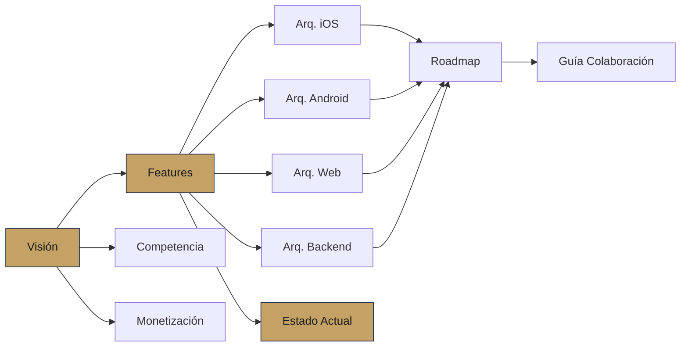

# PRD — Map of Content

> [!info] Solennix
> **Producto**: Plataforma de gestión de eventos para organizadores LATAM
> **Plataformas**: iOS · Android · Web · Backend (Go)
> **Estado**: En desarrollo activo
> **Última actualización**: 2026-04-04

---

## Visión y Estrategia

- [[01_PRODUCT_VISION|Visión del Producto]] — Problema, visión, objetivos, usuarios, historias de usuario
- [[03_COMPETITIVE_ANALYSIS|Análisis Competitivo]] — Posicionamiento vs HoneyBook, Excel, WhatsApp y LATAM
- [[04_MONETIZATION|Monetización]] — Tiers (Básico/Premium), precios, Stripe, StoreKit 2, RevenueCat

## Features y Estado

- [[02_FEATURES|Catálogo de Features]] — Todas las features con tabla de paridad cross-platform
- [[11_CURRENT_STATUS|Estado Actual]] — Implementación por plataforma, brechas, migraciones

## Arquitectura Técnica

- [[05_TECHNICAL_ARCHITECTURE_IOS|Arquitectura iOS]] — SwiftUI + MVVM + @Observable + SPM
- [[06_TECHNICAL_ARCHITECTURE_ANDROID|Arquitectura Android]] — Kotlin + Compose + Hilt + Multi-module
- [[07_TECHNICAL_ARCHITECTURE_BACKEND|Arquitectura Backend]] — Go + Chi + PostgreSQL + pgx
- [[08_TECHNICAL_ARCHITECTURE_WEB|Arquitectura Web]] — React 19 + TypeScript + Vite + Tailwind
- [[Web MOC]] — Documentación detallada de la app web (módulos, design system, hooks)

## Planificación

- [[09_ROADMAP|Roadmap MVP (Etapa 1)]] — Timeline, estimaciones, camino crítico por plataforma
- [[13_POST_MVP_ROADMAP|Roadmap Post-MVP (Etapa 2)]] — Notificaciones, reportes, portal del cliente, diferenciadores
- [[10_COLLABORATION_GUIDE|Guía de Colaboración]] — Workflow con Claude Code, prompts, reglas

---

## Principios Clave

> [!abstract] Paridad Cross-Platform
> Cada feature core y cada bug fix DEBE existir en todas las plataformas. Ver [[01_PRODUCT_VISION#Principio de Paridad Cross-Platform|regla de paridad]] y [[02_FEATURES|tabla de features]].

> [!abstract] Flujo de Eventos
> El flujo core del negocio: **Cotizar → Confirmar → Cobrar anticipo → Ejecutar → Cobrar saldo → Cerrar**. Todo gira alrededor de este ciclo de vida.

> [!abstract] LATAM First
> Español nativo, precios en MXN, IVA configurable. No es una traducción — es el idioma de diseño.

---

## Navegación Rápida

---

> [!tip] Navegación
> Cada documento enlaza con `[[wikilinks]]` a sus dependencias. Usá el **Graph View** de Obsidian para ver las relaciones entre documentos del PRD.

#prd #moc #solennix
