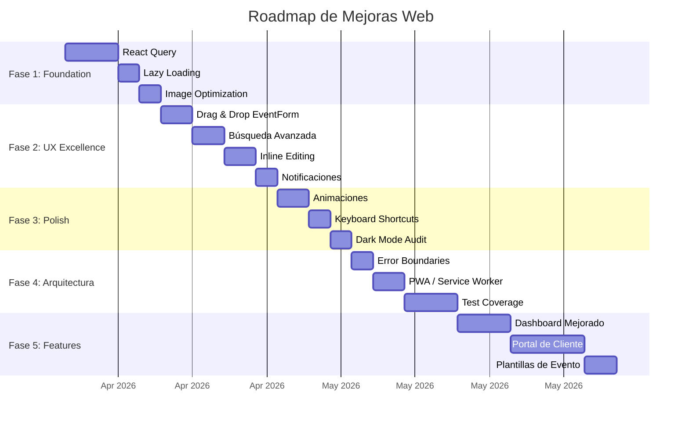

# Roadmap Web — Hacia la Perfección

#web #roadmap #mejoras

> [!tip] Filosofía
> Priorizado por **impacto en usuario** × **esfuerzo técnico**. Las mejoras están organizadas en fases incrementales — cada fase deja la app en un estado shippable mejor que el anterior.

---

## Fase 1: Foundation (Estabilidad y Performance)

> [!success] Impacto: Alto | Esfuerzo: Medio
> Sin estas mejoras, todo lo demás se construye sobre arena.

### 1.1 React Query / TanStack Query

> [!done] 4 dominios core + todas las listas migradas — 2026-04-04
> Foundation completa. 30+ hooks creados, 10 páginas migradas, 4 dominios con hooks completos.

- [x] Instalar `@tanstack/react-query` + devtools
- [x] Crear `queryClient.ts` con error handling global (logError + toast)
- [x] Crear `queryKeys.ts` — key factory centralizada para todos los dominios
- [x] Wiring `QueryClientProvider` + `ReactQueryDevtools` en `App.tsx`
- [x] Migrar `clientService` → `useClientQueries.ts` (6 hooks) + ClientList, ClientForm, ClientDetails
- [x] Migrar `productService` → `useProductQueries.ts` (6 hooks) + ProductList, ProductForm, ProductDetails
- [x] Migrar `inventoryService` → `useInventoryQueries.ts` (5 hooks) + InventoryList, InventoryForm, InventoryDetails
- [x] Migrar `eventService` → `useEventQueries.ts` (13 hooks) + EventList
- [ ] Migrar EventForm, EventSummary (páginas complejas del dominio Events)
- [ ] Migrar `paymentService`, `searchService`, `adminService`, `subscriptionService`
- [ ] Migrar componentes compartidos: StatusDropdown, OnboardingChecklist, PendingEventsModal
- [ ] Rewrite `usePlanLimits` para usar query hooks (mayor win de cache sharing)
- [ ] Migrar Dashboard, Search, Settings, AdminUsers, AdminDashboard
- [ ] Implementar optimistic updates para status changes
- [ ] Eliminar todos los `useState` + `useEffect` + `useCallback` fetch patterns restantes

**Por qué**: Elimina fetches redundantes, agrega cache, mejora UX percibida. Es el cambio con mayor impacto/esfuerzo de toda la app.

### 1.2 Lazy Loading de Rutas
- [ ] Wrappear todas las páginas con `React.lazy()` + `<Suspense>`
- [ ] Crear fallback de loading consistente con `SkeletonTable`
- [ ] Lazy load de `Recharts` solo para Dashboard/Admin
- [ ] Verificar que code splitting funciona en producción

**Por qué**: Reduce bundle inicial significativamente. El usuario no necesita cargar Admin si nunca va ahí.

### 1.3 Image Optimization
- [ ] Agregar `loading="lazy"` a todas las `` en listas
- [ ] Implementar thumbnails en backend o usar CDN con resize
- [ ] Considerar `srcSet` para responsive images
- [ ] Placeholder blur/skeleton mientras cargan las imágenes

**Por qué**: Las listas con fotos (clientes, productos) cargan todas las imágenes upfront.

---

## Fase 2: UX Excellence (Experiencia de Usuario)

> [!success] Impacto: Alto | Esfuerzo: Medio-Alto
> De "funcional" a "un placer de usar".

### 2.1 Drag & Drop en Formulario de Evento
- [ ] Reordenar productos dentro del evento
- [ ] Reordenar extras
- [ ] Feedback visual durante drag

**Por qué**: El formulario de evento es donde los usuarios pasan más tiempo. La reordenación manual es tediosa.

### 2.2 Undo/Redo en Acciones Destructivas
- [ ] Implementar toast con "Deshacer" para eliminaciones
- [ ] Soft delete temporal (30 segundos) antes de confirmar
- [ ] Feedback visual del undo disponible

**Por qué**: El ConfirmDialog actual es bueno, pero el undo es más amigable — menos fricción.

### 2.3 Búsqueda Avanzada
- [ ] Filtros combinables en EventList (fecha + status + cliente + ciudad)
- [ ] Búsqueda por rango de fechas en todas las listas
- [ ] Guardar filtros favoritos (persistir en URL params)
- [ ] Command Palette: agregar filtros rápidos y navegación por teclado

**Por qué**: Los organizadores manejan docenas de eventos. Encontrar "el evento de María en marzo en Monterrey" debería ser instantáneo.

### 2.4 Inline Editing en Tablas
- [ ] Editar status de evento inline ✅ (ya existe via StatusDropdown)
- [ ] Editar notas de cliente inline
- [ ] Editar stock de inventario inline (click en número → input)
- [ ] Editar cantidad en event products inline

**Por qué**: Reduce la navegación constante entre lista → detalle → form → lista.

### 2.5 Notificaciones y Recordatorios
- [ ] Banner de "eventos esta semana" en Dashboard
- [ ] Alerta visual de inventario bajo más prominente
- [ ] Notificación de pagos vencidos/pendientes
- [ ] Resumen semanal por email (backend feature)

**Por qué**: El organizador no debería tener que buscar — la app debería DECIRLE qué necesita atención.

---

## Fase 3: Polish Premium (Detalles que Enamoran)

> [!success] Impacto: Medio | Esfuerzo: Bajo-Medio
> Detalles que separan una app "buena" de una "premium".

### 3.1 Animaciones y Transiciones
- [ ] Page transitions con Framer Motion o View Transitions API
- [ ] Stagger animations en listas (items entran escalonados)
- [ ] Skeleton → content fade-in transition
- [ ] Modal/Dialog enter/exit animations
- [ ] Respetar `prefers-reduced-motion`

### 3.2 Keyboard Shortcuts
- [ ] `N` → Nuevo evento/cliente/producto (contextual)
- [ ] `E` → Editar item seleccionado
- [ ] `Del` → Eliminar con confirmación
- [ ] `↑↓` → Navegar entre filas de tabla
- [ ] `Enter` → Abrir item seleccionado
- [ ] Help overlay con `?` mostrando todos los shortcuts

### 3.3 Empty State Illustrations
- [ ] Reemplazar iconos genéricos con ilustraciones custom para cada empty state
- [ ] Animaciones sutiles en empty states (ej: calendario vacío con confetti)
- [ ] Onboarding más visual con ilustraciones paso a paso

### 3.4 Skeleton Loading Mejorado
- [ ] Skeletons que coincidan EXACTAMENTE con el layout final (no genéricos)
- [ ] Shimmer animation en lugar de pulse
- [ ] Content-aware skeletons (diferentes para cards vs tablas vs forms)

### 3.5 Dark Mode Polish
- [ ] Auditar TODAS las combinaciones de color en dark mode
- [ ] Verificar contraste WCAG AA en dark mode
- [ ] PDFs generados respetando el tema actual del usuario
- [ ] Transición suave entre light/dark (crossfade)

---

## Fase 4: Arquitectura Avanzada

> [!success] Impacto: Medio-Alto | Esfuerzo: Alto
> Preparar la app para escalar a miles de usuarios.

### 4.1 Error Boundaries
- [ ] Implementar `ErrorBoundary` component global
- [ ] Error boundaries por sección (sidebar, content, modal)
- [ ] Fallback UI amigable con opción de reintentar
- [ ] Reportar errores a servicio externo (Sentry)

### 4.2 Service Worker / PWA
- [ ] Registrar Service Worker para caching
- [ ] Manifest para instalación como PWA
- [ ] Cache de assets estáticos
- [ ] Offline fallback page
- [ ] Push notifications (requiere backend)

### 4.3 i18n (Internacionalización)
- [ ] Extraer todos los strings hardcoded a archivos de traducción
- [ ] Implementar `react-intl` o `i18next`
- [ ] Soportar español (default) e inglés
- [ ] Formateo de moneda/fechas por locale

### 4.4 Test Coverage
- [ ] Unit tests para todos los servicios (mock api.ts)
- [ ] Unit tests para hooks (usePagination, usePlanLimits)
- [ ] Component tests para formularios (RHF + Zod validation)
- [ ] E2E tests para flujos críticos (crear evento, pagar, generar PDF)
- [ ] Visual regression tests con Playwright screenshots
- [ ] Coverage target: 70%+ en servicios y hooks

### 4.5 Monitoreo y Analytics
- [ ] Integrar analytics (Posthog, Mixpanel, o similar)
- [ ] Tracking de eventos clave (crear evento, generar PDF, primer pago)
- [ ] Error tracking con Sentry
- [ ] Performance monitoring (Web Vitals)

---

## Fase 5: Features Avanzadas

> [!success] Impacto: Alto | Esfuerzo: Alto
> Features que diferencian de la competencia.

### 5.1 Dashboard Mejorado
- [ ] Widgets configurables (drag & drop)
- [ ] Más gráficos: revenue por mes, top clientes, productos más vendidos
- [ ] Comparativas mes a mes
- [ ] Forecast de revenue basado en eventos confirmados

### 5.2 Timeline de Evento
- [ ] Vista timeline del día del evento (hora por hora)
- [ ] Drag & drop de actividades en la timeline
- [ ] Compartir timeline con equipo/cliente

### 5.3 Colaboración
- [ ] Invitar miembros al equipo
- [ ] Roles y permisos (admin, editor, viewer)
- [ ] Activity log (quién hizo qué)
- [ ] Comentarios en eventos

### 5.4 Portal de Cliente
- [ ] Link compartible para que el cliente vea su evento
- [ ] Firma digital de contrato
- [ ] Pago online directo desde el portal
- [ ] Aprobación de cambios

### 5.5 Plantillas de Evento
- [ ] Guardar evento como plantilla reutilizable
- [ ] Crear evento desde plantilla (pre-llena productos, equipo, insumos)
- [ ] Biblioteca de plantillas por tipo de evento

---

## Prioridad Visual

---

## Quick Wins (< 1 día cada uno)

> [!tip] Victorias rápidas para hacer hoy/mañana

- [ ] `loading="lazy"` en todas las `` de listas
- [ ] `prefers-reduced-motion` media query global
- [ ] Skip-to-content link en Layout
- [ ] Error boundary básico wrapeando `<Routes>`
- [ ] `React.memo()` en componentes de tabla pesados (RowActionMenu, StatusDropdown)
- [ ] Verificar y corregir contraste WCAG en dark mode para `text-text-secondary`
- [ ] Agregar `rel="noopener noreferrer"` a links externos

---

## Relaciones

- [[Web MOC]] — Hub principal
- [[Performance]] — Detalles técnicos de performance
- [[Accesibilidad]] — Gaps de a11y a resolver
- [[Testing]] — Estado actual de tests
