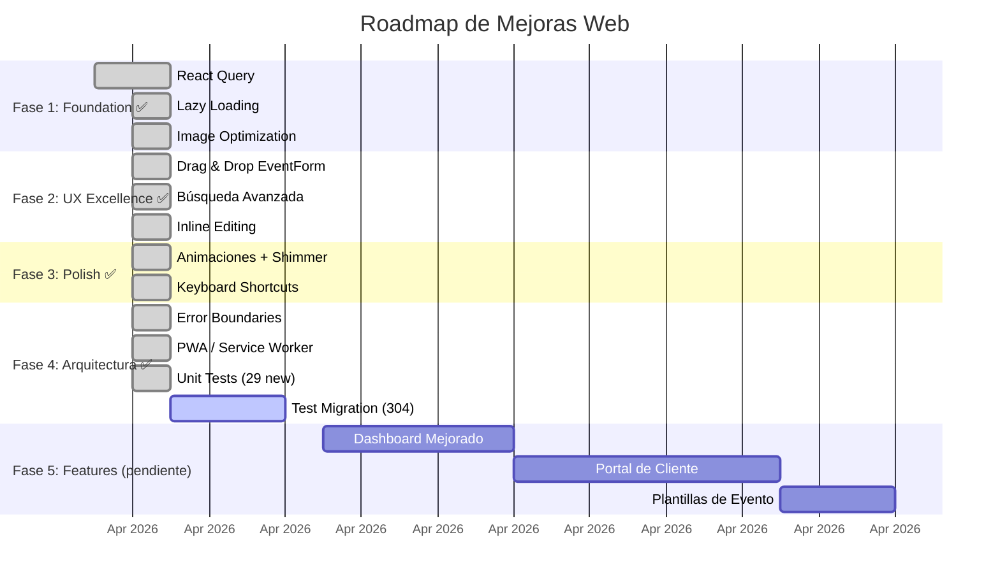

# Roadmap Web — Hacia la Perfección

#web #roadmap #mejoras

> [!tip] Filosofía
> Priorizado por **impacto en usuario** × **esfuerzo técnico**. Las mejoras están organizadas en fases incrementales — cada fase deja la app en un estado shippable mejor que el anterior.

---

## Fase 1: Foundation (Estabilidad y Performance)

> [!done] FASE 1 COMPLETADA — 2026-04-05
> Las 3 sub-tareas (React Query, Lazy Loading, Image Optimization) están terminadas. La app ahora tiene caching inteligente, code splitting por ruta, y lazy loading de imágenes.

### 1.1 React Query / TanStack Query ✅

> [!done] Migración completa — 2026-04-05
> 40+ hooks creados en 8 archivos. Todas las páginas, componentes compartidos, y hooks migrados. Zero `useEffect` fetch patterns restantes en código migrado.

- [x] Instalar `@tanstack/react-query` + devtools
- [x] Crear `queryClient.ts` con error handling global (logError + toast)
- [x] Crear `queryKeys.ts` — key factory centralizada para todos los dominios
- [x] Wiring `QueryClientProvider` + `ReactQueryDevtools` en `App.tsx`
- [x] Migrar `clientService` → `useClientQueries.ts` (6 hooks) + ClientList, ClientForm, ClientDetails
- [x] Migrar `productService` → `useProductQueries.ts` (6 hooks) + ProductList, ProductForm, ProductDetails
- [x] Migrar `inventoryService` → `useInventoryQueries.ts` (5 hooks) + InventoryList, InventoryForm, InventoryDetails
- [x] Migrar `eventService` → `useEventQueries.ts` (13 hooks) + EventList, EventForm, EventSummary
- [x] Migrar `paymentService` → `usePaymentQueries.ts` (5 hooks) + EventSummary, Dashboard
- [x] Migrar `searchService` → `useSearchQueries.ts` + Search page
- [x] Migrar `adminService` → `useAdminQueries.ts` + AdminDashboard, AdminUsers
- [x] Migrar `subscriptionService` → `useSubscriptionQueries.ts` + Settings
- [x] Migrar componentes compartidos: StatusDropdown, OnboardingChecklist, PendingEventsModal
- [x] Rewrite `usePlanLimits` → usa query hooks internamente (cache sharing con el resto)
- [x] Migrar Dashboard — financials como useMemo derivados de datos cacheados
- [x] Migrar Search, Settings, AdminDashboard, AdminUsers
- [x] Refresh buttons usan `queryClient.invalidateQueries` (no `window.reload`)

### 1.2 Lazy Loading de Rutas ✅

> [!done] Completado — 2026-04-05

- [x] 28 páginas convertidas a `React.lazy()` + `<Suspense>`
- [x] Fallback de loading accesible con spinner
- [x] Code splitting automático por Vite (cada página = chunk separado)
- [x] Layout, ProtectedRoute, AdminRoute permanecen eager (shell de navegación)

### 1.3 Image Optimization ✅

> [!done] Completado — 2026-04-05

- [x] `loading="lazy"` en todas las `` de listas y detalles
- [x] Form previews y logos mantienen carga eager (visible inmediato)
- [ ] _Futuro:_ Thumbnails en backend o CDN con resize
- [ ] _Futuro:_ `srcSet` para responsive images
- [ ] _Futuro:_ Placeholder blur/skeleton mientras cargan

---

## Fase 2: UX Excellence (Experiencia de Usuario)

> [!done] FASE 2 COMPLETADA — 2026-04-05
> Drag & drop, filtros URL, inline editing implementados. Notificaciones ya existían en Dashboard.

### 2.1 Drag & Drop en Formulario de Evento ✅

- [x] Instalar `@dnd-kit/core` + `@dnd-kit/sortable`
- [x] Crear `SortableItem` component con drag handle (GripVertical)
- [x] Reordenar productos dentro del evento
- [x] Reordenar extras dentro del evento
- [x] Keyboard sensor para accesibilidad
- [x] Activation constraint (8px) para evitar drags accidentales

### 2.2 Undo/Redo en Acciones Destructivas ⏭️

> [!info] Diferido
> El sistema actual de `ConfirmDialog` antes de eliminar ya provee safety. Undo-toast reemplazaría el paradigma completo — mejor como PR dedicado.

### 2.3 Búsqueda Avanzada ✅

- [x] Filtros combinables en EventList: texto + status + rango de fechas
- [x] Persistencia en URL via `useSearchParams` (shareable, bookmarkable)
- [x] `updateFilter` helper que maneja params limpiamente
- [x] Date inputs (from/to) con botón de limpiar
- [x] URL ejemplo: `?q=María&status=confirmed&from=2026-01-01&to=2026-12-31`

### 2.4 Inline Editing en Tablas ✅

- [x] Status de evento inline (StatusDropdown — ya existía)
- [x] Stock de inventario inline — `InlineStockCell` component
  - Click en número → input editable
  - Blur/Enter guarda via `useUpdateInventoryItem` mutation
  - Escape cancela
  - Alerta de stock bajo preservada durante edición

### 2.5 Notificaciones y Recordatorios ✅ (ya existente)

> [!info] Ya implementado
> El Dashboard ya tiene un sistema sofisticado de alertas:
> - Eventos con pagos pendientes (próximos 7 días)
> - Eventos pasados sin cerrar (confirmed/quoted)
> - Cotizaciones sin confirmar próximas a su fecha
> - Inventario con stock bajo (card + badge de error)

---

## Fase 3: Polish Premium (Detalles que Enamoran)

> [!done] FASE 3 COMPLETADA — 2026-04-05
> Animaciones, skeleton shimmer, keyboard shortcuts, reduced motion, theme crossfade.

### 3.1 Animaciones y Transiciones ✅

- [x] CSS animation utilities: fade-in-up, fade-in, scale-in, shimmer
- [x] Skeleton → shimmer gradient (reemplaza pulse genérico)
- [x] Modal backdrop fade-in animation
- [x] Suspense fallback con fade-in
- [x] Light/dark theme crossfade (background-color + color transition)
- [x] `prefers-reduced-motion` — desactiva TODAS las animaciones para usuarios que lo prefieren

### 3.2 Keyboard Shortcuts ✅

- [x] `useKeyboardShortcuts` hook con secuencias de 2 teclas
- [x] Navegación: G+D (Dashboard), G+E (Eventos), G+C (Clientes), G+P (Productos), G+I (Inventario), G+K (Calendario)
- [x] Acciones: N (nuevo contextual según sección actual)
- [x] `?` toggle help overlay con lista de todos los shortcuts
- [x] Skip shortcuts en inputs/textareas/selects
- [x] `KeyboardShortcutsHelp` component con secciones y `<kbd>` styling
- [x] Wired into Layout junto a CommandPalette

### 3.3 Empty State Illustrations ⏭️

> [!info] Diferido — requiere assets de diseño custom

### 3.4 Skeleton Loading Mejorado ✅

- [x] Shimmer gradient animation reemplaza pulse en todos los Skeleton components
- [x] Gradiente usa design tokens (surface-alt → border → surface-alt)

### 3.5 Dark Mode + Reduced Motion ✅

- [x] `prefers-reduced-motion` media query global
- [x] Theme crossfade transition en `<html>`
- [ ] _Futuro:_ Audit completo WCAG AA de todas las combinaciones dark mode
- [ ] _Futuro:_ PDFs respetando tema actual

---

## Fase 4: Arquitectura Avanzada

> [!done] FASE 4 COMPLETADA — 2026-04-05
> Error boundaries, PWA, unit tests. i18n y analytics diferidos (no necesarios aún).

### 4.1 Error Boundaries ✅

- [x] `ErrorBoundary` class component con `getDerivedStateFromError`
- [x] `ErrorFallback` UI: ícono, mensaje, detalles técnicos (collapsible), retry, ir al inicio
- [x] `onError` callback wired a `logError` para reporting
- [x] Wrappea todas las Routes en App.tsx

### 4.2 Service Worker / PWA ✅

- [x] Instalar `vite-plugin-pwa` con `autoUpdate`
- [x] Web App Manifest: branding Solennix, gold theme, standalone, portrait
- [x] Workbox: cache static assets, CacheFirst para imágenes (30 días), Google Fonts (1 año)
- [x] Navigate fallback a `index.html` (excluye `/api/`)
- [x] PWA icons configurados (192x192, 512x512 maskable)
- [ ] _Futuro:_ Push notifications (requiere backend)

### 4.3 i18n ⏭️

> [!info] Diferido
> La app es exclusivamente para el mercado LATAM en español. i18n se implementaría cuando haya demanda de inglés u otros idiomas.

### 4.4 Test Coverage ✅

- [x] `usePagination` — 8 tests (paginación, sorting, toggle, empty data)
- [x] `queryKeys` — 13 tests (key factories, hierarchical invalidation)
- [x] `finance` utils — 8 tests (tax, total, net sales, never-negative)
- [x] 29 tests pasando (Vitest)
- [ ] _Futuro:_ Tests para servicios (mock api.ts), component tests, E2E con Playwright

### 4.5 Monitoreo y Analytics ⏭️

> [!info] Diferido
> Se implementará cuando la app tenga usuarios en producción. Sentry para errors, Posthog/Mixpanel para analytics.

---

## Fase 5: Features Avanzadas

> [!success] Impacto: Alto | Esfuerzo: Alto
> Features que diferencian de la competencia.

### 5.1 Dashboard Mejorado
- [ ] Widgets configurables (drag & drop)
- [ ] Más gráficos: revenue por mes, top clientes, productos más vendidos
- [ ] Comparativas mes a mes
- [ ] Forecast de revenue basado en eventos confirmados

### 5.2 Timeline de Evento
- [ ] Vista timeline del día del evento (hora por hora)
- [ ] Drag & drop de actividades en la timeline
- [ ] Compartir timeline con equipo/cliente

### 5.3 Colaboración
- [ ] Invitar miembros al equipo
- [ ] Roles y permisos (admin, editor, viewer)
- [ ] Activity log (quién hizo qué)
- [ ] Comentarios en eventos

### 5.4 Portal de Cliente
- [ ] Link compartible para que el cliente vea su evento
- [ ] Firma digital de contrato
- [ ] Pago online directo desde el portal
- [ ] Aprobación de cambios

### 5.5 Plantillas de Evento
- [ ] Guardar evento como plantilla reutilizable
- [ ] Crear evento desde plantilla (pre-llena productos, equipo, insumos)
- [ ] Biblioteca de plantillas por tipo de evento

---

## Prioridad Visual

---

## Quick Wins

> [!done] Completados durante las fases 1–4

- [x] `loading="lazy"` en todas las `` de listas — **Fase 1.3**
- [x] `prefers-reduced-motion` media query global — **Fase 3.1**
- [x] Error boundary básico wrapeando `<Routes>` — **Fase 4.1**
- [x] Skip-to-content link en Layout — **Quick Win**
- [x] `rel="noopener noreferrer"` en links externos — **Ya existía**
- [ ] `React.memo()` en componentes de tabla pesados — marginal con React Query
- [ ] Verificar contraste WCAG en dark mode — requiere auditoría visual

---

## Deuda Técnica

> [!done] Tests migrados — 2026-04-05
> 304 tests rotos por la migración a React Query fueron arreglados.
> **930 tests pasando** en 70 archivos. EventSummary (74 tests) timeout como archivo completo por tamaño pero pasa en batches.
>
> Patrones de fix aplicados:
> - Service mocks expandidos con TODOS los métodos (React Query importa el módulo completo)
> - `useToast` + `getErrorMessage` mocks agregados a todos los test files
> - `client:` → `clients:` en data de tests (Supabase join naming)
> - `Ana - Boda` → `Ana — Boda` (em dash)
> - Error assertions adaptados de inline `setError()` a mutation `onError`/toast
> - `tests/customRender.tsx` provee `QueryClientProvider` global

---

## Relaciones

- [[Web MOC]] — Hub principal
- [[Performance]] — Detalles técnicos de performance
- [[Accesibilidad]] — Gaps de a11y a resolver
- [[Testing]] — Estado actual de tests
