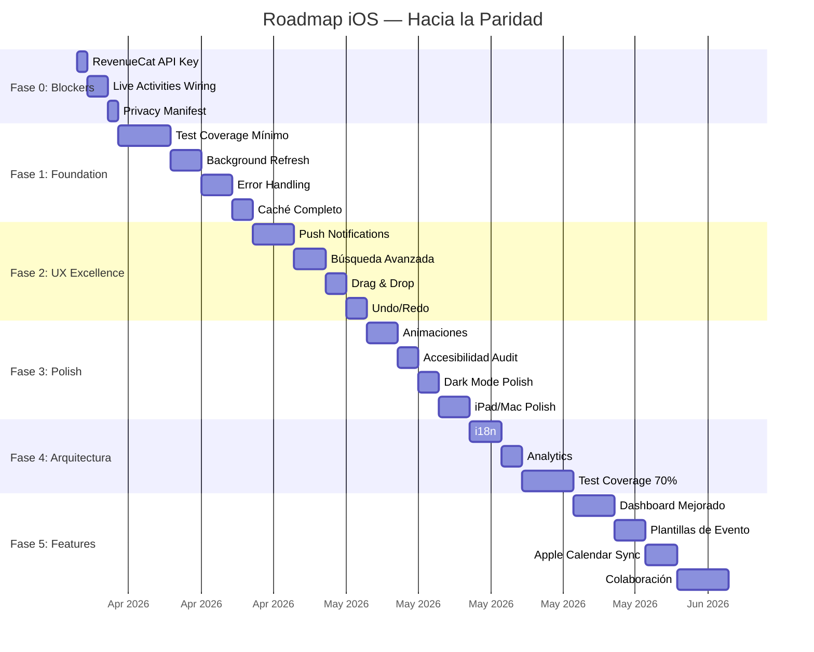

#ios #roadmap #mejoras

# Roadmap iOS — Hacia la Paridad y Más Allá

> [!tip] Filosofía
> Priorizado por **impacto en usuario** × **esfuerzo técnico**. Alineado con [[Roadmap Web]] y [[Roadmap Android]] para paridad cross-platform. iOS es la plataforma más madura — el foco está en pulir, completar integraciones, y testing.
>
> [!warning] Ejecución pendiente
> Los tests agregados el **2026-04-06** (APIClient, OfflineMutationQueue y NotificationManager) están implementados y pendientes de corrida local en máquina con Xcode/Swift.

---

## Estado de Paridad Cross-Platform

| Feature                 | Web   | Android            | iOS                    | Gap iOS      |
| ----------------------- | ----- | ------------------ | ---------------------- | ------------ |
| CRUD Eventos            | ✅    | ✅                 | ✅                     | —            |
| CRUD Clientes           | ✅    | ✅                 | ✅                     | —            |
| CRUD Productos          | ✅    | ✅                 | ✅                     | —            |
| CRUD Inventario         | ✅    | ✅                 | ✅                     | —            |
| Registro de pagos       | ✅    | ✅                 | ✅                     | —            |
| Calendario              | ✅    | ✅                 | ✅                     | —            |
| Dashboard con KPIs      | ✅    | ✅                 | ✅                     | —            |
| Generación de PDFs      | ✅    | ⚠️ Sin librería    | ✅ 8 tipos             | iOS adelante |
| Pagos online (Stripe)   | ✅    | ❌                 | ❌                     | Fase 3       |
| Onboarding checklist    | ✅    | ✅                 | ✅ + TipKit            | iOS adelante |
| Cotización rápida + PDF | ✅    | ✅                 | ✅                     | —            |
| Conflictos equipo       | ✅    | ✅                 | ✅                     | —            |
| Sugerencias equipo      | ✅    | ✅                 | ✅                     | —            |
| Búsqueda global         | ✅    | ✅ + App Search    | ✅ + Spotlight         | —            |
| Dark mode               | ✅    | ✅                 | ✅                     | —            |
| **Google Sign-In**      | ✅    | ✅                 | ✅ Native SDK          | **✅ DONE**  |
| **Apple Sign-In**       | ✅    | ✅                 | ✅ Native ASAuth       | **✅ DONE**  |
| Auth biométrica         | ❌    | ✅                 | ✅ Face/Touch ID       | —            |
| Widgets                 | ❌    | ✅ Glance          | ✅ WidgetKit           | —            |
| Live Activities         | ❌    | ❌                 | ✅ Dynamic Island      | iOS adelante |
| Siri Shortcuts          | ❌    | ❌                 | ✅ AppIntents          | iOS adelante |
| Deep links              | ❌    | ✅                 | ✅ + Spotlight         | —            |
| Offline caché           | ❌    | ✅ Room            | ✅ SwiftData           | —            |
| Background sync         | ❌    | ✅ WorkManager     | ❌                     | **P1**       |
| Push notifications      | ❌    | ⚠️ Stub            | ❌                     | **P1**       |
| React Query / cache     | 🔄    | N/A                | N/A                    | —            |
| iPad / Mac support      | N/A   | Tablet             | ✅ Split layout        | iOS adelante |
| Test coverage           | ❌ 0% | ❌ 0%              | ❌ 0%                  | Todos        |
| i18n                    | ❌    | ❌                 | ❌                     | Todos        |
| Analytics               | ❌    | ❌                 | ❌                     | Todos        |
| Suscripciones           | ❌    | ⚠️ RevenueCat stub | ⚠️ API key placeholder | **P0**       |

---

## Fase 0: Blockers Críticos (Pre-Release)

> [!success] Impacto: Crítico | Esfuerzo: Bajo
> Sin esto, la app NO puede publicarse en App Store.

### 0.1 RevenueCat API Key

- [x] Reemplazar `appl_YOUR_API_KEY` placeholder en `SolennixApp.swift` — ✅ 2026-04-06 (ahora usa `REVENUECAT_PUBLIC_API_KEY` desde Info.plist/build settings)
- [x] Configurar offerings y packages en RevenueCat dashboard
- [ ] Verificar flujo de compra completo en sandbox
- [ ] Testear restore purchases

**Por qué**: Sin API key real, `SubscriptionManager.configure()` falla silenciosamente. No hay monetización.

### 0.2 Live Activities — Completar Wiring

- [x] Conectar actualizaciones de Live Activity con datos reales del evento — ✅ 2026-04-06 (eliminado widget zombie `EventLiveActivity`/`EventActivityAttributes` con tipo divergente; timer ahora usa `Text(startTime, style: .timer)` nativo de WidgetKit y refresca solo; `loadData` reconcilia status con backend post-refresh)
- [x] Implementar push-to-update para Live Activities (APNs) — ✅ 2026-04-06 (Activity ahora se inicia con `pushType: .token`; observer dual stream captura `pushTokenUpdates` → `POST /api/live-activities/register` y `activityStateUpdates` → `DELETE /api/live-activities/by-event/{id}`. Backend con migración 036, repo, service `LiveActivityService` con header `apns-push-type: liveactivity` + topic `bundle.push-type.liveactivity`, y hook automático en `PUT /events/{id}` cuando cambia el status)
- [ ] Testear en dispositivos reales (Dynamic Island solo en iPhone 14 Pro+)

**Por qué**: La infraestructura existe pero el mecanismo de actualización no está completo.

### 0.3 Privacy Manifest Review

- [x] Verificar `PrivacyInfo.xcprivacy` cubre todos los APIs usados — ✅ 2026-04-05
- [x] Declarar uso de Keychain, CoreSpotlight, NetworkMonitor — ✅ No son Required Reason APIs, no necesitan declaración
- [x] Asegurar compliance con App Store requirements 2024+

**Por qué**: Apple rechaza apps sin privacy manifest completo.

---

## Fase 1: Foundation (Estabilidad)

> [!success] Impacto: Alto | Esfuerzo: Medio
> Base sólida para crecimiento.

### 1.1 Test Coverage Mínimo

- [x] Setup: Swift Testing framework + XCTest — ✅ 2026-04-06 (targets de tests agregados para app y paquete SolennixNetwork)
- [ ] Tests para `AuthManager` (state machine, tokens, biometric)
- [x] Tests para `APIClient` (retry, token injection, error mapping) — ✅ 2026-04-06 (cobertura de políticas de offline queue/replay y status handling)
- [ ] Tests para `KeychainHelper` (save, read, delete)
- [ ] Tests para ViewModels clave (Dashboard, EventForm, EventDetail)
- [ ] Tests para PDF generators (output válido)
- [ ] Target: 40% coverage en SolennixNetwork + SolennixCore

**Por qué**: Sin tests, cada cambio es un riesgo. Network y Core son la base de todo.

### 1.2 Background App Refresh

- [x] Implementar `BGAppRefreshTask` para sync periódico — ✅ 2026-04-05 (BackgroundTaskManager, cada ~30 min)
- [x] Sincronizar eventos, clientes, productos en background — ✅ 2026-04-05 (+ inventario, caché SwiftData completo)
- [x] Actualizar widget timelines post-sync — ✅ 2026-04-05 (WidgetDataSync: events + KPIs)
- [x] Actualizar Spotlight index post-sync — ✅ 2026-04-05 (SpotlightIndexer: clients, events, products)

**Por qué**: Alineado con Android (WorkManager). Sin esto, datos pueden estar stale al abrir la app.

### 1.3 Error Handling Robusto

- [x] Retry con exponential backoff para errores transitorios — ✅ 2026-04-05 (2 retries, 1s/2s backoff, GET only, 5xx + timeouts + connection errors)
- [x] UI de error con botón "Reintentar" contextual — ✅ 2026-04-05 (Dashboard, EventList, ClientList, ProductList, InventoryList)
- [x] Sentry/Crashlytics integration — ✅ 2026-04-06 (Sentry SDK real, user tracking via AuthManager delegate, DSN/env por Info.plist)
- [x] Offline-first: queue de operaciones pendientes — ✅ 2026-04-06 (cola persistente FIFO para POST/PUT/DELETE en fallos de red, replay automático al reconectar y tras login, `X-Idempotency-Key` por mutación)

**Por qué**: Actualmente errores de red muestran mensaje genérico. El usuario no sabe qué hacer.

### 1.4 Caché Completo

- [x] Agregar `CachedInventoryItem` a SwiftData — ✅ 2026-04-05
- [x] Agregar `CachedPayment` a SwiftData — ✅ 2026-04-05
- [x] Implementar invalidación de caché por timestamp — ✅ 2026-04-06 (TTL 30 min por dominio en CacheManager: clients/events/products/inventory/payments)
- [x] Mostrar indicador "datos cacheados" en UI — ✅ 2026-04-05 (CachedDataBanner en 4 vistas)
- [x] Cache-first loading en ViewModels — ✅ 2026-04-05 (Client, Event, Product, Inventory)

**Por qué**: Solo Client, Event y Product se cachean. Faltan Inventory y Payment.

---

## Fase 2: UX Excellence (Alineado con Web)

> [!success] Impacto: Alto | Esfuerzo: Medio-Alto
> De "funcional" a "un placer de usar".

### 2.1 Push Notifications (APNs)

- [x] Registrar device token con backend — ✅ 2026-04-06 (APNs token -> `/devices/register` con retry por pending token)
- [x] Notificaciones de eventos próximos — ✅ 2026-04-06 (sincronización automática de recordatorios locales para eventos confirmados al iniciar sesión, reconectar red y volver a foreground)
- [x] Notificaciones de pagos recibidos — ✅ 2026-04-06 (recibo local en Notification Center via `schedulePaymentReceipt`, observer cross-layer `NotificationCenter` ↔ `Notification.Name.solennixPaymentRegistered` declarado en `SolennixCore`, disparado desde `EventDetailViewModel.addPayment` con `payment_id`/`event_id`/`client_name`/`amount`)
- [x] Rich notifications con imagen del evento — ✅ 2026-04-06 (target nuevo `SolennixNotificationServiceExtension` con `NotificationService` que descarga `image_url` del payload remoto y adjunta como `UNNotificationAttachment`; servidor debe enviar `mutable-content: 1` + campo `image_url`. **Pendiente correr `xcodegen generate` para materializar el target en Xcode**)
- [x] Deep links desde notificaciones — ✅ 2026-04-06 (tap/action navega a EventDetail/EventPayments/Inventory)
- [x] Notification categories con acciones (confirmar, ver detalle) — ✅ 2026-04-06 (EVENT/PAYMENT/INVENTORY categories + actions)
- [x] Tests unitarios de routing/parseo de notificaciones — ✅ 2026-04-06 (`routeFromNotification`, extracción de `event_id`, y resolución de fecha/hora de evento)

**Por qué**: Alineado con [[Roadmap Web]] Fase 2.5 y [[Roadmap Android]] Fase 2.1.

### 2.2 Búsqueda Avanzada

- [x] Filtros combinables en EventList (fecha + status + cliente) — ✅ 2026-04-05
- [x] Búsqueda por rango de fechas — ✅ 2026-04-05 (DatePicker from/to)
- [ ] Filtros persistentes en URL/state
- [x] Suggestions en SearchView — ✅ 2026-04-06 (historial local de búsquedas + sugerencias tap-to-search)

**Por qué**: Alineado con [[Roadmap Web]] Fase 2.3.

### 2.3 Drag & Drop

- [x] Reordenar productos en EventForm (Step 2) — ✅ 2026-04-05
- [x] Reordenar extras (Step 3) — ✅ 2026-04-05
- [x] `.draggable()` + `.dropDestination()` nativo de SwiftUI — ✅ 2026-04-05

**Por qué**: Alineado con [[Roadmap Web]] Fase 2.1.

### 2.4 Undo/Redo

- [x] Swipe-to-delete con undo toast (5 segundos soft delete) — ✅ 2026-04-05 (ClientListView)
- [x] `.onDelete` con confirmación y periodo de gracia — ✅ 2026-04-05 (ToastManager.showUndo)
- [x] Extender undo a Product, Inventory, Event deletes — ✅ 2026-04-06 (soft delete + restore + confirm-delete diferido)

**Por qué**: Alineado con [[Roadmap Web]] Fase 2.2.

---

## Fase 3: Polish Premium

> [!success] Impacto: Medio | Esfuerzo: Bajo-Medio
> Detalles premium.

### 3.1 Animaciones y Transiciones

- [ ] `.matchedGeometryEffect` para transiciones lista → detalle
- [ ] `.transition(.asymmetric())` en modales y sheets
- [ ] Stagger en listas con `.animation(.spring(), value:)`
- [ ] Respetar `@Environment(\.accessibilityReduceMotion)`

**Por qué**: Alineado con [[Roadmap Web]] Fase 3.1 y [[Roadmap Android]] Fase 3.1.

### 3.2 Accesibilidad Audit

- [ ] `.accessibilityLabel()` en todos los componentes custom
- [ ] Auditar contraste WCAG AA con paleta dorado/navy
- [ ] Testear con VoiceOver
- [ ] Verificar Dynamic Type con fuente Cinzel
- [ ] Soportar `accessibilityReduceMotion`

### 3.3 Dark Mode Polish

- [ ] Auditar 100+ colores en dark mode
- [ ] Verificar contraste en StatusBadge, KPI cards, formularios
- [ ] PDFs respetando tema del usuario

### 3.4 iPad/Mac Polish

- [ ] Optimizar SidebarSplitLayout para productividad
- [ ] Keyboard shortcuts para acciones frecuentes
- [ ] Hover effects en Mac Catalyst
- [ ] Multi-window support

---

## Fase 4: Arquitectura Avanzada

> [!success] Impacto: Medio-Alto | Esfuerzo: Alto
> Escalar.

### 4.1 i18n

- [ ] Extraer strings a `Localizable.strings`
- [ ] Soportar español (default) e inglés
- [ ] Formateo de moneda/fechas por locale con `FormatStyle`
- [ ] String Catalogs (Xcode 15+)

**Por qué**: Alineado con Web Fase 4.3 y Android Fase 4.1.

### 4.2 Analytics

- [ ] Firebase Analytics o Posthog
- [ ] Tracking de eventos clave
- [ ] Crashlytics / Sentry para error tracking
- [ ] Performance monitoring con MetricKit

**Por qué**: Alineado con Web Fase 4.5 y Android Fase 4.2.

### 4.3 Test Coverage Completo

- [ ] XCUITest para flujos críticos
- [ ] Snapshot tests con swift-snapshot-testing
- [ ] Widget tests
- [ ] Target: 70%+ coverage total

### 4.4 SwiftData Migrations

- [ ] Schema versioning para evolución del modelo
- [ ] Migration plans para updates sin data loss
- [ ] Testear migraciones en dispositivos reales

---

## Fase 5: Features Avanzadas (Paridad con Web)

> [!success] Impacto: Alto | Esfuerzo: Alto
> Features diferenciadoras.

### 5.1 Dashboard Mejorado

- [ ] Swift Charts mejorados: revenue por mes, top clientes
- [ ] Comparativas mes a mes
- [ ] Forecast basado en eventos confirmados

**Por qué**: Alineado con Web Fase 5.1.

### 5.2 Plantillas de Evento

- [ ] Guardar evento como plantilla
- [ ] Crear evento desde plantilla
- [ ] Biblioteca por tipo de evento

**Por qué**: Alineado con Web Fase 5.5 y Android Fase 5.2.

### 5.3 Timeline de Evento

- [ ] Vista hora por hora del día del evento
- [ ] Agregar actividades a la timeline
- [ ] Compartir via ShareSheet

**Por qué**: Alineado con Web Fase 5.2.

### 5.4 Colaboración

- [ ] Invitar miembros al equipo
- [ ] Roles y permisos
- [ ] Activity log
- [ ] SharePlay para planificación en vivo (stretch goal)

### 5.5 Apple Calendar Sync

- [ ] Exportar eventos a Apple Calendar
- [ ] Sync bidireccional con EventKit
- [ ] Colores de estado en Calendar

**Por qué**: Feature nativa que iOS puede ofrecer mejor que Web.

### 5.6 Apple Watch Companion (Stretch Goal)

- [ ] Complication con próximo evento
- [ ] Notificaciones en muñeca
- [ ] Quick check-in desde reloj

---

## Prioridad Visual

---

## Quick Wins (< 1 día cada uno)

> [!tip] Victorias rápidas

- [x] `.accessibilityLabel()` en todos los `Image(systemName:)` de navegación — ✅ 2026-04-05 (14 instancias en 7 vistas)
- [x] Verificar contraste WCAG de StatusBadge en dark mode — ✅ 2026-04-05 (dark mode OK, light mode corregido: Quoted #B45309, Confirmed #0055CC, Cancelled #CC2929)
- [x] `@Environment(\.accessibilityReduceMotion)` en animaciones existentes — ✅ 2026-04-05 (7 vistas, 13 animaciones)
- [x] `.refreshable` en todas las listas (pull-to-refresh) — ✅ Ya implementado (11 vistas)
- [x] `.searchable(placement: .toolbar)` consistente en todas las listas — ✅ Listas principales usan InlineFilterBar (intencional), forms usan .searchable
- [x] Agregar `.sensoryFeedback()` (iOS 17) en acciones de save/delete — ✅ 2026-04-05 (HapticsHelper.play(.warning) en delete triggers de Product e Inventory, paridad con Client)
- [x] Verificar Privacy Manifest tiene todas las declaraciones — ✅ 2026-04-05 (UserDefaults + FileTimestamp correctos, Keychain/CoreSpotlight/NWPathMonitor no requieren Required Reason API)

---

## Etapa 2: Post-MVP — iOS

> [!tip] Documento completo
> Ver [[13_POST_MVP_ROADMAP|Roadmap Post-MVP (Etapa 2)]] para el detalle completo.

### Prioridad iOS Etapa 2

| Feature                          | Vista/Componente                                            | Esfuerzo | Prioridad |
| -------------------------------- | ----------------------------------------------------------- | :------: | :-------: |
| **Preferencias de notificación** | `SettingsView` → sección "Notificaciones" con toggles       |    3h    |    P0     |
| **Pantalla de reportes**         | `ReportsView` + Swift Charts + date picker                  |   15h    |    P1     |
| **Botón "Ir" + acciones**        | `EventDetailView` → botones "En camino", "Llegamos" + Maps  |    8h    |    P1     |
| **WhatsApp deep links**          | Botón "Enviar por WhatsApp" en cotización/contrato          |    2h    |    P0     |
| **Plantillas de evento**         | `TemplateListView` + guardar/cargar                         |    8h    |    P2     |
| **Timeline del evento**          | `EventTimelineView` hora por hora                           |   10h    |    P2     |
| **Modo Día del Evento**          | Banner especial + acciones rápidas + Live Activity mejorada |   12h    |    P2     |
| **Apple Calendar Sync**          | EventKit sync bidireccional                                 |    8h    |    P2     |

---

## Relaciones

- [[iOS MOC]] — Hub principal
- [[Testing]] — estado de tests
- [[Performance]] — oportunidades
- [[Accesibilidad]] — gaps
- [[Caché y Offline]] — gaps de sync
- [[Módulo Settings]] — RevenueCat placeholder
- [[13_POST_MVP_ROADMAP|Roadmap Post-MVP]] — Etapa 2 completa
